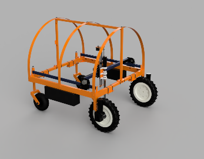
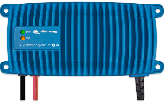
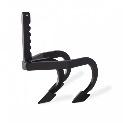
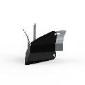
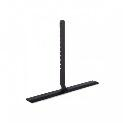
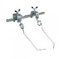
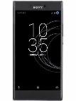
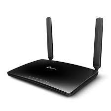
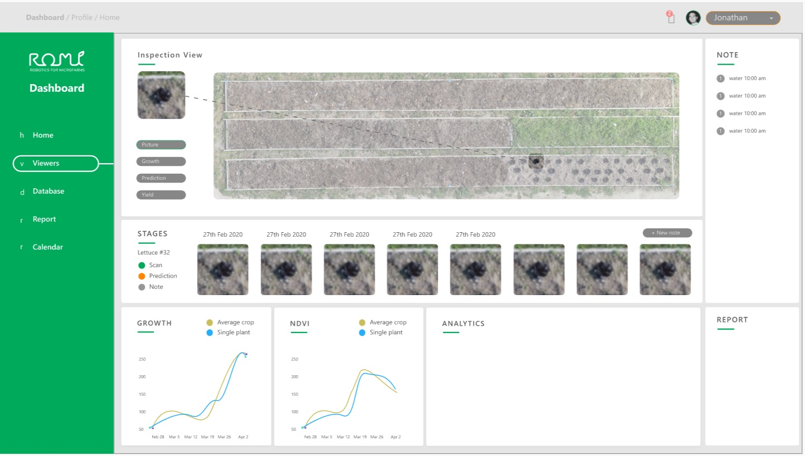

# Functional Specifications and Requirements

The following configuration is required for the use of the ROMI rover.

<table>

<!-- --------------------------------- -->
<tr>
   <td></td>
   <td><strong>Profile</strong></td>
   <td><strong>Price</strong></td>
   <td><strong>Features/Function</strong></td>
</tr>
  
<!-- --------------------------------- -->
<tr>
   <td>Bed of vegetables </td>
   <td colspan="3" >Width of the bed: 
<ul>
<li>min 0.7 m </li>
<li>max 1.2 m  [v3]</li>
</ul>
   </td>
</tr>
  
<!-- --------------------------------- -->
<tr>
   <td>Handled crops </td>
   <td colspan="3" >
<ol>
  <li><strong>Lettuce</strong>: The lettuce can be planted out in any layout, most likely in a quincunx pattern
  <li><strong>Carrots</strong>: The carrots should be sown in line.
  </li>
</ol>
   </td>
</tr>
  
<!-- --------------------------------- -->
<tr>
   <td>ROMI rover with a remote control, a battery charger, and a protective cover</td>
   <td>
 [v3]

   </td>
   <td>5000 € (estimate)</td>
   <td>
<ul>
<li>Prevents weed development
<li>Draw patterns for seeding and planting out
<li>Takes image scans of the beds
</li>
</ul>
   </td>
</tr>

<!-- --------------------------------- -->
<tr>
   <td>Tool carrier</td>
   <td>Photo</td>
   <td>1000 € (estimate)</td>
   <td>Used with the rover to carry the mechanical weeding tools (optional but needed in most configurations)</td>
</tr>
  
<!-- --------------------------------- -->
<tr>
   <td>Mechanical weeding tools (from Terrateck or other manufacturers)</td>
   <td>
<table>
  <tr>
   <td></td>
   <td></td>
  </tr>
  <tr>
   <td></td>
   <td></td>
  </tr>
</table>
   </td>
   <td>400-1000€ (estimate)</td>
   <td>The weeding tools that will be fixed on the tool carrier. Sold by other manufacturers, for example, by [Terrateck](https://www.terrateck.com) ([catalogue](https://www.terrateck.com/en/16-houes-pousse-pousse))</td>
</tr>

<!-- --------------------------------- -->
<tr>
   <td><strong>TOTAL cost of an equipped rover</strong></td>
   <td></td>
   <td><strong>6400 – 7000 €</strong></td>
   <td></td>
</tr>

<!-- --------------------------------- -->
<tr>
   <td>Guides</td>
   <td>Photo</td>
   <td>
   <ul>
     <li>Stainless steel tubes (45x1.5): 3 €/m
     <li>Tuyau irrigation PE HD 50mm : 4.4 €/m
   </ul>
   </td>
   <td>The guides consist of either stainless metal tubes (preferred) or wooden boards. They facilitate the navigation of the rover along the bed so that it can operate accurately and reliably.</td>
</tr>

<!-- --------------------------------- -->
<tr>
   <td>A mobile phone</td>
   <td></td>
   <td>Existing phone: 0€
       Dedicated phone: 200 €
   </td>
   <td>
   <ul>
     <li>Used to control the rover
     <li>To browse the archived images of the online service	
   </ul>
   </td>
</tr>

<!-- --------------------------------- -->
<tr>
   <td>WiFi</td>
   <td></td>
   <td>Rover as hotspot: 0 €/month
Existing WiFi: 0 €/month
GSM WiFi router: 120€ (router) + 10 €/month (SIM card)
   </td>
   <td>WiFi connectivity in the field 
   <ul>
     <li>To connect the mobile phone to the rover (required)
     <li>To archives the images taken by the rover (optional)
     <li>To provide remote assistance (optional)
   </ul>
   </td>
</tr>

<!-- --------------------------------- -->
<tr>
   <td>Romi's Online Farmer's Dashboard [v3++]</td>
   <td></td>
   <td>1 €/month</td>
   <td>Monthly fee for the use of the Romi remote server (optional):
   <ul>
      <li>To archive and browse the images taken by the rover
      <li>To receive remote assistance
   </ul> 
  </td>
</tr>

<!-- --------------------------------- -->
<tr>
   <td>Training</td>
   <td></td>
   <td>70 €/day</td>
   <td>Two days of training for the rover (optional)</td>
</tr>

<!-- --------------------------------- -->
<tr>
   <td>Preprogramming according to the configuration of the farm</td>
   <td></td>
   <td>50 €</td>
   <td>Assistance to fine-tune the rover’s configuration to the farm (optional)</td>
</tr>

<!-- --------------------------------- -->
<tr>
   <td>Maintenance costs</td>
   <td></td>
   <td>5 €/month/rover</td>
   <td>Maintenance contract with the ROMI association (or a local distributor) (optional)</td>
</tr>
</table>

 

## Examples for different farm sizes

For an urban farm of 5 000 m2 (lettuces or carrots)

*   83 beds of 50 meters (beds of 80 cm wide, pathway of 40 cm between beds, 3320 m² cultivated)
*   4150 meters of guides (12 450 €…)
*   1 rover with tool carrier and mechanical weeding tools (7000 €)

Investment costs: 7000 to 7510 + 12450 € + 16 €/months (optional: SIM card, remote maintenance, server archiving)

For a vegetable farm of 2 ha

*   124 beds of 100 meters (beds of 1.1 m wide, pathway of 0.50 m between beds, 13640 m² cultivated)
*   12 400 meters of guides (37.2 k€)

Lettuces (180 000 plants, 54 k€-129 k€ revenu):

*   4 rovers
*   Investment costs: 20.5 k€ + 37.2 k€ + 10 to 31 €/months (wifi and maintenance)
*   Alternative solution: Plastic mulching film: 12 x 226,50 € = 2712 €/year [[REF](https://www.serresvaldeloire.com/films-salade-et-semi-forcage/588-film-paillage-salade.html#/rouleau-140_m_x_1071_m_14_trous)]

Carrots (1.24M plants, 60-130 tonnes, 31k€-130k€ revenue)

*   1 rover
*   Investment costs: 7000 to 7510 € + 49.6 k€ + 10 to 16 €/months (wifi and maintenance)

Sur carottes, l’ensemble des opérations de désherbage varie de 120 à plus de 900 heures/ha. [[http://itab.asso.fr/downloads/fiches-lpc/lpc-carotte.pdf](http://itab.asso.fr/downloads/fiches-lpc/lpc-carotte.pdf)] 

Prix [[https://rnm.franceagrimer.fr/prix?CAROTTE&12MOIS](https://rnm.franceagrimer.fr/prix?CAROTTE&12MOIS)] 

For a vegetable farm of 5 ha

*   XXX beds
*   XXX meters of guides
*   XXX rovers

Investment costs: XXX € + €/months (wifi and maintenance)

It has to be pointed out that in many countries, there are public financial supports for farmers which want to invest in robotics.

