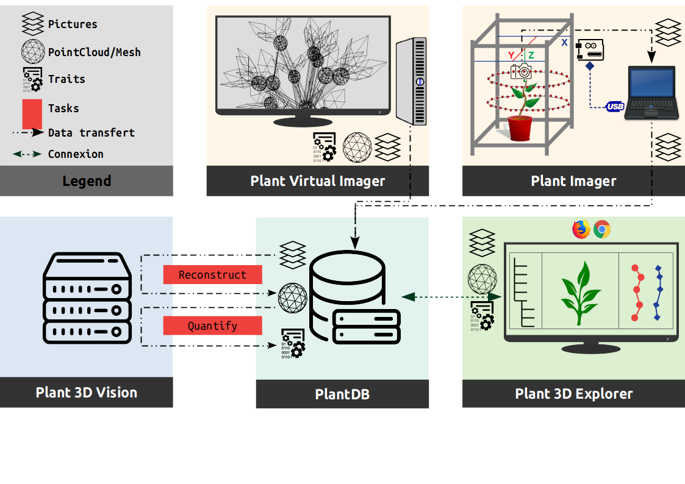

# Overview of the modules interactions
The following figure shows a use case of the ROMI modules, and the way they interact, to design an efficient plant phenotyping platform used in research.

## PlantDB
Should be totally independent of the rest since it could be uses in other parts of the ROMI project (Rover, Cable bot, ...) trough the abstract class `DB` or even the local database class `FSDB`.

## Plant Imager
It requires a physical connection to the hardware (`pyserial`) to control. It also needs an active ROMI database to export acquired datasets (plant images).

## Virtual Plant Imager
It requires a connection to an active ROMI database to export generated datasets (virtual plant images).
In case of machine learning methods, a database would also provide training datasets.

## Plant 3D Vision
It requires connection to an active ROMI database to import datasets to process and export the results.
Two plant reconstruction approaches are available in the SmartInterpreter:

1. Geometry based, try to infer the plant's geometry using structure from motion algorithms and space carving to first reconstruct a point cloud. 
2. Machine learning based, try to infer the plant's geometry using semantic (organ) segmentation of pictures and space carving to first reconstruct a labelled point cloud.

Then meshing and skeletonization finally enables to extract the plant's phyllotaxis.

## Plant 3D Explorer
It requires a database with datasets to browse and represent.

# Research oriented user story

1. The user put his/her plant inside the scanner and run **acquisitions**, which returns a set of images per plant.
2. These images are uploaded to a **central database**.
3. The user **defines a pipeline** to reconstruct and quantify plants architecture by choosing among a set of predefined methods and algorithms. These instructions may be run by a distant server.
4. Finally, the user can access the acquisitions, reconstructions & quantitative data by connecting to a visualization server using his/her computer
