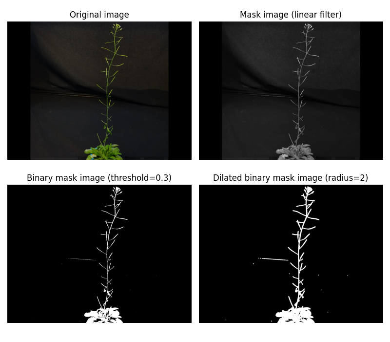
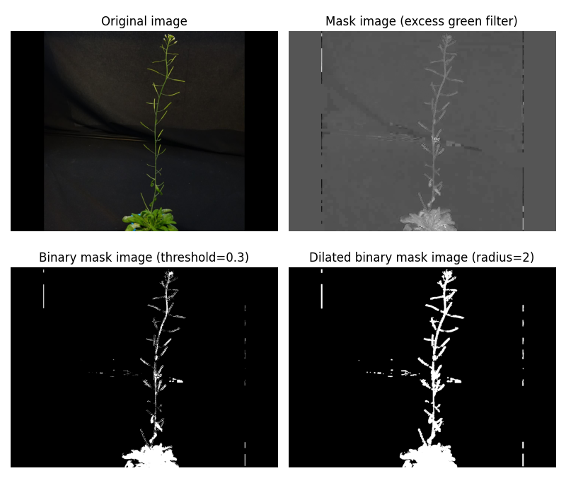

# Masks

Here we show the effects of the `type` of filter to use in the `Mask` task.


## Method `linear`



The image have been generated with the following python code:

```python
import numpy as np
import matplotlib.pyplot as plt
from imageio import imread
from skimage.exposure import rescale_intensity
from plant3dvision import test_db_path
from plant3dvision.proc2d import linear, dilation
path = test_db_path()
im = imread(path.joinpath('real_plant/images/00000_rgb.jpg'))
im = np.asarray(im, dtype=float)  # transform the uint8 RGB image into a float RGB numpy array
im = rescale_intensity(im, out_range=(0., 1.))  # rescale to [0., 1.]
threshold = 0.4
filter = linear(im, [0., 1., 0.])  # apply `linear` filter
mask = filter > threshold  # convert to binary mask using threshold
mask = dilation(mask, 2)  # apply a dilation to binary mask
# Plot the original image, filtered image and binary mask
fig, ax = plt.subplots(1, 3)
ax[0].imshow(im)
ax[0].set_title("Original image")
ax[1].imshow(filter)
ax[1].set_title("Filtered image")
ax[2].imshow(mask, cmap='gray')
ax[2].set_title("Mask image")
```

## Method `excess_green`



The image have been generated with the following python code:

```python
import numpy as np
import matplotlib.pyplot as plt
from imageio import imread
from skimage.exposure import rescale_intensity
from plant3dvision import test_db_path
from plant3dvision.proc2d import excess_green, dilation
path = test_db_path()
im = imread(path.joinpath('real_plant/images/00000_rgb.jpg'))
im = np.asarray(im, dtype=float)  # transform the uint8 RGB image into a float RGB numpy array
im = rescale_intensity(im, out_range=(0., 1.))  # rescale to [0., 1.]
threshold = 0.4
filter = excess_green(im)  # apply `excess_green` filter
mask = filter > threshold  # convert to binary mask using threshold
mask = dilation(mask, 2)  # apply a dilation to binary mask
# Plot the original image, filtered image and binary mask
fig, ax = plt.subplots(1, 3)
ax[0].imshow(im)
ax[0].set_title("Original image")
ax[1].imshow(filter)
ax[1].set_title("Filtered image")
ax[2].imshow(mask, cmap='gray')
ax[2].set_title("Mask image")
```
