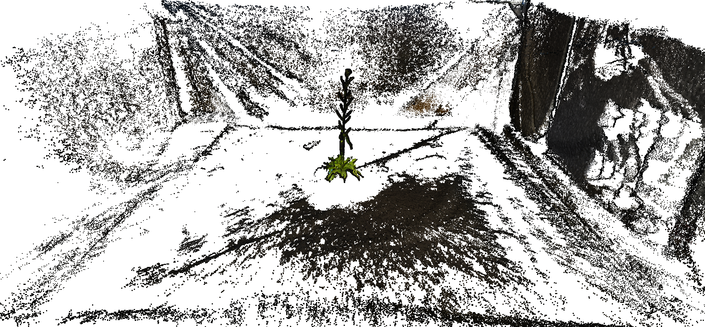

Plant scanner overview
======================

{width=800 loading=lazy}

## User story

1. The user put his/her plant inside the scanner and run **acquisitions**, which returns a set of images per plant.
2. These images are uploaded to a **central database**.
3. The user **defines a pipeline** to reconstruct and quantify plants architecture by choosing among a set of predefined methods and algorithms. These instructions may be run by a distant server.
4. Finally the user can access the acquisitions, reconstructions & quantitative data by connecting to a visualization server using his/her computer

## Modular architecture
We aim at making our software architecture modular to make it more flexible and suitable to several application from the ROMI project when possible.

### Modular design
The following figure shows each independent module and the way they interact.

### Module details
Each of the following modules could be seen as separate virtual machines or containers able to communicates.

| Module Name      |  ROMI Packages                     |  Dependencies                                                 |
|------------------|------------------------------------|---------------------------------------------------------------|
| DB               | `romidata`                         | `luigi`, `flask`                                              |
| SmartInterpreter | `romiscan`, `romiseg`, `romicgal`  | `luigi`, `pytorch`, `labelme`, `tensorboard`                  |
| Visualizer       | `3d-plantviewer`                   | `npm`                                                         |
| PlantImager     | `plant-imager`                      | `pyserial`                                                    |
| VirtualScanner   | `romiscanner`                      | `openalea.plantgl`, `openalea.lpy`, `bpy` (blender), `flask`  |

#### DB
Should be totally independent of the rest since it could be uses in other parts of the ROMI project (Rover, Cable bot, ...) trough the abstract class `DB` or even the local database class `FSDB`.

#### PlantImager
It requires a physical connection to the hardware (`pyserial`) to control. It also needs an active ROMI database to export acquired datasets (plant images).

#### SmartInterpreter
It requires connection to an active ROMI database to import datasets to process and export the results.
Two plant reconstruction approaches are available in the SmartInterpreter:

1. Geometry based, try to infer the plant's geometry using structure from motion algorithms and space carving to first reconstruct a point cloud. 
2. Machine learning based, try to infer the plant's geometry using semantic (organ) segmentation of pictures and space carving to first reconstruct a labelled point cloud.

Then meshing and skeletonization finally enables to extract the plant's phyllotaxis.

#### VirtualScanner
It requires a connection to an active ROMI database to export generated datasets (virtual plant images). In case of machine learning methods, a database would also provides training datasets.

#### Visualizer
It requires a database with datasets to browse and represent.

## Semantics

We hereafter defines the semantic, names and abbreviations to use in the projects documentations and communications.

### Macroscopic & non-technical
- [ ] **ROMI Softwares**: the whole set of software developed by ROMI;
- [ ] **ROMI Hardwares**: the three types of robots developed by ROMI, namely the "cable bot", the "rover" and the "scanner";
- [ ] **ROMI Scanner Softwares** - the set of software developed by the "scanner group";
- [ ] **ROMI Plant Scanner** - RPS: the hardware that enable (automatic) acquisition of a set of 2D or 3D images of the plant;
- [ ] **(Single) Plant Reconstruction Pipeline** - (S)PRP: the set of methods (and packages?) used to performs a 3D reconstruction of a plant using data from the *ROMI Plant Scanner*;
- [ ] **Plant Phenotyping Pipeline** - PPP or P^3^: the set of methods (and packages?) used to performs plant phenotyping (traits quantification) from the obtained 3D reconstruction;
- [ ] **Virtual Plant Image Generator** - VPIG: the set of methods (and packages?) used to generate sets of images in a similar fashion than the RPS;

### Repository & packages

| Repository          | Package             | Description                                                                                                |
|---------------------|---------------------|------------------------------------------------------------------------------------------------------------|
| romidata            | romidata            | The database API used in the ROMI project, as well as classes for data processing using luigi.             |
| romiscan            | romiscan            | This repo gathers the elements used to run 3D scan of individual plants by ROMI partners.                  |
| romiscanner         | romiscanner         | Hardware interface for the 3D Scanner, as well as virtual scanner.                                         |
| romiseg             | romiseg             | Plant segmentation methods using ML approach trained with images generated by virtual scanner.             |
| 3d-plantviewer      | ?                   | Browser application to visualize 3D scanned plants.                                                        |

### Database related
- [ ] database: the database itself;
- [ ] datasets/project: a set of images and the pipelines results;
- [ ] fileset: a set of files (*eg.* a set of RGB images of a plant);
- [ ] plant metadata: set of FAIR metadata attached to the plant (*eg.* species, age, growth conditions...);
- [ ] acquisition metadata: set of metadata attached to the acquisition procedure & hardware configuration (*eg.* version of the CNC controller, camera settings, ...);

!!! danger
    datasets/project are called "scan" for now!
