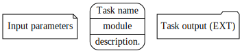
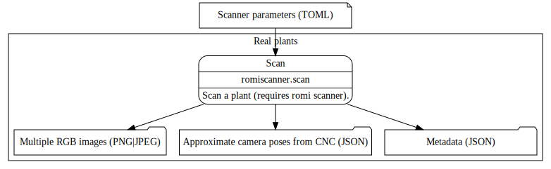
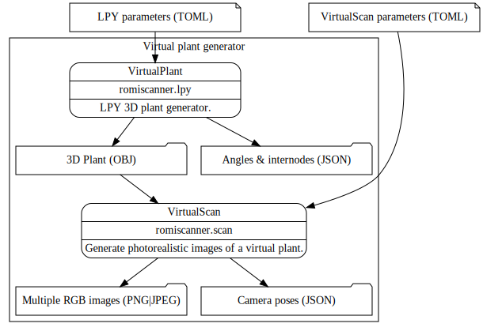
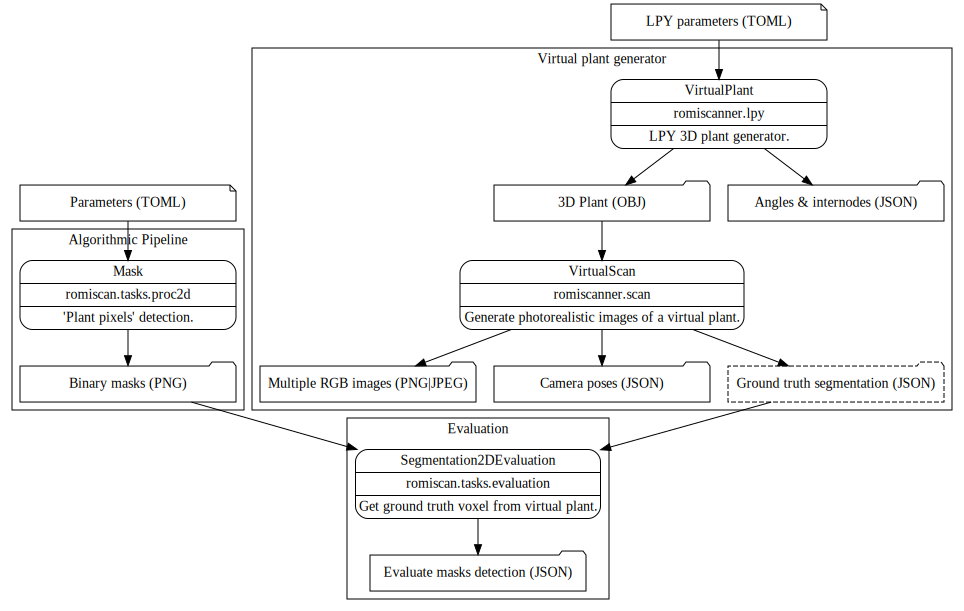
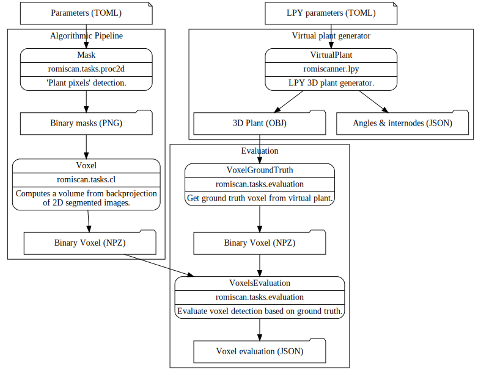
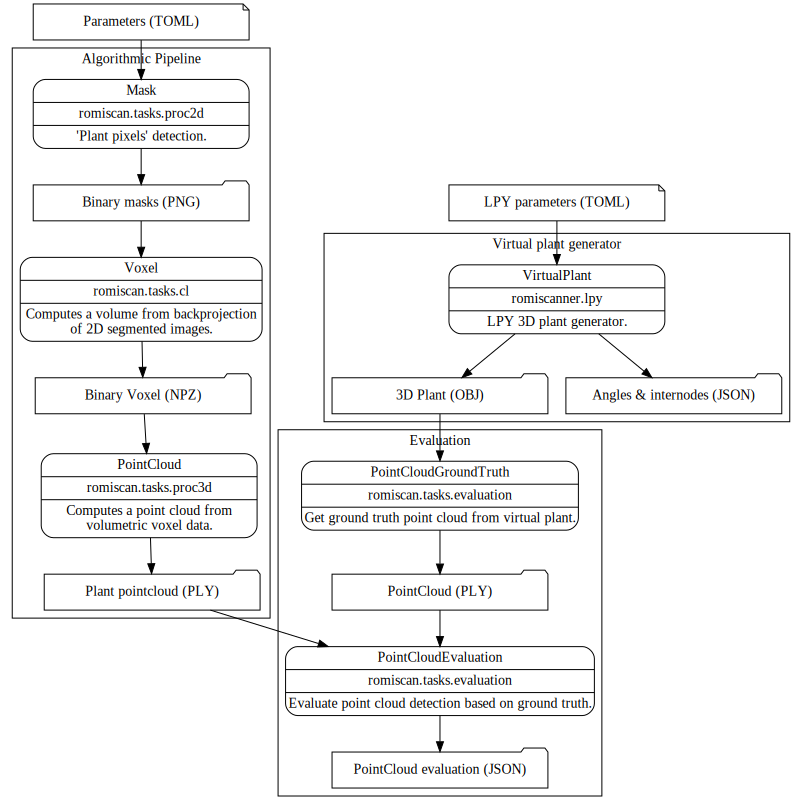

!!! warning
    This is a work in progress... the original author has no idea what he is doing!

## Legend

Let's start with a description of the used symbols:

- _Note shaped_ boxes are `RomiConfig`, they are TOML files that contains parameters for each task.
- _Round shaped_ boxes are `RomiTasks` with their name on the first level, then the module names (`--module` option in `romi_run_task`) and a quick description of the tasks at hand.
- _Folder shaped_ boxes are `RomiTarget`, they indicate files input/output and the file extension is given between parenthesis.

## Acquisitions

### Acquisition of real plant datasets

### Acquisition of virtual plant datasets

## Plant Reconstruction from RGB images

## 3D Plant Phenotyping

### Geometric approach

### Machine Learning approach

## Evaluation

### Mask task evaluation

### Voxel task evaluation

### PointCloud task evaluation

