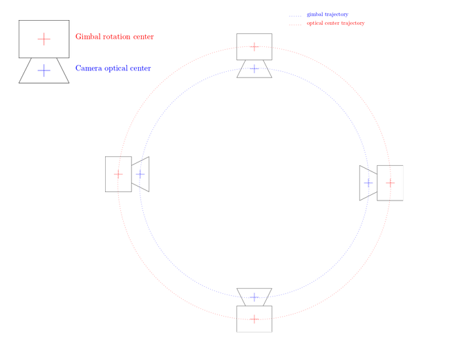
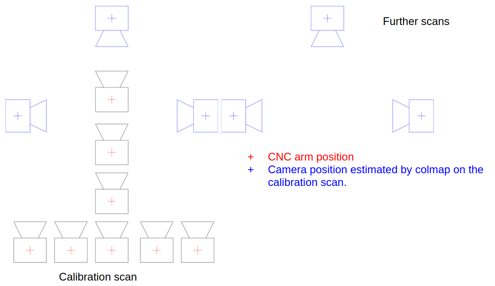

Extrinsic Image Calibration
=================

## Objective
Calibration is giving the right scale to your images and is thus crucial to perform measures from phenotyping imaging.

Scale (pixel size) is a priori unknown in a picture. In addition, some aspects of an hardware setup can create artefacts affecting scaling during 3D reconstruction. Hence, we developed a procedure of extrinsic calibration to scale 3D reconstructions to real world unit and correct possible artefacts induced by the configuration of our plant-imager robot.

In this tutorial, you will learn how to calibrate an image acquisition for downstream analysis and how to re-use a previously made calibration for an analysis, provided that the set-up is the same.

!!! Note
    Intrinsic calibration corrects possible defects induced by the lens of the camera. These type of defects are not addressed by this procedure.

## Prerequisite
*   Make sure that you installed all the ROMI software to run image acquisitions with the ROMI `Plant Imager` (explanation [here](../install/plant_imager_setup.md))

* install also [`plant-3d-vision`](/docs/Scanner/modules/plant_3d_vision.md) to perform the calibration.
  
 We highly recommend the use of dockers to run ROMI software. Details to build and run docker of the ROMI `Plant Imager` are [here](https://github.com/romi/plant-imager#docker)

*   Before reading this tutorial, you should first be able to run a basic acquisition without calibration, as explained in this [tutorial](../tutorials/hardware_scan.md).

*   set up a [database](../user_guide/data.md) or quickly generate a simple database with the following commands:

```shell
mkdir path/to/db
touch path/to/db/romidb
```
You have now your file-based romi database *plantdb*
## Principles of the extrinsic calibration performed here
The motor positions moving the camera along the acquisition path give a first indication of the scale of the picture, but this motor information is as accurate as the encoder allows them to be.

To have the closest scaling from reality, we use *[Colmap](https://colmap.github.io/)* (a structure-from-motion algorithm) at the very beggining of the 3d reconstructions (see [here](/docs/Scanner/user_guide/pipelines.md)): this technique allows to refine the positions of the camera given by the robot motors.
However, those computed positions are determined up to a scaling and roto-translation of the world and as a result, present a problem for measuring real world unit quantities. In addition, each camera pose is aligned with the corresponding CNC arm position. This can lead to a bias in scaling induced by the offset between the camera optical center and the CNC arm as represented in the following picture:    
{width=600 loading=lazy} 

It is particularly true when doing circular path (which is often the case with the phenotyping station). 
Indeed, because of that offset, the distance between 2 camera poses is bigger than it should be and as a result, the reconstructed the object is bigger than it is in real life (with a relative error of 2d / D). 
To correct that, a procedure has been developed to perform an extrinsic calibration and apply the results for further image acquisitions using the same hardware settings.

## Step-by-step tutorial

### 1. Calibration acquisition
Because the bias is mainly induced by making a circular path of image acquisition, one way to avoid it is to do a calibration acquisition with first a path constituted of two lines (two orthogonal lines in our case) followed by the path that will be used by other acquisitions.  

{width=600 loading=lazy}

To do so, run the task 'CalibrationScan' the same way as for a regular acquisition with the `romi_run_task` command, including your regular configuration file adapted to your plant imager (hereafter: `hardware.toml`).

In the command, define a folder inside your romi database (called above `plantdb`) that will store the data of this calibration acquisition:

```shell
romi_run_task --config config/hardware.toml \ #command and config
CalibrationScan \ # romi task
/path/to/plantdb/calibration_scan_id/ #data destination of this calibration scan 
```

!!! Note
    Run this command either in a docker container of the plant-imager or, if you install plant-imager in your system, do not forget to activate the appropriate virtual environment to make `romi_run_task` command accessible.


Colmap performance increases when several "recognizable" objects are present in the scene, so that the program easily defines matching reference points between overlapping images. We advise to put such objects in the scene for the calibration acquisition (they could be removed later)

### 2. Compute circular poses from path lines with Colmap

Thanks to the linear path added to the circular one, Colmap can now retrieve accurate poses with a proper scaling. Colmap can be easily run with romi software `plant-3d-vision`.

For such a run, a proper configuration file (.toml) is required. A [default one](https://github.com/romi/plant-3d-vision/tree/dev/config) is provided with `plant-3d-vision`, and accessible from your local git-cloned repository or in the repository included inside the docker container.


```shell
romi_run_task --config path/toconfig/geom_pipe_full.toml \ #command and path to config file
Colmap \ #the task Colmap
/path/to/plantdb/calibration_scan_id/ #data destination folder
```

!!! Note
    Run this command either in a docker container of `plant-3d-vision` or, if you install plant-imager in your system, do not forget to activate the appropriate virtual environment to make `romi_run_task` command accessible.


### 3. (re)Use the poses extracted from the calibration scan
Now, the calibrated poses can be used to properly scale 3d reconstruction each time an analysis is performed (full process detailed [here](reconstruct_scan.md)) on other image dataset.

To do so, just add in the *Colmap* section of the configuration *.toml* file for reconstruction:

```toml
[Colmap]
calibration_scan_id = "calibration_scan_id" #name of the folder containing calibration data
```

**Important**: 

    *   Calibration_scan_id and the other dataset to be analyzed must be in the same romi database.
    *   To be valid, calibration data can only be used if the camera position has not changed at all (tilt, etc...) in the robotic arm. For instance, a new calibration acquisition should be performed each time the camera is removed and replaced back on the arm.
