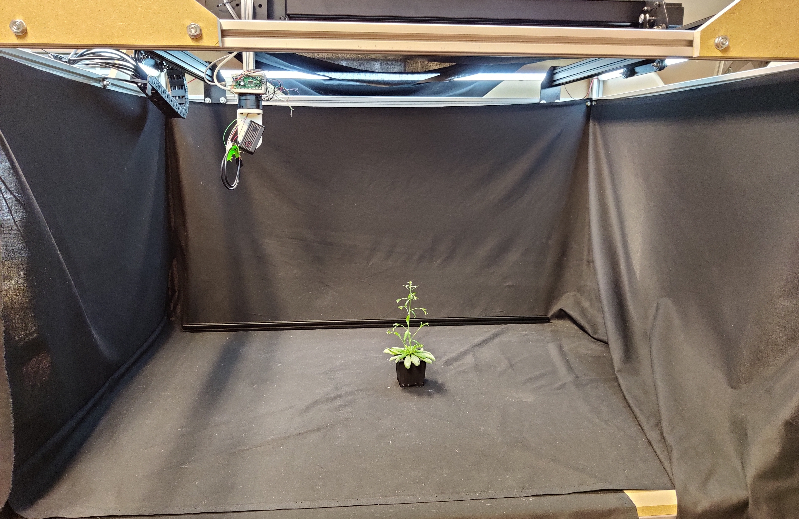

Plant Imager Bot
===

## Objective
This tutorial will guide through the steps of acquiring images of a plant using the `plant imager` robot  
{width=800 loading=lazy}  
In order to collect data in the process of plant phenotyping, the plant imager robot takes RGB images of an object following a particular path with precise camera poses.


## Prerequisite

To run an acquisition, you should previously have:

* built the scanner following the guidelines [here](../build/index.md)
* installed the necessary ROMI software [here](../install/plant_scanner_setup.md) 
  (make sure you are in the conda environment or that you run properly the docker for the `plantimager` repository)
* interfaced the machine running the ROMI software with the plant imager
  (main steps: 
    1. check it is correctly connected to the Gimball and CNC by USB link
    2. turn on camera and connect it to the device via wifi)
* set up a [DB](../user_guide/data.md) (or do the following steps)

To quickly retrieve an example DB you can use:
```bash
wget https://db.romi-project.eu/models/test_db.tar.gz
tar -xf test_db.tar.gz
```
This will create a `integration_tests` folder with a ready to use test database.  

You can also generate a simple database with the following commands:
```bash
mkdir path/to/db
touch path/to/db/db/romidb
```


## Step by step tutorial


### Running an acquisition with the `Scan` task

`Scan` is the basic task for running an acquisition with the robot.

A **default** configuration file for the plant imager can be found under `romiscanner/config/hardware.toml`.
It regroups :  
- specifications of the device setup (under the arguments linked to Scan.scanner)  
- parameters describing the acquisition path (detailed in Scan.path)  
- description of the object (in Scan.metadata)  
```toml
[Scan.scanner]
camera_firmware = "sony_wifi"
cnc_firmware = "grbl-v1.1"
gimbal_firmware = "blgimbal"

[Scan.scanner.scanner_args] # These are the kwargs passed to the scanner constructor
inverted = false

[Scan.scanner.camera_args] # These are the kwargs passed to the camera constructor
postview = true
device_ip = "10.0.2.66"
api_port = "10000"

[Scan.scanner.cnc_args] # These are kwargs passed to the CNC constructor
homing = true
port = "/dev/ttyUSB0"

[Scan.scanner.gimbal_args]
port = "/dev/ttyACM1"
has_tilt = false
zero_pan = 145

[Scan.scanner.camera_model] # This is a precalibrated camera model
width = 1616
height = 1080
id = 1
model = "OPENCV"
params = [ 1120.72122223961, 1120.72122223961, 808.0, 540.0, 0.0007513494532588769, 0.0007513494532588769, 0.0, 0.0,]

[Scan.scanner.workspace] # A volume containing the target scanned object
x = [ 200, 600,]
y = [ 200, 600,]
z = [ -100, 300,]

[Scan.path] # Example circular scan with 72 points:
type = "circular"

[Scan.path.args]
num_points = 3
radius = 350
tilt = 0.45 # rad
xc = 400
yc = 400
z = 0

[Scan.metadata]
key = value # Any metadata you want to add to the scan
```

!!! Warning
    This is a default configuration file. You will most probably need to create one to fit your hardware setup. 
    Check the acquisition configuration documentation for the [scan settings](../metadata/hardware_metadata.md) and for the [scanned object](../metadata/biological_metadata.md)

Assuming you have an active database, you can now run a scan using `romi_run_task`:
```bash
romi_run_task --config config/hardware.toml Scan /path/to/db/scan_id/
```
where:

- `/path/to/db` must be an existing FSDB database
- there is no `/path/to/db/scan_id` already existing in the database.

This will create the corresponding folder and fill it with images from the scan.


### Creation of a "scan"

Once the acquisition is done, the database is updated and we now have the following tree structure:
```
db/
├── scan_id/
│   ├── images/
│   ├── metadata/
│   │   └── images/
│   │   └── images.json
│   └── files.json
│   └── scan.json
└── romidb
```

with:

- `images` containing a list of RGB images acquired by the camera moving around the plant
- `metadata/images` a folder filled with json files recording the poses (camera coordinates) for each taken image  
- `metadata/images.json` containing parameters of the acquisition that will be used later in reconstruction (type of format for the images, info on the object and the workspace)
- `files.json` detailing the files contained in the scan
- `scan.json` a copy of the acquisition config file


You can now [reconstruct your plant in 3d](reconstruct_scan.md) !


## Troubleshooting

### Serial access denied
* Look [here](../build/troubleshooting.md#serial-access-denied) if you can not communicate with the scanner using usb.
* Make sure the device used to run the acquisition is well connected to the camera (wifi)
* Message to Gimball still transiting :

```bash
Traceback (most recent call last):
  File "/home/romi/miniconda3/envs/scan_0.8/lib/python3.8/site-packages/serial/serialposix.py", line 265, in open
    self.fd = os.open(self.portstr, os.O_RDWR | os.O_NOCTTY | os.O_NONBLOCK)
OSError: [Errno 16] Device or resource busy: '/dev/ttyACM0'
```
Try deconnect and reconnect the USB link and rerun a Scan