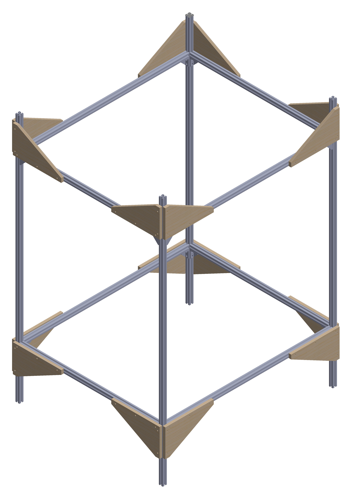

---
hide:
  - navigation # Hide navigation
  - toc        # Hide table of contents
---

# Robotics for micro-farms

ROMI is a four-year Europe-funded research project committed to promote a sustainable, local, and human-scale agriculture. It is developing an affordable, multipurpose platform adapted to support organic and poly-culture market-garden farms.

<table style="background-color: #ffffff; margin-top: 20px; margin-bottom: 20px; border-style: none;">

<tbody>

<tr>
    <td style="padding: 10px; vertical-align: center; text-align: center;">Plant Phenotyping</td>
    <td style="padding: 10px; vertical-align: center; text-align: center;">Crop Monitoring</td>
    <td style="padding: 10px; vertical-align: center; text-align: center;">Weeding</td>
</tr>

<tr>
<td style="width: 33%; vertical-align: center; text-align: center;">

</td>
<td style="width: 33%; vertical-align: center; text-align: center;">

</td>
<td style="width: 33%; vertical-align: center; text-align: center;">

</td>
</tr>

<tr>
<td style="vertical-align: top;">
Using the <i>Plant Imager</i> hardware & the <i>Plant 3D Vision</i> reconstruction software you can reliably quantify phenotypic traits of potted single plants. This technology is currently developed on <i>Arabidopsis thaliana</i>.
</td>

<td style="vertical-align: top;">
Awesome text to come.
</td>

<td style="vertical-align: top;">
The project description goes here!.
</td>

</tr>
</tbody>
</table>

