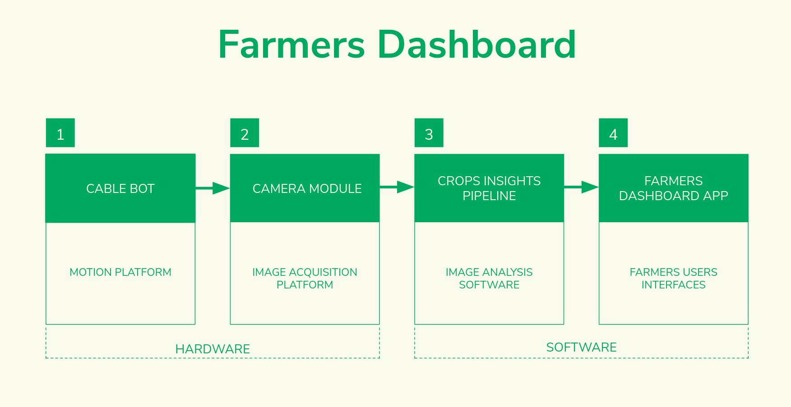
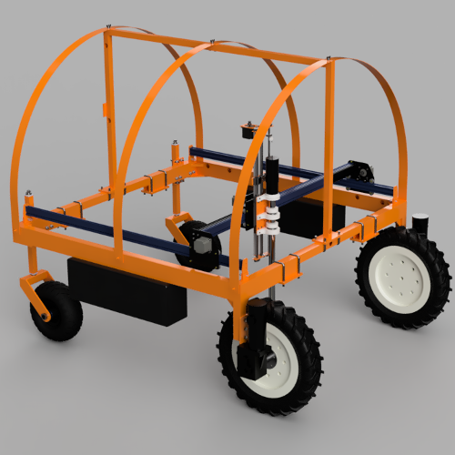

---
hide:

- navigation # Hide navigation
- toc # Hide table of contents

---

# Robotics for micro-farms

| Plant Phenotyping                           | Crop Monitoring                      | Rover                          |
| :-----------------------------------------: | :----------------------------------: | :----------------------------: |
| [{: style="width:350px"}](../plant_imager/) | [{: style="width:350px"}](../Farmers Dashboard/) | [{: style="width:350px"}](../Rover/)  |

## List of all modules

| Type         | Source code link                               |
| ------------ | ---------------------------------------------- |
| Hardware     | [Plant Imager :material-robot-excited-outline:](https://github.com/romi/plant-imager){ .md-button } [Cable Bot :material-camera-wireless-outline:](https://github.com/romi/romi-cablebot){ .md-button } [Rover :material-robot-mower-outline:](https://github.com/romi/romi-rover-build-and-test){ .md-button } |
| Storage      | [PlantDB :material-database-outline:](https://github.com/romi/plantdb){ .md-button } |
| Viewers      | [Plant 3D Explorer :material-file-tree-outline:](https://github.com/romi/plant-3d-explorer){ .md-button } [Farmers Dashboard :material-monitor-dashboard:](https://github.com/romi/farmers-dashboard){ .md-button } |
| Algorithms   | [Plant 3D Vision :material-pine-tree-box:](https://github.com/romi/plant-3d-vision){ .md-button } [romiseg :material-graph-outline:](https://github.com/romi/romiseg){ .md-button } [DTW :material-chart-timeline-variant-shimmer:](https://github.com/romi/dtw){ .md-button } |
| Third-party & wrapping | [romicgal :material-graphql:](https://github.com/romi/romicgal){ .md-button } |

