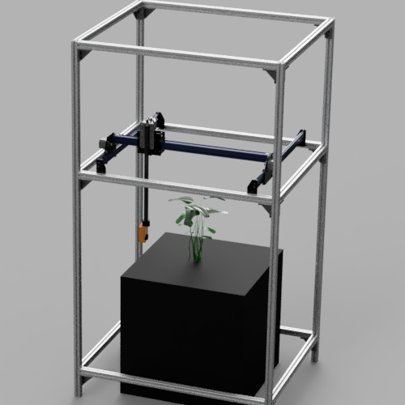
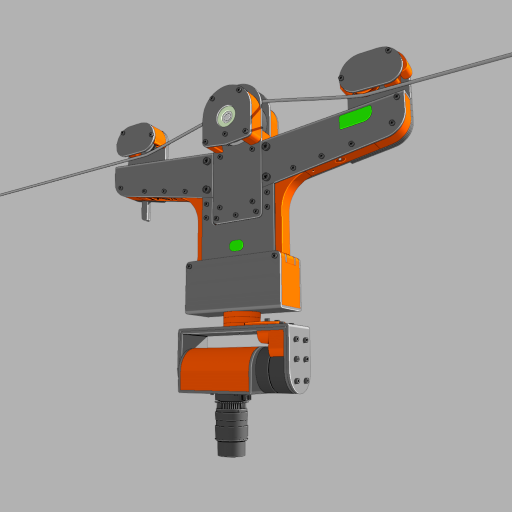

---
hide:
  - navigation # Hide navigation
  - toc        # Hide table of contents
---

# Robotics for micro-farms

ROMI is a four-year Europe-funded research project committed to promote a sustainable, local, and human-scale agriculture. It is developing an affordable, multipurpose platform adapted to support organic and poly-culture market-garden farms.

<table style="background-color: #ffffff; margin-top: 20px; margin-bottom: 20px; border-style: none;">

<tbody>

<tr>
    <td style="padding: 10px; vertical-align: center; text-align: center;">Plant Phenotyping</td>
    <td style="padding: 10px; vertical-align: center; text-align: center;">Crop Monitoring</td>
    <td style="padding: 10px; vertical-align: center; text-align: center;">Weeding</td>
</tr>

<tr>
<td style="width: 33%; vertical-align: center; text-align: center;">

</td>
<td style="width: 33%; vertical-align: center; text-align: center;">

</td>
<td style="width: 33%; vertical-align: center; text-align: center;">

</td>
</tr>

<tr>
<td style="vertical-align: top;">
Using the <i>Plant Imager</i> hardware & the <i>Plant 3D Vision</i> reconstruction software you can reliably quantify phenotypic traits of potted single plants. This technology is currently developed on <i>Arabidopsis thaliana</i>.
</td>

<td style="vertical-align: top;">
Awesome text to come.
</td>

<td style="vertical-align: top;">
The project description goes here!.
</td>

</tr>
</tbody>
</table>

## Complete list of modules

### Hardware
[Plant Imager :material-robot-excited-outline:](https://github.com/romi/plant-imager){ .md-button }
[Cable Bot :material-camera-wireless-outline:](https://github.com/romi/romi-cablebot){ .md-button }
[Rover :material-robot-mower-outline:](https://github.com/romi/romi-rover){ .md-button }

### Storage
[PlantDB :material-database-outline:](https://github.com/romi/plantdb){ .md-button }

### Viewers
[Plant 3D Explorer :material-file-tree-outline:](https://github.com/romi/plant-3d-explorer){ .md-button }
[Farmers Dashboard :material-monitor-dashboard:](https://github.com/romi/farmers-dashboard){ .md-button }

### Algorithms
[Virtual Plant Imager :material-camera-iris:](https://github.com/romi/virtual_plant_imager){ .md-button }
[Plant 3D Vision :material-pine-tree-box:](https://github.com/romi/plant-3d-vision){ .md-button }
[romiseg :material-graph-outline:](https://github.com/romi/romiseg){ .md-button }
[DTW :material-chart-timeline-variant-shimmer:](https://github.com/romi){ .md-button }

### Third-party & wrapping
[romicgal :material-graphql:](https://github.com/romi/romicgal){ .md-button }
