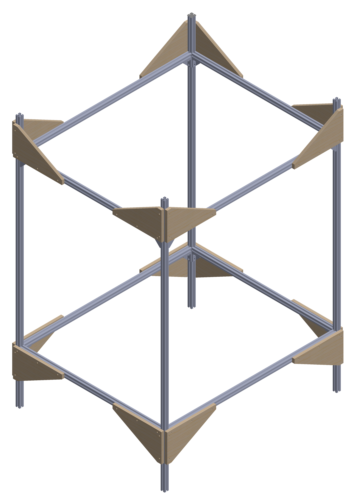

# Assembly instructions for the aluminium frame v2

!!! important
    All units are in millimeters!

## BOM

To assemble the aluminium frame you will need:

* 4x 1800mm 3030 profiles (**A**)
* 4x 1200mm 3030 profiles (**B**)
* 4x 1007mm 3030 profiles (**C**)
* 16x brackets (30x60) for 3030 profiles
* 64x M6 T-nuts
* 64x M6x12 screws

Note that:

* Parts **A** defines the height of the enclosure;
* Parts **B** & **C** depends on the external size of the chosen CNC frame!

## Assembly instructions

Start by assembling the smallest sides of the frame using two **A** parts & two **C** parts per side.
To ease the build, lay them flat on the floor.

1. Prepare all **A** parts with their brackets at the right position:

    <figure>
        
      <figcaption>Positioning the 30x60 brackets on the 1800mm 3030 profiles (A).</figcaption>
    </figure>

2. Add two **C** parts per side to construct the "small sides". Make sure they are horizontal.

3. Then add the two lower **B** parts & finally the two upper **B** parts.

    <figure>
        
      <figcaption>Assembled aluminium frame schematic & isometric view.</figcaption>
    </figure>

## Optional

Add wood corner brackets to rigidify the structure.

<figure>
    
  <figcaption>Assembled aluminium frame with wood corners schematic.</figcaption>
</figure>

<figure>
    
  <figcaption>Isometric view of assembled aluminium frame with wood corners.</figcaption>
</figure>

