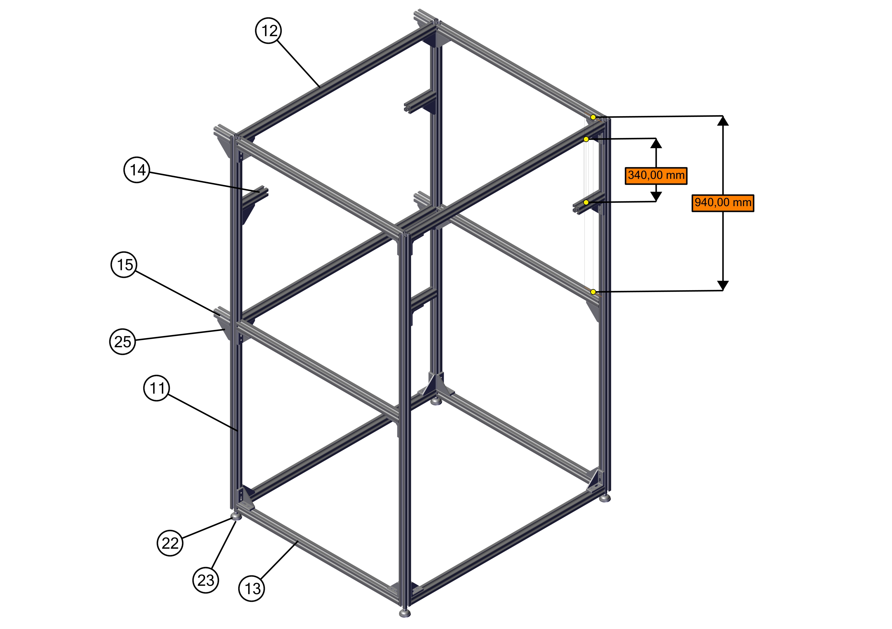

# Aluminium frame assembly

!!! important
    All units are in millimeters!

## BOM

| ID | Name                                                   | Qty | Off the shelf / Custom | Material  | Manufactureur | Serial number   | Link                                                                                                                                                                                                                                                                             |
|----|--------------------------------------------------------|-----|------------------------|-----------|---------------|-----------------|----------------------------------------------------------------------------------------------------------------------------------------------------------------------------------------------------------------------------------------------------------------------------------|
| 11 | Profil 40x40x2000                                      | 4   | Off the shelf          | Aluminium | Bosch Rexroth | 3842993120      | [rs-online.com](https://fr.rs-online.com/web/p/tubes-et-profiles-de-structures/4597205)                                                                                                                                                                                          |
| 12 | Profil 40x40x1200                                      | 5   | Off the shelf          | Aluminium | Bosch Rexroth |                 |                                                                                                                                                                                                                                                                                  |
| 13 | Profil 40x40x1006                                      | 6   | Off the shelf          | Aluminium | Bosch Rexroth |                 |                                                                                                                                                                                                                                                                                  |
| 14 | Profil 40x40x160                                       | 4   | Off the shelf          | Aluminium | Bosch Rexroth |                 |                                                                                                                                                                                                                                                                                  |
| 15 | Profil 40x40x100                                       | 4   | Off the shelf          | Aluminium | Bosch Rexroth |                 |                                                                                                                                                                                                                                                                                  |
| 22 | HINGED_FOOT                                            | 4   | Off the shelf          |           | Bosch Rexroth | 3842352061      | [rs-online.com](https://fr.rs-online.com/web/p/pieds-roulettes-et-brides-de-fixation/3902252)                                                                                                                                                                                    |
| 23 | DAMPING_RING_D44                                       | 4   | Off the shelf          |           | Bosch Rexroth | 3842521817      | [rs-online.com](https://fr.rs-online.com/web/p/supports-antivibratoires/0499245)                                                                                                                                                                                                 |
| 25 | brackets_ce-sb3680-8                                   | 30  | Off the shelf          |           | Bosch Rexroth | 3 842 529 005   | [faure-technologies.com](https://shop.faure-technologies.com/fr/3-842-529-005-equerre-de-fixation-nue-en-40x80-mm-pour-rainure-de-10-mm)                                                                                                                                         |
| 26 | Ecrou de butée pour rainure de 10 mm - Taraudage M8    | 220 | Off the shelf          |           | Bosch Rexroth | 3 842 345 081   | [faure-technologies.com](https://shop.faure-technologies.com/fr/3-842-345-081-ecrou-de-butee-pour-rainure-de-10-mm-taraudage-m8)                                                                                                                                                 |
| 27 | Vis à tête rectangulaire pour rainure de 10 mm - M8x25 | 220 | Off the shelf          |           | Bosch Rexroth | 3 842 528 718   | [faure-technologies.com](https://shop.faure-technologies.com/fr/3-842-528-718-vis-a-tete-rectangulaire-pour-rainure-de-10-mm-m8x25)                                                                                                                                              |
 
## Assembly

Assemble the frame to obtains the following structure:

{: style="width:800px"}

!!! note
    The 4 wall mountings, made of parts 15 & 25, are optional.

We suggest that you start by assembling the smaller sides, laying them on a flat floor to help you get a square structure.
Make sure that everything is **square** and **properly tightened** before moving to the next step!