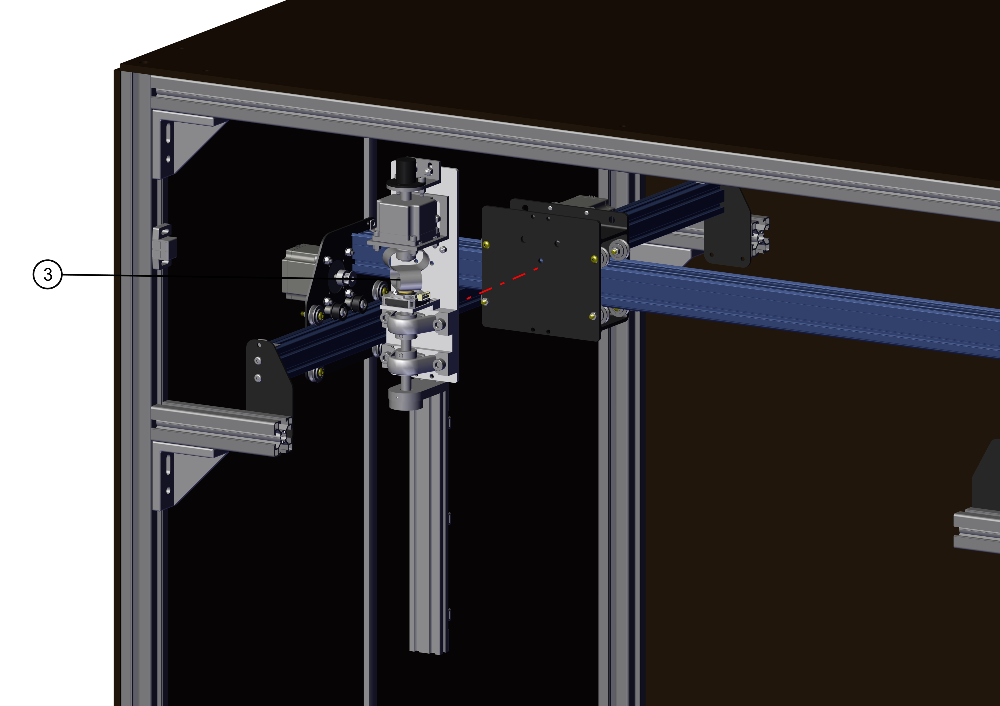

# Mounting the pan arm

## BOM

- 4x M5x16 flat head screw
- 4x M5 nuts.

## Assembly
Mount the pan arm to the X carriage of the X-carve CNC as follows:

!!! note
    Use the holes ot the x-carriage & arm mounting plate.