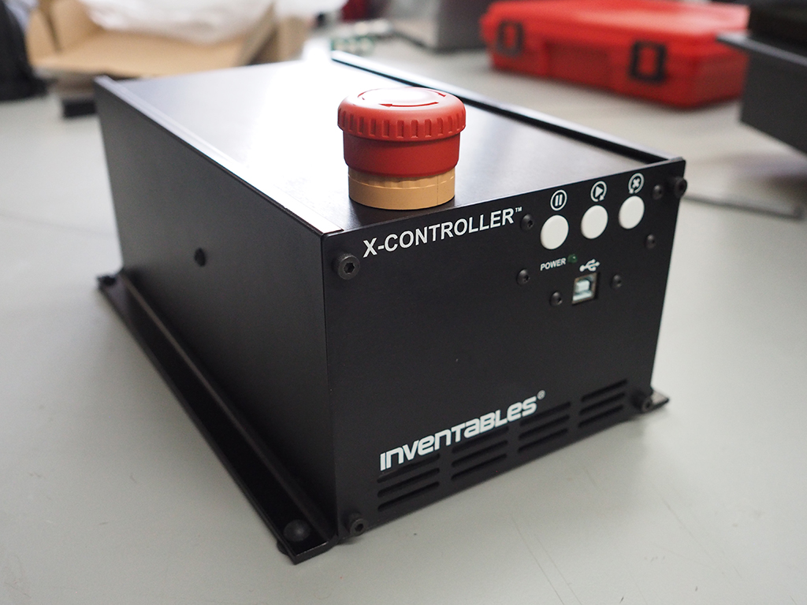

# Wiring of the X-Controller

## BOM

To assemble the X-Controller, you will need to buy one:

* US buy [here](https://www.inventables.com/technologies/x-carve/choose)
* EU buy [here](https://robosavvy.com/store/inventables-x-carver-1000mm-in-stock.html)

## Assembly

If you ordered the X-Controller, follow the official assembly instructions [here](https://inventables.gitbook.io/x-carve-assembly/x-controller).

!!! note
    This is what we used in our first and third version of the plant imager hardware.

!!! warning
    We replaced the default `Grbl` firmware by `Oquam`, our own implementation. See [here](flashing_oquam.md) for the instructions on how to flash this firmware to the X-Controller.

## Troubleshooting

### Parts

If you burn the X-Controller main board, you can buy a new one [here](https://www.inventables.com/technologies/x-controller-main-board).