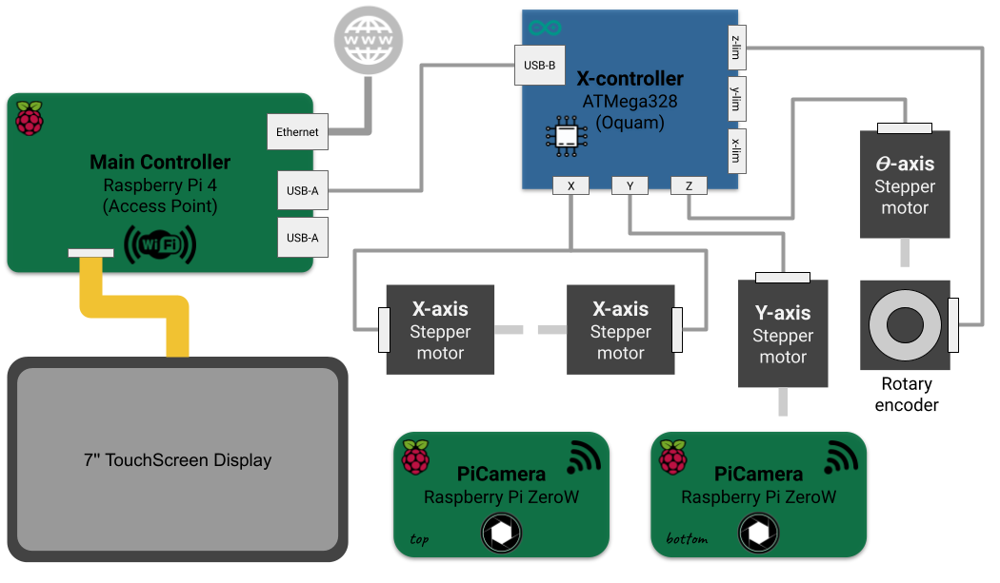

# Plant Imager communications

## Overview
We use a Raspberry Pi 4 as a "main controller" to:

1. attach a touchscreen to display and interact with the _Plant Imager_ user interface
2. control the CNC (with `Oquam`) over USB
3. create an access point
4. control the PiCamera(s)

It thus acts as an _Access Point_ (_a.k.a._ Hotspot) for the other devices, notably for the PiCamera(s) (Pi Zero W).

<figure>

  <figcaption>Overview of the connectivity for the Plant Imager v3.</figcaption>
</figure>

!!! Note
    The Ethernet connection is not mandatory, you may want to isolate this from the internet for security reasons!

## Access point
As the above schematic illustrate, in the following steps you will **create a local network**.

This will require to choose:

- an **SSID**, that is the name of the network the other devices will connect to
- a **password**, to restrict access to this network

For the sake of clarity, we will use:

- SSID: `Plant Imager`
- password: `my_secret_password!`

!!! warning
    Change the password as it is not so secret anymore, and use a strong one!

## RaspberryPi OS
As the above schematic illustrate, in the following steps you will **set up several Operating Systems**.

This will require to choose:

- a **username**, that is the name of the (admin) user
- a **password**, to restrict access to this device

For the sake of clarity, we will use:

- username: `romi`
- password: `my_raspberry!`

!!! warning
    Change the password as it is not so secret anymore, and use a strong one!
