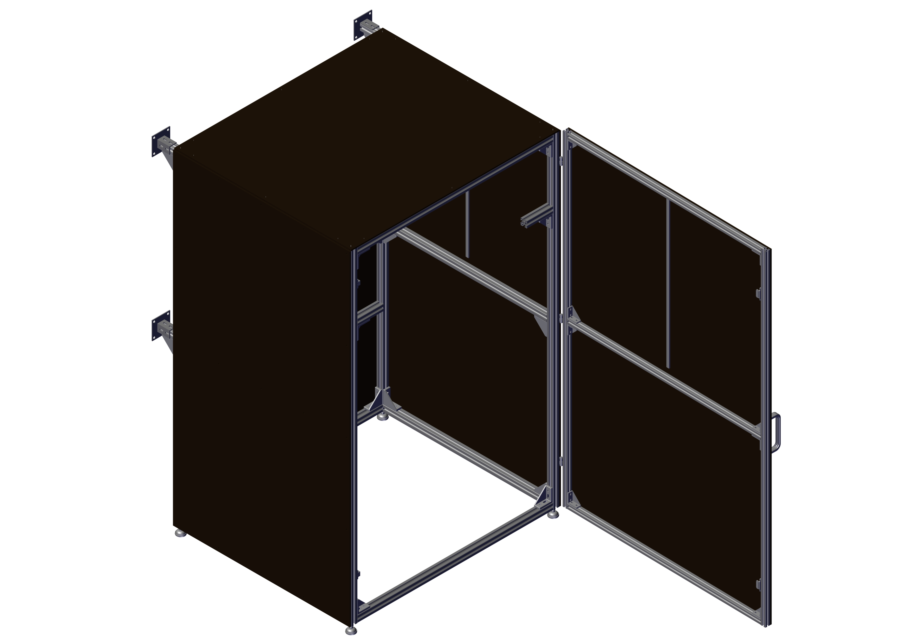

# Enclosure assembly

You can find the PDF with the BOM and assembly instructions for the enclosure [here](../../assets/images/plant_imager_v3/enclosure/Plant-imager_Box-BOM_Assembly.pdf).

!!! note
    You may want to change the orientation of the LED bars to horizontal to reduce shading by the CNC gantry.