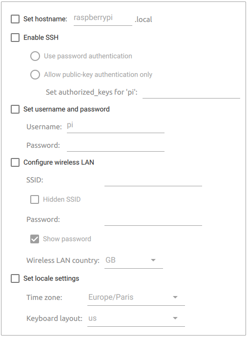

# Flashing RaspberryPi OS

To flash the OS on the microSD, have a look at the official Raspberry Pi OS instructions [here](https://www.raspberrypi.com/software/).

We strongly advise to use the **Raspberry Pi Imager** as it will allow you to set the hostname, create a user and its password prior to booting the RPi.

If you have access to `snaps`, use the `rpi-imager` package from the store:
```shell
sudo snap install rpi-imager
```
This will guarantee to get the latest version of the `imager` tool with the configurable **Advanced options**!

Here is a screenshot of the **Advanced options** for the _Raspberry Pi Imager v1.7.3_:



This will allow you to save a lot of time and efforts in the following steps, especially you will not have to connect a screen and keyboard to the device!