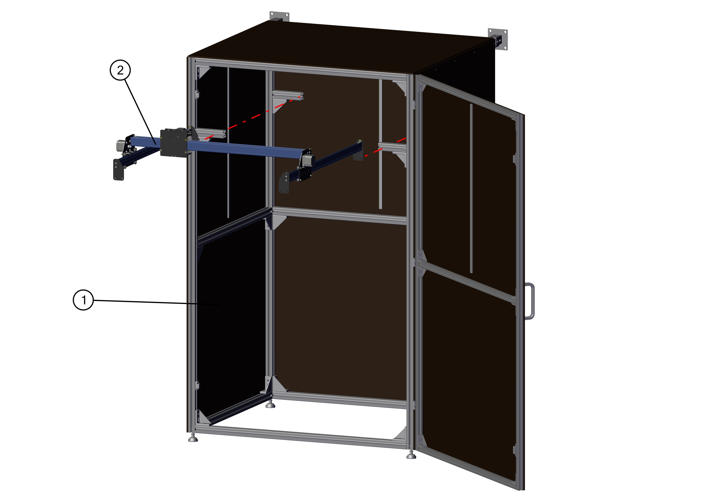

# Enclosure & CNC assembly

You may now put the X-Carve CNC into the enclosure as follows:

!!! note
    While the image above shows the CNC mounted in the aluminium frame with the wooden enclosure, it might be more practical to only mount the wooden panels AFTER mounting the CNC.