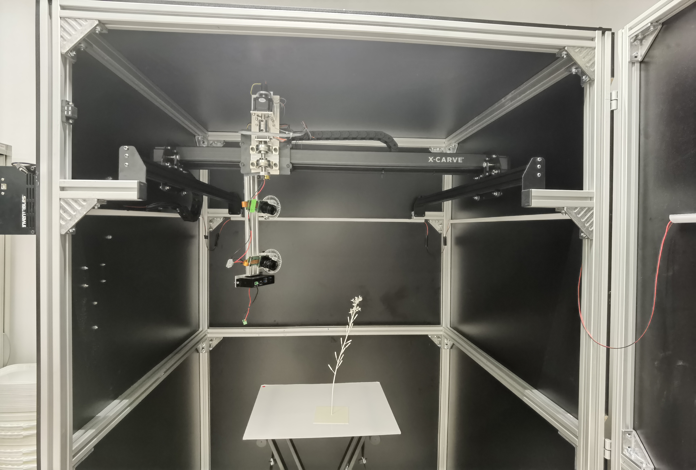

# Assembly instructions for the third version of the Plant Imager

This is the documentation for the third iteration of the plant imager hardware.
It aims at improving the overall quality of the build and to fix some limitations of the second iteration.

<figure>
  
  <figcaption>The Plant Imager v3 assembled at the RDP laboratory.</figcaption>
</figure>

## Rationale

Notable limitations of the second version of the plant imager hardware:

- unused z-axis motor in absence of a tilt motor
- camera powered by batteries (limited to RX-0)
- unstable control of the gimbal (due to usb cable length)
- wobbling camera arm and enclosure
- poor surrounding isolation, even when wrapped with opaque fabric
- no indication of camera tilt

Change list in this third version:

- conversion of the z-axis to pan-axis control
- manual z-axis control thanks to vertical ruler on arm and arrowhead on manual gimbal mount
- manual tilt control thanks to a 360° protractor and arrowhead on manual gimbal mount
- possibility to add a second picamera
- `oquam` firmware instead of `Grbl`
- complete wooden enclosure of the plant imager

## Assembly overview

You will have to achieve the following steps:

1. assemble the aluminium frame: [instructions](alu_frame.md)
2. assemble the X-Carve CNC, except Z-axis motor & arm: [instructions](cnc_frame.md)
3. attach the CNC to the aluminium frame: [instructions](frame_cnc.md)
4. add the wooden enclosure & the LED bars inside: [instructions](cnc_electronics.md)
5. assemble the X-Carve controller and attach it to the enclosure (left wooden panel at the same height as the X-Carve)
6. flash `oquam` firmware in place of `Grbl` on the X-Carve controller: [instructions](flashing_oquam.md)
7. wire the X-Carve CNC motors & endstops to the controller (except z-axis motor and endstop)
8. assemble the arm: [instructions](pan_arm.md)
9. attach the arm to the CNC X-Carriage: [instructions](cnc_arm.md)
10. assemble the manual gimbal: [instructions](manual_gimbal.md)
11. assemble the picamera: [instructions](picamera.md)
12. attach the picamera to the gimbal then to the pan arm
14. wire the pan encoder as z-endstop: [instructions](pan_electronics.md)

## Open Hardware

We use "widely available" materials and provides all the required information, so you can reproduce and modify our work.

If you want to modify it, please note the following important points:

1. The width and depth of the aluminium frame is dependent of the CNC frame size, make sure the CNC frame fits inside the aluminium frame!
2. The height of the aluminium frame will determine the maximum observable plant height.

## Wiring & communication overview

!!! todo
    Update this section!