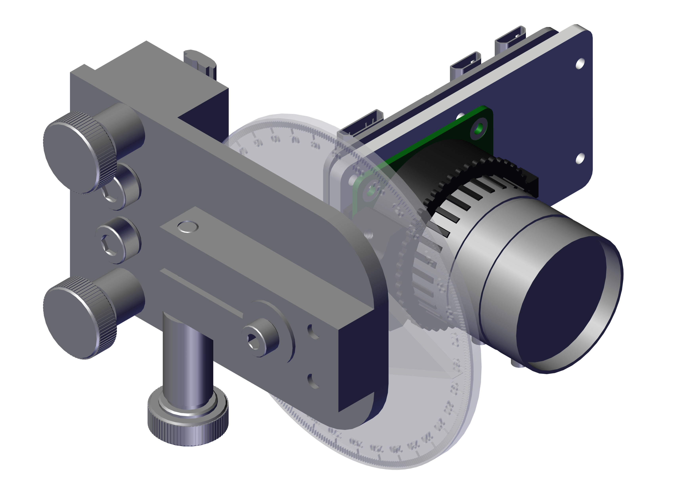
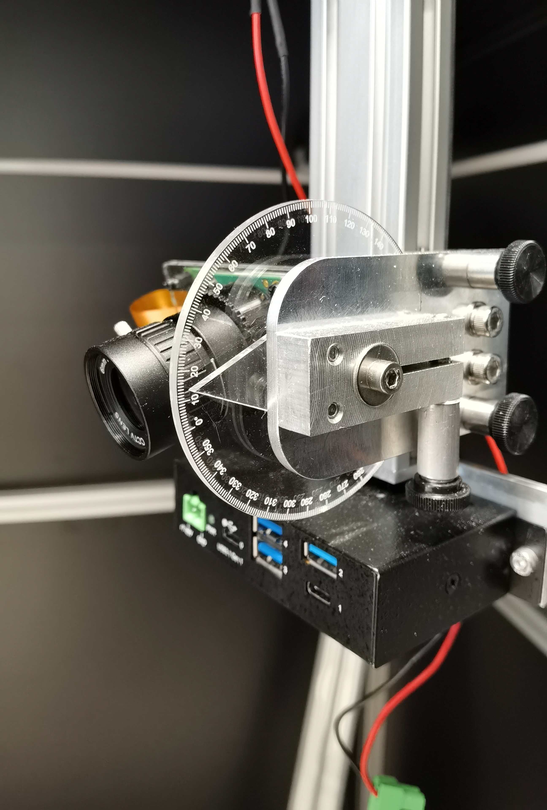

# Manual gimbal

<figure>
  
  <figcaption>CAD - Manual gimbal with 360° protractor & PiCamera.</figcaption>
</figure>

## BOM

To assemble a SINGLE manual gimbal, you will need the following list of materials:

| ID  | Name                              | Qty | Off the shelf / Custom | Material  | Manufacturer  | Serial number | Link                                                                                                                                                                                                                                                                     |
|-----|-----------------------------------|-----|------------------------|-----------|---------------|---------------|--------------------------------------------------------------------------------------------------------------------------------------------------------------------------------------------------------------------------------------------------------------------------|
| 1   | MG004                             | 1   | Custom                 | Aluminium |               |               | [pdf](../../assets/images/plant_imager_v3/manual_gimbal/MG004_Dessin.pdf)                                                                                                                                                                                               |
| 2   | MG009                             | 1   | Custom                 | Aluminium |               |               | [pdf](../../assets/images/plant_imager_v3/manual_gimbal/MG009_Dessin.pdf)                                                                                                                                                                                               |
| 3   | MG010                             | 1   | Custom                 | Aluminium |               |               | [pdf](../../assets/images/plant_imager_v3/manual_gimbal/MG010_Dessin.pdf)                                                                                                                                                                                               |
| 4   | MG012                             | 1   | Custom                 | Aluminium |               |               | [pdf](../../assets/images/plant_imager_v3/manual_gimbal/MG012_Dessin.pdf)                                                                                                                                                                                               |
| 5   | MG011                             | 1   | Custom                 | PMMA      | RS PRO        | 434-295       | [pdf](../../assets/images/plant_imager_v3/manual_gimbal/MG011_Dessin.pdf), [dxf](../../assets/images/plant_imager_v3/manual_gimbal/MG011.dxf), [rs-online.com](https://fr.rs-online.com/web/p/plaques-en-plastique/0434295)                                            |
| 6   | MG014                             | 1   | Custom                 | PMMA      |               |               | [dxf](../../assets/images/plant_imager_v3/manual_gimbal/MG014.dxf)                                                                                                                          |
| 8   | Protractor dial deg               | 1   | Custom                 | PMMA      |               |               | [dxf](../../assets/images/plant_imager_v3/manual_gimbal/Protractor_dial_deg_v2.dxf)                                                                                                                                                                                     |
| 9   | Spacer M5x8                       | 2   | Off the shelf          |           | Vis express   | 8470100818    | [vis-express.fr](https://www.vis-express.fr/fr/entretoise-cylindrique-lisse-inox-a2/319096-1953491-entret-cyl-lisse-10x8-diam-int-5-inox-3663072497689.html#/21-conditionnement-unitaire)                                                                                |
| 10  | Spacer M5x20                      | 1   | Off the shelf          |           | Vis express   | 8470102018    | [vis-express.fr](https://www.vis-express.fr/fr/entretoise-cylindrique-lisse-inox-a2/319101-1953511-entret-cyl-lisse-10x20-diam-int-5-inox-3663072501874.html#/21-conditionnement-unitaire)                                                                               |
| 11  | Bouton de serrage M5              | 3   | Off the shelf          |           | RS PRO        | 771-673       | [rs-online.com](https://fr.rs-online.com/web/p/boutons-de-serrage/0771673)                                                                                                                                                                                               |
| 12  | M5x40 Socket Head                 | 1   | Off the shelf          |           | RS PRO        | 293-353       | [rs-online.com](https://fr.rs-online.com/web/p/vis-a-six-pans/0293353)                                                                                                                                                                                                   |
| 13  | M5x30 Socket Head                 | 2   | Off the shelf          |           | RS PRO        | 290-130       | [rs-online.com](https://fr.rs-online.com/web/p/vis-a-six-pans/0290130)                                                                                                                                                                                                   |
| 14  | M5x12 Socket Head                 | 2   | Off the Shelf          |           | RS PRO        | 281-079       | [rs-online.com](https://fr.rs-online.com/web/p/vis-a-six-pans/0281079)                                                                                                                                                                                                   |
| 15  | M4x16 Flat Head                   | 2   | Off the Shelf          |           | RS PRO        | 171-837       | [rs-online.com](https://fr.rs-online.com/web/p/vis-a-six-pans/0171837)                                                                                                                                                                                                   |
| 16  | M4x12 Socket Head                 | 1   | Off the shelf          |           | RS PRO        | 281-035       | [rs-online.com](https://fr.rs-online.com/web/p/vis-a-six-pans/0281035)                                                                                                                                                                                                   |
| 17  | M3x8 Socket Head                  | 2   | Off the Shelf          |           | RS PRO        | 280-997       | [rs-online.com](https://fr.rs-online.com/web/p/vis-a-six-pans/0280997)                                                                                                                                                                                                   |
| 18  | Bosch nut                         | 2   | Off the Shelf          |           | Bosch Rexroth | 3842523142    | [rs-online.com](https://fr.rs-online.com/web/p/raccords-pour-elements-de-structure/4667297)                                                                                                                                                                              |
| 19  | Washer M4 L                       | 1   | Off the Shelf          |           | Vis express   | 3534000402    | [vis-express.fr](https://www.vis-express.fr/fr/rondelle-plate-serie-l-large-acier-nfe-25513/29531-1002784-rondelle-plate-m4x14x08-l-acier-zing-blanc-3663072058569.html#/21-conditionnement-unitaire)                                                                    |
| 20  | IGUS GTM-0818-020                 | 2   | Off the Shelf          |           | IGUS          | GTM-0818-020  | [amazon.fr](https://www.amazon.fr/GTM-0818-020-Roulement-support-r%C3%A9sistance-ouverture/dp/B08KG7VZRR/ref=sr_1_1?__mk_fr_FR=%C3%85M%C3%85%C5%BD%C3%95%C3%91&crid=19FJXDQWH1EPZ&keywords=igus+GTM-0818-020&qid=1642583634&sprefix=igus+gtm-0818-020%2Caps%2C53&sr=8-1) |

## Assembly

You can find the PDF with the BOM and assembly instructions for the manual gimbal [here](../../assets/images/plant_imager_v3/manual_gimbal/Manual_Gimbal-BOM_Assembly.pdf).

<figure>
  
  <figcaption>Manual gimbal with 360° protractor & PiCamera.</figcaption>
</figure>
