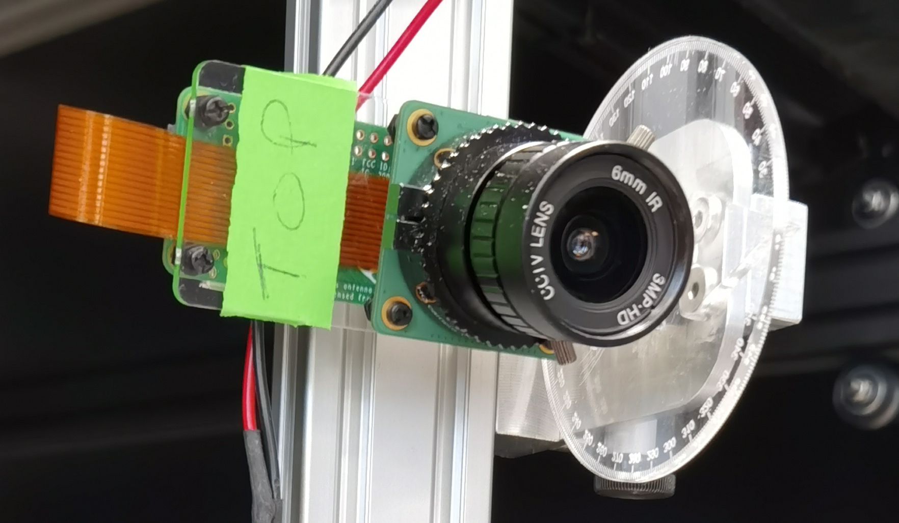

# PiCamera HQ

<figure>
  
  <figcaption>PiCamera.</figcaption>
</figure>

## BOM

To assemble a SINGLE PiCamera HQ, you will need the following list of materials:

| ID  | Name                              | Qty | Off the shelf / Custom | Material  | Manufacturer  | Serial number | Link                                                                                                                                                                                                                                                                     |
|-----|-----------------------------------|-----|------------------------|-----------|---------------|---------------|--------------------------------------------------------------------------------------------------------------------------------------------------------------------------------------------------------------------------------------------------------------------------|
| 7   | Mounting Plate Rpi Zero Hq Camera | 1   | Custom                 | PMMA      |               |               | [dxf](../../assets/images/plant_imager_v3/manual_gimbal/Mounting_Plate_Rpi_Zero_Hq_Camera_V3.dxf)                                                                                                                                                                       |
| 21  | RaspberryPiZeroW                  | 1   | Off the Shelf          |           |               |               | [kubii.fr](https://www.kubii.fr/home/2077-kit-pi-zero-w-kubii-3272496009509.html?search_query=kit+pi+zero&results=91)                                                                                                                                                    |
| 22  | Raspberry Pi HQ Camera            | 1   | Off the Shelf          |           |               |               | [kubii.fr](https://www.kubii.fr/raspberry-pi-microbit/2950-camera-hq-officielle-633696492738.html)                                                                                                                                                                       |
| 23  | 6mm CS-mount lens                 | 1   | Off the Shelf          |           |               |               | [kubii.fr](https://www.kubii.fr/raspberry-pi-microbit/2952-lentille-grand-angle-officielle-6mm-3272496301498.html)                                                                                                                                                       |
| 24  | Ribbon cable                      | 1   | Off the Shelf          |           |               |               | [kubii.fr](https://www.kubii.fr/cameras-accessoires/1830-cable-pour-camera-pi-zero-edition-kubii-3272496006768.html)                                                                                                                                                     |
| 25  | 5mm M2.5 nylon screws             | 8   | Off the Shell          |           |               |               | [thepihut.com](https://thepihut.com/products/mounting-plate-for-high-quality-camera?variant=31867507048510)                                                                                                                                                              |

## Assembly

!!! todo
    Write assembly instructions!
