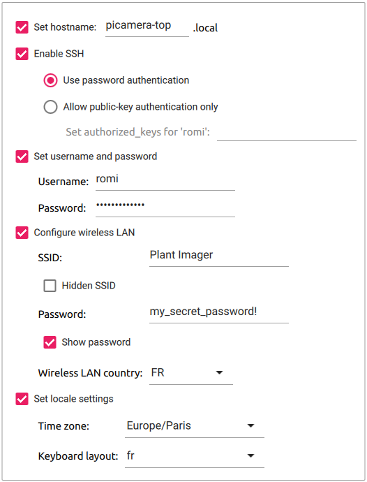

# PiCamera - Software setup

## Flash Raspbian Lite OS

The procedure to flash the Raspberry Pi OS on the microSD card AND to set up the necessary options is:

1. Open the `Imager` app
2. Choose the OS, we use the `Raspberry Pi OS Lite (32bit)` as we have an PiZW
3. Select the storage device (microSD)
4. Click the "Advanced options" icon (bottom right)
   1. "Set hostname" to `picamera`, add a number or another indication if you plan to have more than one 
   2. "Enable SSH" to "Use password authentication"
   3. "Set username and password" to `romi` and `my_raspberry!`
   4. "Configure wireless LAN" to:
      - SSID: `Plant Imager`
      - password: `my_secret_password!`
      - Set the "Wireless LAN country"
   5. Change the "locale settings" to match yours
5. Finally, hit the "Write" button to flash the OS to the microSD.

!!! important
    We use the **32bit** version with the **Raspberry Pi OS Lite** NOT Desktop!.

!!! important
    Do NOT forget to replace the (not so) secret password by the one you used!

You should end up with something like this:




## Manually setting the advanced options
Hereafter we show how to manually define the _advanced options_ after flashing the OS without defining any.
This requires to boot the RPi with a screen and keyboard.

!!! warning
    There is **NO NEED** to do this if you have followed the previous instructions on how to configure the advanced options prior to flashing the microSD card!

The first time you boot your RPi with your new image, you can follow the steps of the "Welcome" screen:

* Select a country, language, keyboard layout, timezone.
* Connect to a Wi-Fi network, here our access point:
  * SSID: `Plant Imager`
  * password: `my_secret_password!`
* Change the default user `pi` and password `raspberry` to:
  * user: `romi` 
  * password: `my_raspberry!`.
* (Optional) Update packages to their newest version, this OBVIOUSLY requires an internet connexion.

!!! important
    Do NOT forget to replace the (not so) secret password by the one you used!


### 1. Set the `hostname`
We strongly advise to give a specific `hostname` to each device to avoid having the all named `raspberrypi`.

!!! Important
    RFCs mandate that a hostname's labels may contain only the ASCII letters 'a' through 'z' (case-insensitive), the digits '0' through '9', and the hyphen.
    Hostname labels cannot begin or end with a hyphen.
    No other symbols, punctuation characters, or blank spaces are permitted.

Choose an option, then reboot the RPi!

=== "raspi-config"
    It is possible to set the `hostname` with the `raspi-config` tool, in a terminal:
    ```shell
    sudo raspi-config
    ```
    Then move to `1 System Options > S4 Hostname`.
    Enter the desired hostname, _e.g._ `picamera`, and hit `<OK>`.

=== "command-line"
    It is possible to set the `hostname` manually by changing `/etc/hostname` & `/etc/hosts` with:
    ```shell
    export NEW_HNAME="picamera"
    sudo sed "s/raspberrypi/$NEW_HNAME/" /etc/hostname
    sudo sed "s/raspberrypi/$NEW_HNAME/" /etc/hosts
    ```


### 2. Enable SSH
Enabling SSH allows to easily connect to all the devices (connected to the `Plant Imager` Access Point) using a terminal.

!!! warning
    This represents a security risk if you do not change the default user `pi` and password `raspberry` or use a weak password!

=== "raspi-config"
    It is possible to enable SSH with the `raspi-config` tool, in a terminal:
    ```shell
    sudo raspi-config
    ```
    Then move to `5 Interfacing Options > P2 SSH`, and select `<Yes>`.

=== "command-line"
    It is possible to enable SSH with `systemctl`, in a terminal:
    ```shell
    sudo systemctl enable ssh    
    sudo systemctl start ssh    
    ```

Once the `picamera` device is connected to a network, you can SSH to this device using a machine connected to the same network.
You will need the IP address of the device you want to connect to.
It is accessible in a terminal with:
```shell
hostname -l
```

### 3. Set username and password
If at the first boot you did NOT change the default `pi` user & `raspberry` password you can still do it as follows:

1. Create the user `romi` with:
    ```shell
    sudo adduser romi
    ```
    This will also create the home directory for this user and ask for a password.
2. Add this user to `dialout`, `video` & `sudo` groups with:
    ```shell
    sudo adduser romi dialout
    sudo adduser romi video
    sudo adduser romi sudo
    ```
3. Remove the default `pi` user with:
    ```shell
    sudo deluser --remove-home pi
    ```

### 4. Configure wireless LAN

=== "raspi-config"
    It is possible to configure the wireless LAN with the `raspi-config` tool, in a terminal:
    ```shell
    sudo raspi-config
    ```
    Then move to `1 System options > S2 Wireless LAN`, then enter your SSID `Plant Imager` and password `my_secret_password!`.

=== "command-line"
    You can edit the `wpa_supplicant.conf` file to add the `Plant Imager` network information.
    Copy/paste the next lines in your favorite editor, change the `psk`, then copy/paste this in the terminal:
    ```shell
    cat << EOF >> /etc/wpa_supplicant/wpa_supplicant.conf
    network={
      ssid="Plant Imager"
      psk="my_secret_password!"
    }
    EOF
    ```
    This will add the lines 2 to 5 to the end of the `wpa_supplicant.conf` file.

!!! important
    Do NOT forget to replace the (not so) secret password by the one you used!

### 5. Change the locale settings

=== "raspi-config"
    It is possible to change the locale settings with the `raspi-config` tool, in a terminal:
    ```shell
    sudo raspi-config
    ```
    Then move to `5 Localisation Options`, then set `L1 Locale`, `L2 Timezone`, `L3 Keyboard` and `L4 WLAN country`.

=== "command-line"
    It is possible to change the locale settings with the `dpkg-reconfigure` tool, in a terminal:
    ```shell
    sudo dpkg-reconfigure locales
    ```
    Then follow the instructions in the terminal prompt. 


## ROMI software
We will now set up the necessary ROMI software to enable the camera and make the PiCamera device communicate with the main controller.
Notably to be able to capture the images upon request by the _Plant Imager_ main controller.

### Install requirements
To install the requirements, in a terminal simply run:
```shell
sudo apt install build-essential cmake git libpng-dev libjpeg9-dev
```

We also deactivate something useless in our case (dynamic linker):
```shell
sudo mv /etc/ld.so.preload /etc/ld.so.preload.bak
```

### Clone the sources
To clone the sources from the ROMI GitHub repository, simply run:
```shell
git clone --branch ci_dev --recurse-submodules https://github.com/romi/romi-rover-build-and-test.git
```

!!! note
    The `--recurse-submodules` option will automatically initialize and update each submodule in the repository.

### Compile the sources
Then move to the cloned `romi-rover-build-and-test` directory and compile the `romi-camera` app with:
```shell
cd romi-rover-build-and-test
mkdir build
cd build
cmake ..
make romi-camera
```

### Test the `romi-camera` app
Assuming:

* everything went well in the previous steps
* you are connected to the `Plant Imager` network
* the `rcom-registry` app is running on the `plant-imager` controller see [here](https://docs.romi-project.eu/plant_imager/build_v3/plantimager_controller/#configure-rcom)
* you want to register a camera named `camera-top`
* it has an HQ (v2) camera lens

You can test the `romi-camera` app with:
```shell
./bin/romi-camera --registry 10.10.10.1 --topic camera-top --camera-version hq --mode still --width 2028 --height 1520 &
```

### Automatically enable the `romi-camera` app at startup
To activate the `romi-camera` app at startup, we add the previous command to `/etc/rc.local` as follows:
```shell
cat << EOF >> /etc/rc.local

sudo -u romi /home/romi/romi-rover-build-and-test/build/bin/romi-camera --registry 10.10.10.1 --topic camera-top --camera-version hq --mode still --width 2028 --height 1520 &
EOF
```

This assumes you have created a romi user, if not, change the `romi`:

* in `sudo -u romi` to the correct username
* in `/home/romi` to the correct username

!!! todo
    The use of `rc.local` is obsolete... use `systemd` instead!