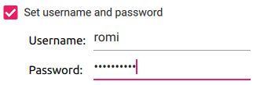

# Plant Imager controller

We use a Raspberry Pi 4 as a "main controller" to:
1. control the CNC (with Oquam) over USB
2. create a local Wi-Fi network

It thus acts as an _access point_ for other devices, notably for the PiCamera(s) (Pi Zero W).

## Initial setup

### Flash Raspberry Pi OS

To flash the OS on the microSD, have a look at the official Raspberry Pi OS instructions [here](https://www.raspberrypi.com/software/).

We strongly advise to use the **Raspberry Pi Imager** as it will allow you to set the hostname, create a user and its password prior to booting the RPi.

If you have access to `snaps`, use the `rpi-imager` package from the store:
```shell
sudo snap install rpi-imager
```
This will guarantee to access the latest version of the `imager` tool with the configurable options!

Then the procedure to install and configure is as follows:

1. Open the `Imager` app
2. Choose the OS, we use the `Raspberry Pi OS (64bit)` as we have an RPi4
3. Select the storage device
4. Click the "Advanced options" icon (bottom right)
   1. Click "Set hostname" and set it to `plant-imager` 
   2. Click "Set username and password" and set it to `romi` (or something else) and use a password 
   3. Optionally set the "locale settings"
   4. Hit the "Save" button (this should close the "Advanced options" windows and go back to the main one)
5. Finally, hit the "Write" button to flash the OS to the microSD.


#### Manually change the `hostname`
We strongly advise to give a specific `hostname` to each device to avoid having the all named `raspberrypi`.

Choose option A OR B, then reboot the RPi!

!!! Important
    RFCs mandate that a hostname's labels may contain only the ASCII letters 'a' through 'z' (case-insensitive), the digits '0' through '9', and the hyphen.
    Hostname labels cannot begin or end with a hyphen.
    No other symbols, punctuation characters, or blank spaces are permitted.

###### A. Using `raspi-config`
It is possible to change the hostname with the `raspi-config` tool:
```shell
sudo raspi-config
```
Then move to `1 System Options > S4 Hostname`.
Enter the desired hostname, _e.g._ `plant-imager`, and hit `<OK>`.

###### B. Command-line
For example, we want to rename our first _romi-camera_ `plant-imager`.
We can do so by changing `/etc/hostname` & `/etc/hosts` with:
```shell
export NEW_HNAME="plant-imager"
sudo sed "s/raspberrypi/$NEW_HNAME/" /etc/hostname
sudo sed "s/raspberrypi/$NEW_HNAME/" /etc/hosts
```


#### Manually create the `romi` user
Boot the RPi, login with the default `pi` user & `raspberry` password.
Then create the user `romi` with:
```shell
sudo adduser romi
```
This will also create the home directory for this user and ask for a password.

!!! Warning
    We should probably give instructions to remove the default `pi` user, or at least to remove it from the `sudo` group?!
    `sudo deluser --remove-home pi`


### Add the `romi` user to groups

Add this user to `dialout`, `video` & `sudo` groups with:
```shell
sudo adduser romi dialout
sudo adduser romi video
sudo adduser romi sudo
```


### Rotate the 7'' touchscreen
To rotate the 7'' touchscreen, with an RPi 4 and the latest Raspberry OS:

1. Hit the raspberry main menu
2. Got to `Preference` > `Screen Configuration`
3. On the `Screen Layout Editor` menu bar, hit `Configure`, select `Screens` > `DSI-1` > `Orientation` and select `inverted`.
4. Hit the "Green check" icon :material-check-outline: to validate!
5. It should ask you to reboot to apply changes.


## Install `Oquam`

### Install the system requirements
To install the system requirements, simply run:
```shell
sudo apt install build-essential cmake git libpng-dev libjpeg-dev
```

### Clone the sources
To clone the sources from the ROMI GitHub repository, simply run:
```shell
git clone --branch ci_dev --recurse-submodules https://github.com/romi/romi-rover-build-and-test.git
```

!!! note
    The `--recurse-submodules` option will automatically initialize and update each submodule in the repository.

### Compile the sources
Then move to the cloned directory and compile the `oquam` app with:
```shell
cd romi-rover-build-and-test
mkdir build
cd build
cmake ..
make oquam
```


## Configure the controller to act as a hotspot
To configure the RPi4 to act as a hotspot you may use the `network-hotspot-setup.sh` CLI, as root:
```shell
sudo bash tests-hardware/network-hotspot-setup.sh  --ssid "Plant Imager" --pwd "my_secret_password!"
```

This will:

- install the required dependencies
- configure the routing tables
- set the name of the SSID
- set the password to use to connect to the hotspot

!!! important
    Change the password as it is not so secret anymore!


## Install the `plant-imager`

### Install system requirements
You will need python and pip, that can be easily installed as follows:
```shell
sudo apt update
sudo apt install python3 python3-pip
```

### Add the user's private `bin` to the `$PATH`
We have to add a few lines to the `.bashrc` file so the locally installed Python library are available.

To do so, simply copy/paste the following lines in the terminal:
```shell
cat<<EOF >> ~/.bashrc

# set PATH so it includes user's private bin if it exists
if [ -d "$HOME/.local/bin" ] ; then
    PATH="$HOME/.local/bin:$PATH"
fi
EOF
```

### Clone the sources
To clone the `plant-image` sources from the ROMI GitHub repository, simply run:
```shell
cd  # Move back to the user home directory
git clone --branch dev_lyon --recurse-submodules https://github.com/romi/plant-imager.git
```

!!! note
    The `--recurse-submodules` option will automatically initialize and update each submodule in the repository.

### Install the sources
Then move to the cloned directory and install the `plant-imager` Python library and its submodules (`plantdb` & `romitask`) with:
```shell
# Don't forget to activate the environment!
cd plant-imager
# Install `plantdb` requirements & sources from submodules:
python -m pip install -r ./plantdb/requirements.txt
python -m pip install -e ./plantdb/
# Install `romitask` sources from submodules:
python -m pip install -e ./romitask/
# Install `plant-imager`:
python -m pip install -e .
```

### Test the installation
To test the installation of the Python libraries you can run:
```shell
python -c "import plantdb"
python -c "import romitask"
python -c "import plantimager"
```

If no error message is returned, you are all set with this part, well done!