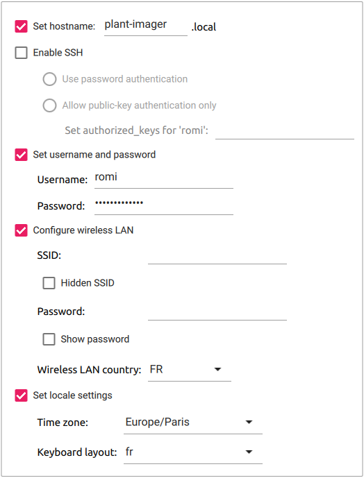

# Plant Imager controller

This section use a RaspberryPi 4 with RaspbianOS as the main controller.

## BOM
The bill of material is quite simple:

- Raspberry Pi 4B [4GB](https://secure.reichelt.com/fr/en/raspberry-pi-4-b-4x-1-5-ghz-4-gb-ram-wlan-bt-rasp-pi-4-b-4gb-p259920.html) or [8GB](https://secure.reichelt.com/fr/en/raspberry-pi-4-b-4x-1-5-ghz-8-gb-ram-wlan-bt-rasp-pi-4-b-8gb-p276923.html)
- Power supply, 5.1 V, 3.0 A, USB Type-C [like this](https://secure.reichelt.com/fr/en/raspberry-pi-power-supply-5-1-v-3-0-a-usb-type-c-eu-plug--rpi-ps-15w-wt-eu-p260026.html)
- 7" TFT LCD TouchScreen 800x480 [like this](https://www.reichelt.com/fr/en/7-tft-lcd-touch-display-800-x-480-pixel-raspberry-pi-7td-p159859.html)
- 7" TouchScreen case [like this](https://www.reichelt.com/fr/en/housing-for-raspberry-pi-4-amp-7-touch-display-rpi4-case-lcd7bk-p268976.html)
- a microSD card, with a minimum of 8Go

## Flash Raspberry Pi OS
The procedure to install and configure is as follows:

1. Open the `Imager` app
2. Choose the OS, we use the `Raspberry Pi OS (64bit)` as we have an RPi4
3. Select the storage device (microSD)
4. Click the "Advanced options" icon (bottom right)
   1. "Set hostname" to `plant-imager`, add a number or another indication if you plan to have more than one 
   2. Do NOT "Enable SSH", except if you know what you are doing!
   3. "Set username and password" to `romi` and `my_raspberry!`
   4. Do NOT "Configure wireless LAN", except the "Wireless LAN country", as we will later create an Access Point!
   5. Change the "locale settings" to match yours
5. Finally, hit the "Write" button to flash the OS to the microSD.

!!! important
    We use the **64bit** version with the **Raspberry Pi Desktop** NOT "Lite" as we want to use it to display a user interface.

!!! important
    Do NOT forget to replace the (not so) secret password by the one you used!

You should end up with something like this:



## Manually setting the advanced options
Hereafter we show how to manually define the _advanced options_ after flashing the OS without defining any.
This requires to boot the RPi with a screen and keyboard.

!!! warning
    There is **NO NEED** to do this if you have followed the previous instructions on how to configure the advanced options prior to flashing the microSD card!

The first time you boot your RPi with your new image, you can follow the steps of the "Welcome" screen:

* Select a country, language, keyboard layout, timezone.
* Do NOT connect to a Wi-Fi network!
* Change the default user `pi` and password `raspberry` to:
  * user: `romi` 
  * password: `my_raspberry!`.
* (Optional) Update packages to their newest version, this OBVIOUSLY requires an internet connexion.

!!! important
    Do NOT forget to replace the (not so) secret password by the one you used!


### 1. Set the `hostname`
We strongly advise to give a specific `hostname` to each device to avoid having the all named `raspberrypi`.

!!! Important
    RFCs mandate that a hostname's labels may contain only the ASCII letters 'a' through 'z' (case-insensitive), the digits '0' through '9', and the hyphen.
    Hostname labels cannot begin or end with a hyphen.
    No other symbols, punctuation characters, or blank spaces are permitted.

Choose an option, then reboot the RPi!

=== "raspi-config"
    It is possible to set the `hostname` with the `raspi-config` tool, in a terminal:
    ```shell
    sudo raspi-config
    ```
    Then move to `1 System Options > S4 Hostname`.
    Enter the desired hostname, _e.g._ `plant-imager`, and hit `<OK>`.

=== "command-line"
    It is possible to set the `hostname` manually by changing `/etc/hostname` & `/etc/hosts` with:
    ```shell
    export NEW_HNAME="plant-imager"
    sudo sed "s/raspberrypi/$NEW_HNAME/" /etc/hostname
    sudo sed "s/raspberrypi/$NEW_HNAME/" /etc/hosts
    ```

### 2. Enable SSH
Enabling SSH allows to connect to the `plant-imager` device from any machine connected to the `Plant Imager` Access Point.

!!! warning
    This represents a security risk if you do not change the default user `pi` and password `raspberry` or use a weak password!

=== "raspi-config"
    It is possible to enable SSH with the `raspi-config` tool, in a terminal:
    ```shell
    sudo raspi-config
    ```
    Then move to `5 Interfacing Options > P2 SSH`, and select `<Yes>`.

=== "command-line"
    It is possible to enable SSH with `systemctl`, in a terminal:
    ```shell
    sudo systemctl enable ssh    
    sudo systemctl start ssh    
    ```

Once the `plant-imager` device will reboot, you can SSH to this device using a machine connected to the same network.
You will need the IP address of the `plant-imager` device.
It is accessible in a terminal with:
```shell
hostname -l
```
It should be `10.10.10.1`.


### 3. Set username and password
If at the first boot you did NOT change the default `pi` user & `raspberry` password you can still do it as follows:

1. Create the user `romi` with:
    ```shell
    sudo adduser romi
    ```
    This will also create the home directory for this user and ask for a password.
2. Add this user to `dialout`, `video` & `sudo` groups with:
    ```shell
    sudo adduser romi dialout
    sudo adduser romi video
    sudo adduser romi sudo
    ```
3. Remove the default `pi` user with:
    ```shell
    sudo deluser --remove-home pi
    ```


### Rotate the 7" touchscreen
To wire the 7" touchscreen you can follow these [instructions](https://www.instructables.com/Raspberry-Pi-Touchscreen-Setup/).
Some people says that there is no need to wire SCL & SDA... Do what you want!

If you are using the 7" touchscreen with the case we described in the BOM, you may notice it is rotated by 180°.
To rotate the 7" touchscreen, with an RPi 4 and the latest Raspberry OS:

1. Hit the raspberry main menu
2. Got to `Preference` > `Screen Configuration`
3. On the `Screen Layout Editor` menu bar, hit `Configure`, select `Screens` > `DSI-1` > `Orientation` and select `inverted`.
4. Hit the "Green check" icon :material-check-outline: to validate!
5. It should ask you to reboot to apply changes.


## Install requirements

### Oquam requirements

#### Install the system requirements
To install the system requirements, simply run:
```shell
sudo apt install build-essential cmake git libpng-dev libjpeg-dev
```

### Python requirements

#### Install system requirements
You will need `python3` and `pip`, that can be easily installed as follows:
```shell
sudo apt update
sudo apt install python3 python3-pip ipython3
```

#### Add the user's private `bin` to the `$PATH`
We have to add a few lines to the `.bashrc` file so the locally installed Python library are available.

To do so, simply copy/paste the following lines in the terminal:
```shell
cat<<EOF >> ~/.bashrc

# set PATH so it includes user's private bin if it exists
if [ -d "$HOME/.local/bin" ] ; then
    PATH="$HOME/.local/bin:$PATH"
fi
EOF
```


## ROMI software

### Install `Oquam`

#### Install the system requirements
To install the system requirements, simply run:
```shell
sudo apt install build-essential cmake git libpng-dev libjpeg-dev
```

#### Clone the sources
To clone the sources from the ROMI GitHub repository, simply run:
```shell
git clone --branch ci_dev --recurse-submodules https://github.com/romi/romi-rover-build-and-test.git
```

!!! note
    The `--recurse-submodules` option will automatically initialize and update each submodule in the repository.

#### Compile the sources
Then move to the cloned directory and compile the `oquam` app with:
```shell
cd romi-rover-build-and-test
mkdir build
cd build
cmake ..
make oquam
```


### Configure the controller to act as a hotspot
To configure the RPi4 to act as a hotspot you may use the `network-hotspot-setup.sh` CLI, as root:
```shell
sudo bash tests-hardware/network-hotspot-setup.sh --wlan wlan0 --ssid "Plant Imager" --pwd "my_secret_password!"
```

This will:

- install the required dependencies
- configure the routing tables
- set the name of the SSID
- set the password to use to connect to the hotspot

!!! important
    Change the password as it is not so secret anymore!


### Configure `rcom`

```shell
cd romi-rover-build-and-test
git submodule init  # if not done yet (empty 'rcom' directory)
git submodule update
cd build
cmake ..
make rcom-registry
```

Start `rcom-registry`:
```shell
./bin/rcom-registry
```

Power the Picamera, you should see a message when it connects to the AP!

### Configure live-preview
You have to install and configure `apache2`.

Let's start by installing the requirements:
```shell
sudo apt install apache2
```

Change `DocumentRoot` in `/etc/apache2/sites-enabled/000-default.conf` to `/home/romi/romi-rover-build-and-test/applications/romi-monitor/`

Also add:
```shell
        <Directory /home/romi/romi-rover-build-and-test/applications/romi-monitor/>
                   Options Indexes
                   AllowOverride None
                   Require all granted
        </Directory>
```
Then restart the `apache2.service` with `systemctl`:
```shell
sudo systemctl restart apache2.service
```

Finally, on the controller, open a web browser (Chromium on the RPi) at `10.10.10.1/camera.html`.
Then scroll down to hit the "connect" icon.
If the PiCamera is ON, you should now see something!

It's now time to adjust the lens! GOOD LUCK!

### Install the `rcom` Python library
The `librcom` library offer a Python library.

Install it as follows:
```shell
cd ~/romi-rover-build-and-test/librcom/python
python -m pip install -r requirements.txt
python -m pip install -e .
```

### Install the `romi` Python library
The `romi-rover-build-and-test` library offer a Python library to communicate with Oquam.

Install it as follows:
```shell
cd ~/romi-rover-build-and-test/python
python -m pip install -e .
```

### Install the `plant-imager` Python library

#### Clone the sources
To clone the `plant-imager` sources from the ROMI GitHub repository, simply run:
```shell
cd  # Move back to the user home directory
git clone --branch dev_lyon --recurse-submodules https://github.com/romi/plant-imager.git
```

!!! note
    The `--recurse-submodules` option will automatically initialize and update each submodule in the repository.

#### Install the sources
Then move to the cloned directory and install the `plant-imager` Python library and its submodules (`plantdb` & `romitask`) with:
```shell
# Don't forget to activate the environment!
cd plant-imager
# Install `plantdb` requirements & sources from submodules:
python -m pip install -r ./plantdb/requirements.txt
python -m pip install -e ./plantdb/
# Install `romitask` sources from submodules:
python -m pip install -r ./romitask/requirements.txt
python -m pip install -e ./romitask/
# Install `plant-imager`:
python -m pip install -e .
```

#### Test the installation
To test the installation of the Python libraries you can run:
```shell
python -c "import plantdb"
python -c "import romitask"
python -c "import plantimager"
```

If no error message is returned, you are all set with this part, well done!
