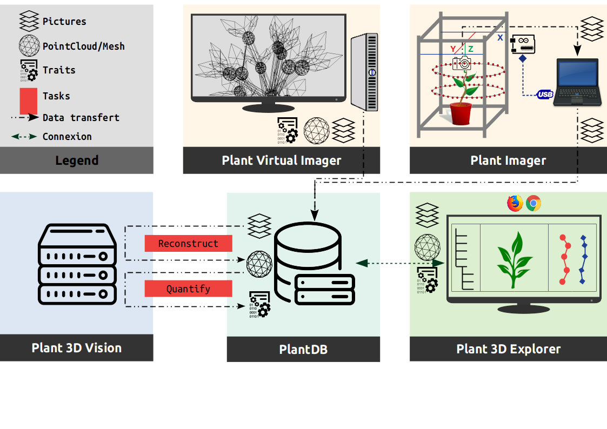

# Overview of the modules interactions

The following figure shows a use case of the ROMI modules, and the way they interact, to design an efficient plant phenotyping platform used in research.

## PlantDB
It implements our _database system_ and is totally **independent** of the rest since it could be uses in other parts of the ROMI project (Rover, Cable bot, ...) through the abstract class `DB` or even the local database class `FSDB`.

## Plant Imager
It requires a **physical connection** to the hardware (`pyserial`) to control.
It also needs an active ROMI database (PlantDB) to export acquired datasets (plant images).

## Virtual Plant Imager
It requires a connection to an active ROMI database (PlantDB) to export generated datasets (virtual plant images).
In case of machine learning methods, the database would also provide training datasets and trained models.

## Plant 3D Vision
It requires connection to an active ROMI database (PlantDB) to import the dataset to process and export the results.
Two plant reconstruction approaches are available:

1. **Geometry based**: try to infer the plant's geometry using structure from motion algorithms and space carving to first reconstruct a point cloud.
2. **Machine learning based**: try to infer the plant's geometry using semantic (organ) segmentation of pictures and space carving to first reconstruct a labelled point cloud.

Then meshing and skeletonization finally enables to extract the plant's phyllotaxis.

## Plant 3D Explorer

It requires an active ROMI database (PlantDB) with datasets to browse and represent.
