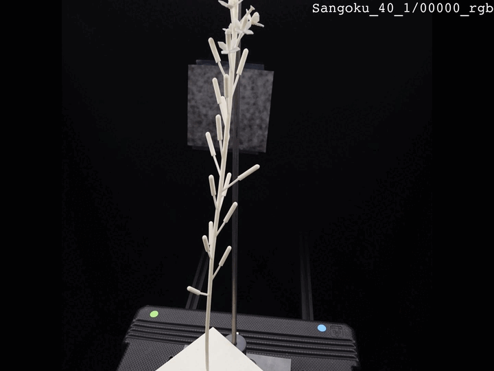

# Known strengths and limitations

The way we designed the _Plant Imager_ and the software has strengths but also some limitations.
We try to cover those we are aware of in the following section.

## Open loop design

### The problem
The motors we use function in an _open loop_ manner, that is: we send and series of instructions to the motors, telling them how many steps we want and in which direction to performs them... and we hope for the best.

Indeed, contrary to a _feedback loop_ design, there is no way of knowing if those instruction were followed accurately.
This _open loop_ design might seem unfortunate or inadequate but this is actually a lot cheaper and widely used in robotics.

As there is a user standing next to the _Plant Imager_ you might expect her/him to notice any mistake made by the robot.
This is simply not true and not a good approach to tackling the problem.

### The visual proof
I have performed a series of 5 repetitions of the very same acquisitions, without changing a thing between each of them.
To my knowledge, everything went fine, but this is what I got when I cycled through the pictures taken at the same position (the first one):

As you can see, most of the images looks exactly the same, and if it was not for the frame indicator on the top right we would not notice the change.
However, we can clearly see that one frame, `Sangoku_40_1`, has a small offset compared to the others.

### The solution
As the accuracy of the camera positions is not perfect, we have to resort to _Structure from Motion_ algorithm to compensate for those imperfections.

## Intrinsic calibration procedure

### The problem
Every camera need a lens to capture the luminous signals.
However, the cheaper the camera, the cheaper the lens and the more likely it will induce deformations to the image due to imperfections.

### The solution
We developed an intrinsic calibration procedure to compensate for lens aberrations.
We use OpenCV and a ChArUco board to accurately estimate and correct them.