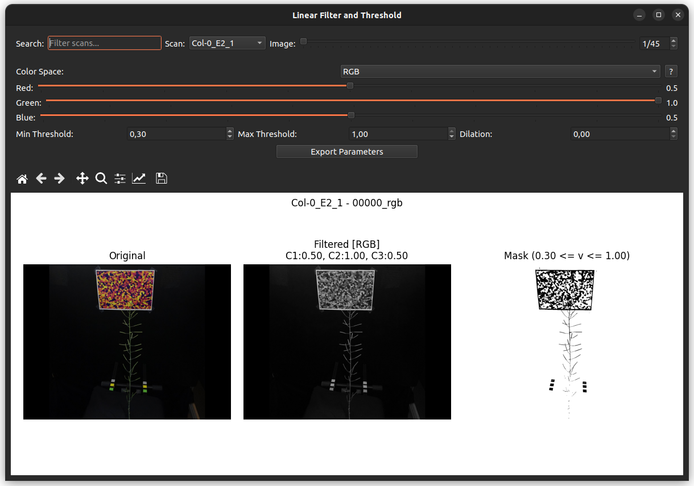

## How to Choose Linear Coefficients and Threshold Parameters for Plant‑Mask Generation

**Goal**: Find a set of channel‑mix coefficients (`C₁, C₂, C₃`) and a
`min_threshold` that isolate the plant in a binary mask for your specific imaging setup.



---

### 1. Launch the GUI

```shell
conda activate plant3dvision
linear_filter            # starts the app
```

If you already have an image you want to test, you can also start the app with the path:

```shell
linear_filter path/to/image.jpg
```

---

### 2. Load an Image

1. Click **Load Image**.
2. In the file‑dialog, navigate to the folder that contains one of the images from your dataset and select it.

The original picture appears on the left panel of the display area.

---

### 3. Pick a Color Space (optional)

The dropdown **Color Space** lets you work in **RGB** (default), **HSV**, or **YCbCr**.

* Use **RGB** for most plant‑imaging cases.
* Switch to **HSV** or **YCbCr** only if the plant colors are not well separated in RGB (e.g., strong hue shifts).

---

### 4. Tune the Channel Coefficients

Three horizontal sliders control the contribution of each color channel (values = 0 – 1).

| Slider | Default label                      | Typical plant‑specific advice                           |
|--------|------------------------------------|---------------------------------------------------------|
| **C₁** | Red / Hue / Luminance              | Increase if the plant appears reddish or yellowish.     |
| **C₂** | **Green** / Saturation / Blue‑diff | **Keep at 1.0** for healthy green foliage.              |
| **C₃** | Blue / Value / Red‑diff            | Reduce to suppress background sky or water reflections. |

!!! Tips
    As you move a slider, the **Filtered** image (centre panel) updates instantly, letting you see how the grayscale intensity changes.

!!! Remember
    This is an additive RGB color model, see [Wikipedia](https://en.wikipedia.org/wiki/RGB_color_model#Additive_colors) for detailed explanations.

---

### 5. Set the Threshold Range

Two spin boxes control the binary mask:

* **Min Threshold**: lower bound (default 0.30).
* **Max Threshold**: upper bound (default 1.00).

Start by leaving **Max Threshold** at 1.00 and move **Min Threshold** downward until the plant silhouette is fully visible but background noise is minimized.
Inversely, if the mask becomes too sparse, lower the value slightly.

The **Mask** panel on the right shows the resulting binary image in real time.

---

### 6. Iterate Until Satisfied

1. Adjust the three coefficients **and** the `min_threshold` as described above.
2. Observe the three panels (Original | Filtered | Mask).
3. Confirm that:

    * The whole plant (including stems) appears white in the mask.
    * Unwanted bright artifacts (e.g., specular highlights) are either removed or acceptable for downstream analysis.

4. When the result looks good on the first image, repeat the same parameter set on a second image from the same dataset to verify robustness.
   Small illumination changes may require a modest tweak of the**Min Threshold**.

---

### 7. Record the Final Parameters

Write down the three channel coefficients and the chosen `min_threshold` (and `max_threshold` if you changed it).
Use these values in your reconstruction TOML configuration file.

---

### Quick Reference (cheat‑sheet)

| Control              | How to adjust                 | When to change                                                     |
|----------------------|-------------------------------|--------------------------------------------------------------------|
| **Color Space**      | Drop‑down menu                | Plant  color not well separated in RGB                             |
| **Red / Hue / Y**    | Slider (0–1)                  | Plant has significant red/yellow component                         |
| **Green / Sat / Cb** | Slider (0–1)                  | Keep at **1.0** for typical green foliage                          |
| **Blue / Val / Cr**  | Slider (0–1)                  | Reduce to suppress background blues                                |
| **Min Threshold**    | Spin box (0.0–1.0, step 0.01) | Increase to cut background, decrease to fill gaps                  |
| **Max Threshold**    | Spin box (0.0–1.0, step 0.01) | Rarely needed; keep at 1.0 unless you want to clip bright outliers |

By following these focused steps, you’ll quickly arrive at a reliable linear‑mix and threshold configuration that isolates your plant for downstream analysis.
Happy masking!