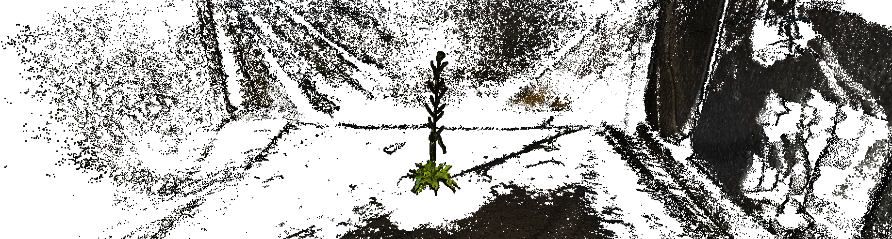

---
hide:
  - toc
---
# Plant Phenotyping

**Within the ROMI project, some work packages are oriented towards the development of a 3D plant phenotyping platform adapted to single potted plants.
To achieve this goal, the team developed a suite of affordable open-source tools (hardware & software) presented hereafter.**

{loading=lazy}

We aim at making our software architecture modular to ensure the required flexibility and adaptability to most of the robotic & research applications from the ROMI project when possible.

The flowchart belows indicate how the various modules and parts of the ROMI software interact:
<!-- Use https://mermaid.live to live edit -->

## List of Python modules

Hereafter we list the Python module used in the _Plant Imager_ project:

[plant-imager :material-robot-excited-outline: :material-blender-software:](https://github.com/romi/plant-imager){ .md-button } to control the _Plant Imager_ hardware, generates virtual plants and image them with the _Virtual Plant Imager_.

[plantdb :material-database-outline:](https://github.com/romi/plantdb){ .md-button } the database to host and serve images and processed data.

[plant-3d-explorer :material-file-tree-outline:](https://github.com/romi/plant-3d-explorer){ .md-button } to visualize the images and processed data.

[plant-3d-vision :material-pine-tree-box:](https://github.com/romi/plant-3d-vision){ .md-button } to reconstruct the RGB images into 3D models and to quantify phylotaxis from 3D models

[romiseg :material-graph-outline:](https://github.com/romi/romiseg){ .md-button } for semantic labelling of plants. 

[romicgal :material-graphql:](https://github.com/romi/romicgal){ .md-button } wrapper around CGAL for triangulation and skeletonization.

[romitask :octicons-command-palette-16:](https://github.com/romi/romitask){ .md-button } defines the tasks and the command-line-interface (CLI) `romi_run_task`.

[dtw :material-chart-timeline-variant-shimmer:](https://github.com/romi/dtw){ .md-button } to align sequences, notably angles and internodes obtained from phylotaxis measurements. 

## Usage

We provide tutorials explaining the usage of out various tools and how-to detailing the algorithms at work for each task.  

[Tutorials :material-school-outline:](tutorials/index.md){ .md-button }
[How-to :simple-jupyter:](how_to/index.md){ .md-button }
