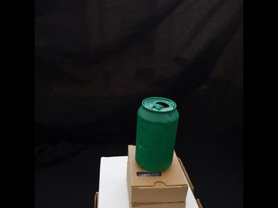
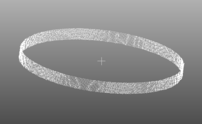

Evaluation-related tasks
===

These tasks require the definition of a *ground truth*.

## EvaluationTask

This is the base (abstract) evaluation task.

## PointCloudSegmentationEvaluation

## PointCloudEvaluation

## Segmentation2DEvaluation

## VoxelsEvaluation


## CylinderRadiusEvaluation
Thanks to ground truth derived from virtual plants data, most of the reconstruction tasks can be properly evaluated.
However, the acquisition made by the plant imager can not be assessed with virtual ground truth and needs some from real world with an adapted comparison method.  
The 2 main outputs of the plant imager are a set of images and the corresponding positions from the robotic arm.
Those data are used later in the reconstruction pipeline, therefore their precision can be evaluated by the precision of the reconstructed object.
The evaluation of this acquisition component will be described in this section.

### Objective
The goal here is to be able to evaluate the precision of an acquisition by comparing the measurement of a specific trait in an actual object with the same feature in its reconstruction.
One basic shape that can often be encountered in plants is the cylinder (stem are often cylindrical, and sometimes so are fruits). 
It has been therefore chosen as model from which to extract main characteristics (as the height or the radius).
In this evaluation we focused on the radius estimation.  
The several steps are:  

* Make an acquisition of a cylindrical object  
* Generate a point cloud from the collected images  
* Estimate the radius of the reconstructed object and compare it with the "ground truth" radius  


### Prerequisite

* install romi `plant-imager` (from [source](https://github.com/romi/plant-imager) or using a [docker image](../docker/plantimager_docker.md) ) & read [install procedure](../install/plant_imager_setup.md)
* install romi `plant-3d-vision` (from [source](https://github.com/romi/plant-3d-vision) or using a [docker image](../docker/plantinterpreter_docker.md)) & read [install procedure](../install/plant_reconstruction_setup.md)
* Create and activate isolated python environment (see the procedure [here](../../install/create_env.md) )

### Step-by-step tutorial

#### 1. Image a cylindrical object  
In order to have a precise measurement of the object radius, it can be a good idea to use manufactured items with a calibrated size.
In our case we chose to evaluate our plant imager with a can.

!!! Note
    Be careful to be able to detect your object from the background in the future reconstruction process. 
    Different segmentation methods are described [here](../explanations/segmentation.md) and as we use the "Binary segmentation" algorithm the can has been painted in a very tasteful green.  
    {loading=lazy}  


The procedure to take images is described in the [plant imager tutorial](../tutorials/hardware_scan.md) but here are the basic steps:  

* DB creation  
```shell
mkdir path/to/db
touch path/to/db/romidb
```
* Run an acquisition with the `Scan` task, and a `hardware.toml` configuration file in the newly created DB  
```shell
romi_run_task Scan /path/to/db/imageset_id/ --config plant-imager/config/hardware.toml
```
* The `imageset_id` fileset is now filled :  
```
db/
├── imageset_id/
│   ├── files.json
│   ├── images/
│   ├── metadata/
│   │   └── images/
│   │   └── images.json
│   └── scan.toml
└── romidb
```

As for the `AnglesAndInternodes` measurement, in order for the `CylinderRadiusEvaluation` to retrieve the ground truth radius value, it must be added manually in a `imageset_id/measures.json` file:
```json
{
  "radius":7.95
}
```

#### 2. Point cloud reconstruction 
The next step is to compute a point cloud from the acquired data.
As before, the full explanation of the operations concerning the reconstruction pipeline can be found in [this tutorial](../tutorials/reconstruct_scan.md) but mainly are:
```shell
romi_run_task PointCloud /path/to/db/imageset_id/ --config plant-3d-vision/config/pipeline.toml
```

Resulting an equivalent of this tree structure (depending on the used configuration file):
```
db/
├── imageset_id/
│   ├── Colmap__/
│   ├── files.json
│   ├── images/
│   ├── Masks__/
│   ├── measures.json
│   ├── metadata/
│   │   └── images/
│   │   └── images.json
│   ├── pipeline.toml
│   ├── PointCloud__/
│   ├── scan.toml
│   ├── Undistorted__/
│   └── Voxels__/
└── romidb
```

!!! Note
    Be sure to obtain a proper reconstructed cylinder (as maybe a section of the object) by checking if you are satisfied with the `PointCloud_created_fileset/PointCloud.ply` point cloud in you favorite 3d software.  
    {loading=lazy}   
    If not, you can try to modify parameters in the `pipeline.toml` configuration file as:    
    - the `bounding box` in the `Colmap` section  
    - the `threshold` parameter (or equivalent) of the `Masks` task  
    - the `voxel_size` linked to the `Voxels` task


#### 3. Cylinder Radius Evaluation
It is now possible to extract the radius from the point cloud using the `CylinderRadiusEvaluation`.
Parameters in the `pipeline.toml` associated to the task must be defined accordingly:
```toml
[CylinderRadiusEvaluation]
upstream_task = "PointCloud"
```

!!! Note
    By default the `upstream_task` parameter of `CylinderRadiusEvaluation` is `CylinderRadiusGroundTruth`

With the following command line:
```shell
romi_run_task CylinderRadiusEvaluation /path/to/db/imageset_id/ --config plant-3d-vision/config/pipeline.toml --module plant3dvision.tasks.evaluation
```

The `CylinderRadiusEvaluation.json` can be found in the `CylinderRadiusEvaluation__` fileset with the output results:
```json
{
    "calculated_radius": 8.265318865620745,
    "gt_radius": 7.95,
    "err (%)": 3.97
}
```

### Evaluate the cylinder radius estimation task

To assess the accuracy of the cylinder radius estimate from a point-cloud, we developed a `CylinderRadiusGroundTruth` task.
It produces a ground truth point-cloud with a cylinder shape.
By default, random dimensions (height and radius) are assumed.

To generate the cylinder point-cloud, assuming you did set a `ROMI_DB` environment variable to your local database:
0. Set a `ROMI_DB` environment variable pointing to your local database:
    ```shell
    export ROMI_DB=$USER"/romi_db/"
    ```
1. Create a scan folder, e.g. `virtual_cylinder`:
    ```shell
    mkdir $ROMI_DB/virtual_cylinder
    ```
2. Then, it can be run the same way as any other task:
    ```shell
    romi_run_task CylinderRadiusGroundTruth $ROMI_DB/virtual_cylinder/ --module plant3dvision.tasks.evaluation
    ```

You may want to specify a `radius` and/or `height` in the toml config:
```toml
[CylinderRadiusGroundTruth]
radius=66.6
height=13.0
```

To evaluate of the `CylinderRadiusEvaluation` task thanks to the virtual cylinder generated by `CylinderRadiusGroundTruth`:
0. Set a `ROMI_DB` environment variable pointing to your local database:
    ```shell
    export ROMI_DB=$USER"/romi_db/"
    ```
1. Then, run the `CylinderRadiusEvaluation` task with:
    ```shell
    romi_run_task CylinderRadiusEvaluation $ROMI_DB/virtual_cylinder/ --config plant-3d-vision/config/virtual_cylinder.toml  --module plant3dvision.tasks.evaluation
    ```
