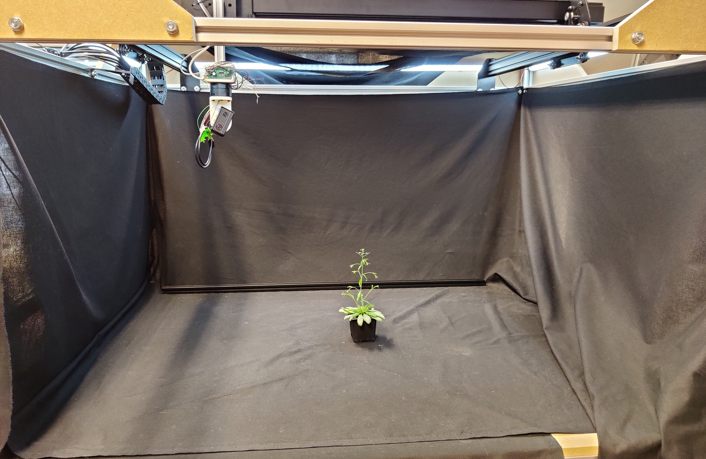

# Make an acquisition with the Plant Imager


## Objective

This tutorial will guide through the steps of acquiring images of a plant using the `plant imager` robot  
{width=800 loading=lazy}  
In order to collect data in the process of plant phenotyping, the plant imager robot takes RGB images of an object following a particular path with precise camera poses.

## Prerequisite

To run an acquisition, you should previously have:

* built the robot following the guidelines [here](../build_v2/index.md)
* installed the necessary ROMI software [here](../install/plant_imager_setup.md)

## Step-by-step tutorial

### 1. Check that you are well interfaced with the plant imager

- make sure you are in the conda environment or that you run properly the docker for the `plantimager` repository
- interface the machine running the ROMI software with the plant imager:
    1. check that your device is correctly connected to the Gimbal and CNC both by USB
    2. turn on camera and connect it to the device via Wi-Fi
- set up a [DB](../specifications/data.md) or quickly generate a simple database with the following commands:

```shell
mkdir path/to/db
touch path/to/db/romidb
```

You have now your file based database *plantdb*

### 2. Get the right configuration

`Scan` is the basic task for running an acquisition with the robot.
To run this task properly with `romi_run_task`, a configuration file is needed.
A **default** one for the plant imager can be found under `plantimager/config/hardware.toml`.  
It regroups specifications on:

- the acquisition path (ScanPath)
- needed parameters for connection between hardware components (CNC, Gimbal and camera) and software (Scan.scanner)
- object metadata (in Scan.metadata.object)
- hardware metadata (in Scan.metadata.hardware)

An important parameter is the number of images acquisition you want to perform, defined by `n_points`.
If you pick a number of acquisition in the following range of values, it will result in an integer rotation angle:
1, 2, 3, 4, 5, 6, 8, 9, 10, 12, 15, 18, **20**, **24**, **30**, **36**, **40**, **45**, 60, 72, 90, 120, 180, 360.

The truly recommended values are in **bold**.

```toml
[ScanPath] # Example, circular path with 60 points:
class_name = "Circle"

[ScanPath.kwargs]
center_x = 375
center_y = 375
z = 80
tilt = 0
radius = 300
n_points = 60

[Scan.scanner.cnc] # module and kwargs linked to the CNC
module = "plantimager.grbl"

[Scan.scanner.cnc.kwargs]
homing = true
port = "/dev/ttyACM0"

[Scan.scanner.gimbal] # module and kwargs linked to the gimbal
module = "plantimager.blgimbal"

[Scan.scanner.gimbal.kwargs]
port = "/dev/ttyACM1"
has_tilt = false
zero_pan = 0
invert_rotation = true

[Scan.scanner.camera] # camera related parameters
module = "plantimager.sony"

[Scan.scanner.camera.kwargs]
device_ip = "192.168.122.1"
api_port = "10000"
postview = true
use_flashair = false
rotation = 270

[Scan.metadata.object] # object related metadata
species = "chenopodium album"
seed_stock = "Col-0"
plant_id = "3dt_chenoA"
growth_environment = "Lyon-indoor"
growth_conditions = "SD+LD"
treatment = "None"
DAG = 40
sample = "main_stem"
experiment_id = "3dt_26-01-2021"
dataset_id = "3dt"

[Scan.metadata.hardware] # hardware related metadata
frame = "30profile v1"
X_motor = "X-Carve NEMA23"
Y_motor = "X-Carve NEMA23"
Z_motor = "X-Carve NEMA23"
pan_motor = "iPower Motor GM4108H-120T Brushless Gimbal Motor"
tilt_motor = "None"
sensor = "RX0"

[Scan.metadata.workspace] # A volume containing the target imaged object
x = [ 200, 600,]
y = [ 200, 600,]
z = [ -100, 300,]
```

!!! Warning
    This is a default configuration file.
    You will most probably need to create one to fit your hardware setup.
    Check the configuration documentation for the [hardware](../metadata/hardware_metadata.md) and the [imaged object](../metadata/biological_metadata.md)

### 3. Run an acquisition with the `Scan` task

Assuming you have an active database, you can now run the `Scan` task using `romi_run_task`:

```shell
romi_run_task --config config/hardware.toml Scan /path/to/db/imageset_id/
```

where:

- `/path/to/db` must be an existing FSDB database
- there is no `/path/to/db/imageset_id` already existing in the database.

This will create the corresponding folder and fill it with images from the _imageset_.

!!! Warning
    After a rather short time following running the command, you should hear the robot start and when the acquisition is finished, a `This progress looks :)` should appear.
    If it's not the case, try to look at the Troubleshooting section at the end of this tutorial

### 4. Obtain an image set

Once the acquisition is done, the database is updated, and we now have the following tree structure:

```
db/
├── imageset_id/
│   ├── files.json
│   ├── images/
│   ├── metadata/
│   │   └── images/
│   │   └── images.json
│   └── scan.toml
└── romidb
```

with:

- `images` containing a list of RGB images acquired by the camera moving around the plant
- `metadata/images` a folder filled with json files recording the poses (camera coordinates) for each taken image
- `metadata/images.json` containing parameters of the acquisition that will be used later in reconstruction (type of format for the images, info on the object and the workspace)
- `files.json` detailing the files contained in the imageset_id
- `scan.json`, a copy of the acquisition config file

You can now [reconstruct your plant in 3d](reconstruct_scan.md) !

## Troubleshooting

### Serial access denied

* The CNC and Gimbal might be connected to different ports than the ones specified in the configuration file. Please check with the `dmesg -w` command.
* Look [here](../build_v2/troubleshooting.md#serial-access-denied) if you can not communicate with the scanner using usb.
* Make sure the device used to run the acquisition is indeed connected to the camera (Wi-Fi)
* Message to Gimbal still transiting :

```shell
Traceback (most recent call last):
  File "/home/romi/miniconda3/envs/scan_0.8/lib/python3.8/site-packages/serial/serialposix.py", line 265, in open
    self.fd = os.open(self.portstr, os.O_RDWR | os.O_NOCTTY | os.O_NONBLOCK)
OSError: [Errno 16] Device or resource busy: '/dev/ttyACM0'
```

Try disconnect and reconnect the USB link and rerun an acquisition
