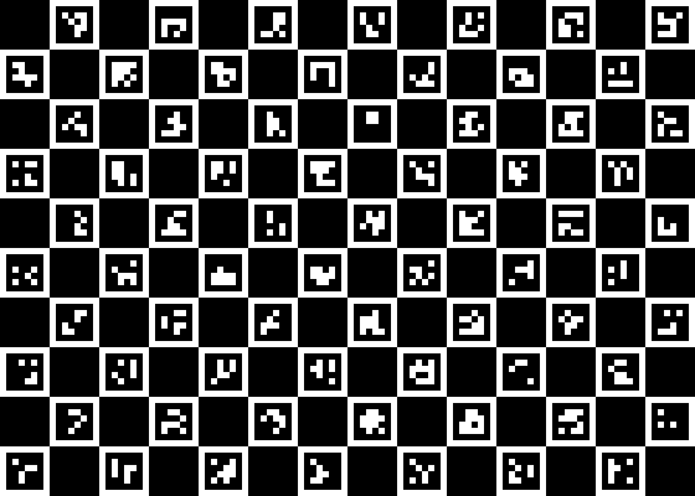

# Intrinsic Calibration

Some cameras introduce significant distortion to images.
The two major kinds of distortion are **radial distortion** and **tangential distortion**.

With _radial distortion_, straight lines appear curved while with _tangential distortion_ some objects of the image may appears closer than they are in reality.


## Objective
Correcting these "aberrations" prior to image processing can be a good idea to improve **quality** and **accuracy** of the reconstructed 3D scenes by _structure from motion_ algorithms.

In this tutorial, you will learn how to **estimate the intrinsic camera parameters** to calibrate image acquisition for downstream analysis and how to re-use it for a reconstruction pipeline, provided that the set-up is the same (same camera, optics, image size...).


## Prerequisite

* Install the [`plant-imager`](../modules/plant_imager.md) ROMI library required to perform _image acquisitions_ together with the _Plant Imager hardware_.

* Install the [`plant-3d-vision`](../modules/plant_3d_vision.md) ROMI library required to perform _intrinsic calibration_.

* Set up a ROMI `plantdb` local [database](../specifications/data.md) or quickly create it (under `/data/ROMI/DB`) with the following commands:
    ```shell
    export DB_LOCATION=/data/ROMI/DB
    mkdir $DB_LOCATION
    touch $DB_LOCATION/romidb
    ```
  
We highly recommend the use of docker containers to run ROMI software, if you wish to use the docker images we provide, have a look [here](https://github.com/romi/plant-imager#docker).


## Step-by-step tutorial

### 1. Make a ChArUco board and print it
A ChArUco board is the combination of a chess board and of ArUco markers.

<figure>
     
    <figcaption>An example of a 14x10 ChArUco board with 20mm chess square and 15mm 4x4 ArUco markers.</figcaption>
</figure>

The previous figure shows the default board that we will use in this tutorial.

To create it, you have to run the `create_charuco_board` CLI as follows:
```shell
create_charuco_board --config plant-3d-vision/config/intrisic_calibration.toml
```

We strongly advise to **use the same** TOML configuration file as you will later need it for the estimation of the intrinsic camera parameters.
An example of such configuration file is:
```toml
[IntrinsicCalibrationScan]
n_poses = "20"  # Number of acquisition of the printed ChArUco board
offset = "5"

[CreateCharucoBoard]
n_squares_x = "14"  # Number of chessboard squares in X direction.
n_squares_y = "10"  # Number of chessboard squares in Y direction.
square_length = "2."  # Length of square side, in cm
marker_length = "1.5"  # Length of marker side, in cm
aruco_pattern = "DICT_4X4_1000"  # 'DICT_4X4_50', 'DICT_4X4_100', 'DICT_4X4_250', 'DICT_4X4_1000'

[DetectCharuco]
upstream_task = "ImagesFilesetExists"
board_fileset = "CreateCharucoBoard"
min_n_corners = "20"  # Minimum number of detected corners to export them

[IntrinsicCalibration]
upstream_task = "DetectCharuco"
board_fileset = "CreateCharucoBoard"
camera_model = "OPENCV"  # defines the estimated parameters
```

You may now **print it**.
Pay attention to use a software (like GIMP) that allows you to set the actual size of the image you want to print.
With the previous configuration it should be:
 - width : `n_squares_x * square_length = 14 * 2. = 28cm`
 - height : `n_squares_y * square_length = 10 * 2. = 20cm`

Finally, **tape it flat onto something solid** in order to avoid deformation of the printed pattern!


### 2. Scan the ChArUco board
To scan your newly printed ChArUco board, use the `IntrinsicCalibrationScan` task from `plant_imager`:
```shell
romi_run_task IntrinsicCalibrationScan $DB_Location/intrisic_calib_1 --config plant-3d-vision/config/intrisic_calibration.toml
```

The camera should move to the center front of the scanner where you will hold your pattern and take `20` pictures (according to the previous configuration).
Try to take picture of the board in different positions, it may even be cropped but needs to be still.

!!! notes
  It is not required to have the whole board in the picture, the ArUco markers will be used to detect the occluded sections!


### 3. Performs the camera parameters estimation
You may now estimate the camera parameters, for a given model with:
```shell
romi_run_task IntrinsicCalibration $DB_Location/intrisic_calib_1 --config plant-3d-vision/config/intrisic_calibration.toml
```

This should generate a `camera_model.json` in a `camera_model` folder inside the `$DB_Location/intrisic_calib_1` folder.