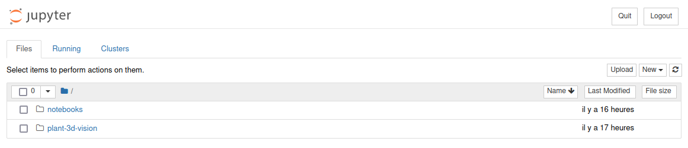

# Workshop IPPN Anger 2023

## Talk

_By Fabrice Besnard._

You can find the slides used during the presentation made by Fabrice Besnard on the ROMI Google Drive [here](https://drive.google.com/file/d/1aA1N2Bu8LQZpadMn9tVi-NDnE0oXbKFL/view?usp=sharing).


## Demonstration

_By Jonathan Legrand & Fabrice Besnard._

You can find the slides used during the demonstration made by Jonathan Legrand on the ROMI Google Drive [here](https://docs.google.com/presentation/d/1DxEbd1a7uZlIri6L5PgRtdqnRHGnumUzmBraqaCU2c0/edit?usp=sharing)

### Getting started

#### Install Docker Engine
If it's not done already, **install the Docker Engine** on your machine.

Follow the official instructions here: [Install Docker Engine](https://docs.docker.com/engine/install/).

#### Pull the Docker image
We made a specific Docker image for this workshop shipping an example dataset and notebooks.

To pull this image, from our [DockerHub](https://hub.docker.com/u/roboticsmicrofarms):
```shell
docker pull roboticsmicrofarms/plant-3d-vision:ippn
```

### Start a container
To start a container based on this `roboticsmicrofarms/plant-3d-vision:ippn` image:
```shell
docker run --rm --gpus all -p 8888:8888 roboticsmicrofarms/plant-3d-vision:ippn
```

This should start a container and jupyter notebook.

!!! note

    - `--rm` automatically remove the container when it exits
    - `-gpus all` add all GPU devices to the container
    - `-p 8888:8888` bing your port 8888 to the container port 8888

To stop the container, press <kbd>ctrl</kbd> + <kbd>c</kbd> twice to exit the jupyter notebook, this will also stop (and destroy) the container.

### Connect to the notebook
Following the previous `docker run` command, a series of messages should appear in the terminal.
They are emitted by jupyter notebook, and they should give you something like:

```shell
    To access the notebook, open this file in a browser:
        file:///home/myuser/.local/share/jupyter/runtime/nbserver-1-open.html
    Or copy and paste one of these URLs:
        http://fdc0ad0ca87d:8888/?token=0598c4791146a98cf9b0c9344c32a7df15e703af79415ea7
     or http://127.0.0.1:8888/?token=0598c4791146a98cf9b0c9344c32a7df15e703af79415ea7
```

You may click or copy/paste the URL starting with `127.0.0.1:8888` in your favorite browser.
This should take you to the landing page of jupyter notebook.

You should see something like this:


### Run a notebook
To start playing around with our notebooks, move to the `notebooks` folder, then select the notebook you want to use.

### Access a running container
Once your container is up and running, you may open a second terminal and connect to the running container.
This can be useful, notably to perform other tasks than running the notebook. 

Your first need to know the ID or NAME of your container.
You may access this information by calling `docker container list`.

For example:
```
CONTAINER ID   IMAGE                                     COMMAND                  CREATED          STATUS          PORTS                                       NAMES
969493021b00   roboticsmicrofarms/plant-3d-vision:ippn   "/bin/bash -c 'jupyt…"   30 seconds ago   Up 29 seconds   0.0.0.0:8888->8888/tcp, :::8888->8888/tcp   exciting_shamir
```

To access this container you can then call:
```shell
docker exec -it 969493021b00 bash
```
You should now be logged as `myuser` inside the `969493021b00` container, and your terminal should look like this:
```shell
myuser@969493021b00:~$ 
```
To exit the running container, press <kbd>ctrl</kbd> + <kbd>d</kbd> to log out and destroy it.

### Launch an interactive container
If you do not wish to use the jupyter notebook or want to start the container and gain access to the terminal, simply do:
```shell
docker run -it --rm --gpus all -p 8888:8888 roboticsmicrofarms/plant-3d-vision:ippn bash
```

To exit the running container, press <kbd>ctrl</kbd> + <kbd>d</kbd> to log out and destroy it.

### Perform a reconstruction job
Once you followed the [access a running container](#access-a-running-container) or [launch an interactive container](#launch-an-interactive-container) instruction, you can launch a reconstruction job on a dataset.

For example, to obtain a _point cloud_ using the _geometric based reconstruction pipeline_ for the _Ler_20220803_2_1_ dataset, simply run:
```shell
# Start by cleaning the dataset:
romi_run_task Clean $DB_LOCATION/Ler_20220803_2_1 --config plant-3d-vision/config/geom_pipe_real.toml
# Reconstruct the point cloud:
romi_run_task PointCloud $DB_LOCATION/Ler_20220803_2_1 --config plant-3d-vision/config/geom_pipe_real.toml
```

### Access a host directory from the container
As we did not bind a local directory to the container, everything you do in that container will stay inside it (hence the name...).
This also mean that upon exit (and destruction with the `--rm` option), all of your work and modification will be gone!

To prevent this, you may use the `-v` option to bind mount a local folder as a volume in the container.
For example, to mount another database from your host, registered under `$DB_LOCATION`, use: `-v $DB_LOCATION:/myapp/db`.

!!! note 

    This will 'overwrite' the demonstration database (for this container only).


### FYI
Here are a few facts about this Docker image:

- The `plant-3d-vision` sources can be found under `$HOME/plant-3d-vision`.
- The database can be found under `/myapp/db`, this path is saved to the `DB_LOCATION` environment variable.
- The shared database has been acquired using our _Plant Imager v2_ with a Sony RX-0 camera (more
  info [here](../plant_imager/build_v2/index.md)).
- If you perform a reconstruction using the task `Colmap` it will use another Docker image
  named `roboticsmicrofarms/colmap`.
