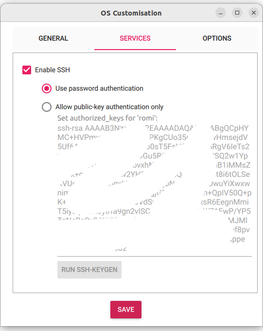

## Introduction

Romi allows you to combine cameras, CNC-like devices and brushed DC motors into a single
hardware platform. The camera we use mostly is the Pi Camera. The CNC
interface is designed for devices with up to 3 degrees of freedom using stepper motors. This
include devices that use the same hardware as 3D printers, but also
devices that can come in other shapes, such as camera gimbals.

There are several ways to talk to these devices. Probably the easiest
way is to write a Python script, such as the one below.


```python
from romi.camera import Camera

camera = Camera.create("camera")
image = camera.grab()
image.save("test.jpg")
```

The expression `Camera.create("camera")` returns a new camera
object. It will look on the network for an available camera called
"camera". If you want to use several cameras then you should give them different names, for example, "left-camera" and
"right-camera". Behind the scenes, `Camera.create` will
figure out where the camera is located on your local network, create a
connection to it, and send/receive commands, such as the `grab`
command above that captures and downloads a JPEG image. In the Python interface, `grab`
will return an image using the [PIL](https://pillow.readthedocs.io/en/stable/index.html) library.

Similarly, to interact with a CNC, you can do the following:

```python
from romi.cnc import CNC

cnc = CNC.create("cnc")
cnc.power_up()
cnc.homing()
cnc.moveto(0.1, 0.1, 0)
cnc.power_down()
```

Similar to the camera example, `CNC.create` will find the device
called "cnc" on the local network and connect to it. You can then send
commands. In general, it's a good idea to power up the CNC when you
start, and power it down again when you are finished, to reduce energy
use and avoid overheating.

The homing command will position the CNC in the (0,0,0) position. Not
all CNC devices support homing, though. (This is configurable, see
later.)

By default, a CNC has three linear axes, X, Y and Z. Distances are
measured in meters. So `moveto(0.1, 0.1, 0)` will position the CNC
0.1 meter on the X-axis, 0.1 meter on the Y-axis, and zero on the
Z-axis.

Not all CNCs have three degrees of freedom, for example, a camera on a
rail only has one. Also not all CNCs have linear axes. For example, a
gimbal may have two degrees of freedom, the pan and tilt angles
measured in degrees. More on this later in the section on CNCs (TODO).

The Romi system generally consists of several computing
devices that are connected to the same network, over wifi or
ethernet. Each of these devices runs a Romi app that listens to the
network for connections (we are using websockets) and that executes
commands, using a
[RPC-like](https://en.wikipedia.org/wiki/Remote_procedure_call)
interaction (although other design patterns are possible, too).

The underlying networking capabilities are provided by the Rcom library, 
which stands for Romi communication. You normally don't have to
know the details of Rcom, but you should be aware of the following. To
find the available devices, Rcom uses a registry. Let me explain. A
Romi "app" is the software that controls a hardware device. We also
may use the term Romi "node" to highlight the network aspect of the
Romi system. When a Romi app starts up, it connects to the hardware
and also to the network (opening a websocket server). It also
registers itself to another application on the network called `rcom-registry` to
announce its availability and provide its topic (or name), type (`cnc`, `camera`, `motors`...) and address (IP address and port).

Whenever you execute `Camera.create("camera")`, the Python code will
query rcom-registry to ask at what address the app called "camera" is
available. It then connect to the Romi app using a client
websocket.

So the Romi system consists of: the rcom-registry service, of which
there must be one and only one active on the local network, one or
more Romi apps to control cameras and CNCs, all with distinct names,
and then your Python script (or C++ or Javascript application) that
ties everything together so you can get your stuff done.

For example, the following script will take 11 x 2 pictures at 10 cm
interval using a linear rail system that transports two cameras:

```python
from romi.camera import Camera
from romi.cnc import CNC

camera1 = Camera.create("camera1")
camera2 = Camera.create("camera2")
cnc = CNC.create("rail")
cnc.power_up()
cnc.homing()
for i in range(11):
    cnc.moveto(i * 0.1, 0, 0)
    camera1.grab().save(f"camera1-{i:02d}.jpg")
    camera2.grab().save(f"camera2-{i:02d}.jpg")
# Travel back, almost to zero, then do a homing
cnc.moveto(0.01, 0, 0)
cnc.homing()
cnc.power_down()
```

## Web interface

Romi includes a web-based interface that allows you to view the available apps. The root of the web interface is the directory `romi-apps/apps/romi-interface`. Later in the documentation, we will explain how to set up a web server to access the interface. 


## Installation Romi Camera

Before we go into the details of setting up a camera, let me explain some basics. There are three main components: 
1. The hardware: by default, a Raspberry Pi Camera Module connected to a Raspberry Pi, 
2. The software: the Romi Camera app (or `romi-camera`) will take the images, and then 
3. Your Python script that requests and processes the images. 

The hardware is not limited to Raspberry Pi's or Raspberry Pi Camera modules. An alternative is to use any Linux machine combined with a USB camera (any camera with a Video4Linux interface, or V4L2 in short). Also, if you are developing a C++ application, it is possible to integrate the camera code directly into your application. This usage is explained much later in this documentation.

In this documentation we'll assume you're using a [Raspberry Pi Zero 2 W](https://www.raspberrypi.com/products/raspberry-pi-zero-2-w/) and [Pi Camera Module v3](https://www.raspberrypi.com/products/camera-module-3/). The set-up for using an USB camera is actually not that much different.


In addition to the three elements you may need:

1. The Rcom Registry
2. Optionally, the web interface to view the cameras.
3. Optionally, a startup scripts to run the registry and app automatically upon booting.

### Hardware

In this example, we assume that you are using a [Raspberry Pi](https://www.raspberrypi.com/documentation/computers/getting-started.html#setting-up-your-raspberry-pi) and the [Pi Camera Module](https://www.raspberrypi.com/documentation/accessories/camera.html). You will need an SD card. The size of the SD card depends on your usage. After installation of the ROMI software following the set-up below on a 32 GB SD card, there is still 25 GB of free space available, which is plenty for most use cases.

Install the [Raspberry Pi Imager](https://www.raspberrypi.com/software/) on your PC. This application is used to prepare an SD Card for the Pi.


After installation, on Linux, you can run it as follows:

```sh
$ rpi-imager
```

Choose the device, i.e. what model of the Raspberry Pi.


Then choose the OS flavor.


Personally, I like to install the  "Raspberry Pi OS Lite" version that you can find in the "Raspberry Pi OS (other)" because I don't need the desktop environment. But YMMV. Select the 64-bit versions.


Select the SD card:


The next step is a very handy one: You can edit the settings of the newly installed OS. Notably, you can set the initial user name, the WiFi configuration, and request SSH to be installed. I will use the name "romi" for the default user in this documentation. It may be useful to choose a distinctive hostname. Afterwards, it may be possible to find the Raspberry Pi on the network using this hostname without setting up a DNS server.




If all is configured, go ahead with the installation.


It's probably safest to reboot the Raspberry Pi with a keyboard and screen attached. If there are no mistakes in the configuration, it should be possible to boot the RPi without screen and keyboard and connect to it directly using ssh (using the "scanner-camera.local" as the hostname of the RPi):


```sh
$ ssh romi@scanner-camera.local
```

You can also find its IP number on the local network as follows:

```sh
$ ip a
# Should return the local IP addresses of your machine
$ nmap -sP 192.168.0.*
# Where 192.168.0.* is the network address of your local network 
```

If you want to avoid having to enter the password every time you connect to the Raspberry Pi, you can set up SSH with a public/private key pair. If you haven't generated a public/private key-pair on your machine, yet, you can do so as follows:


```sh
$ ssh-keygen -t rsa
```

Then copy the key from your PC to the Pi:

```sh
$ scp ~/.ssh/id_rsa.pub romi@scanner-camera.local:
s ssh romi@scanner-camera.local
```

And finally, on the Pi, copy the key into the authorized_keys file:

```sh
# Now connected to the Raspberri Pi:
$ mkdir --mode=0700 .ssh
$ cat id_rsa.pub >> .ssh/authorized_keys
```
The next time you connect, you should get a terminal directly, without entereing a password.

Before installing any software, it is best to update the existing software:


```sh
sudo apt update
sudo apt upgrade
```

### Installing the Rcom Registry and Romi Camera app

To install the Romi software, you currently still have to compile the source code. We will try to build Debian packages in the future (any volonteers?).

First, make sure you have the required dependencies. In a terminal run the following command to install the required tools and libraries:

```sh
$ sudo apt install build-essential git cmake libcamera-dev libjpeg-dev libpng-dev
```

Then, in the terminal, in your home directory, run the following commands:

```sh
$ git clone --recurse-submodules https://github.com/romi/romi-apps.git
$ cd romi-apps
$ mkdir build
$ cd build
$ cmake .. -DADDRESS_SANITISER_BUILD=OFF
$ make
```

When all is done and well, you should have the `rcom-registry` and `romi-camera` binaries in the `romi-apps/build/bin` directory.

#### First trial of the software

In a first terminal, type:
```sh
$ cd ~/romi-apps/build
$ ./bin/rcom-registry
```

It should print out the IP address that it is listening on.

In a second terminal, type:
```sh
$ cd ~/romi-apps/build
$ ./bin/romi-camera --config ../config/config-pi-camera-v3.json
```

In case you are using another camera module than the v3 module, you may want to change the configuration file. 

```sh
$ cd ~/romi-apps/build
$ cp ../config/config-pi-camera-v3.json ../config/config-my-pi-camera.json
```

In particular, you may want to adjust the size of the images taken:

```sh
$ nano ../config/config-my-pi-camera.json
```
and change the section:

```json
        "libcamera": {
            "width": 2304,
            "height": 1296
        }
```

Then start romi-camera with your config file as an argument:

```sh
$ ./bin/romi-camera --config ../config/config-my-pi-camera.json
```


### Installing the Python interface

In line with the recommendations, we will use a virtual environment. In our case, I will use the `venv` module:

```sh
$ python3 -m venv ~/romi-env
$ source ~/romi-env/bin/activate
```

In case you get the below error message, you'll have to install the venv module as follows: `sudo apt install python3.10-venv` (your version of Python may vary).

```
The virtual environment was not created successfully because ensurepip is not
available.  On Debian/Ubuntu systems, you need to install the python3-venv
package using the following command.

    apt install python3.10-venv

You may need to use sudo with that command.  After installing the python3-venv
package, recreate your virtual environment.
```

Once the virtual environment is active, you can install the required Python packages:

```sh
(romi-env) $ pip install romiserial rcom romi_apps

Collecting romiserial
  Downloading romiserial-0.1.2-py3-none-any.whl (14 kB)
Collecting rcom
  Downloading rcom-0.1.11-py3-none-any.whl (14 kB)
Collecting romi_apps
  Downloading romi_apps-0.2.0-py3-none-any.whl (16 kB)
Collecting pyserial
  Using cached pyserial-3.5-py2.py3-none-any.whl (90 kB)
Collecting crc8
  Downloading crc8-0.2.1-py3-none-any.whl (5.6 kB)
Collecting websockets
  Downloading websockets-15.0.1-cp310-cp310-manylinux_2_5_x86_64.manylinux1_x86_64.manylinux_2_17_x86_64.manylinux2014_x86_64.whl (181 kB)
     ━━━━━━━━━━━━━━━━━━━━━━━━━━━━━━━━━━━━━━━━ 181.6/181.6 KB 6.0 MB/s eta 0:00:00
Collecting websocket-client
  Downloading websocket_client-1.8.0-py3-none-any.whl (58 kB)
     ━━━━━━━━━━━━━━━━━━━━━━━━━━━━━━━━━━━━━━━━ 58.8/58.8 KB 5.7 MB/s eta 0:00:00
Installing collected packages: pyserial, crc8, websockets, websocket-client, romiserial, rcom, romi_apps
Successfully installed crc8-0.2.1 pyserial-3.5 rcom-0.1.11 romi_apps-0.2.0 romiserial-0.1.2 websocket-client-1.8.0 websockets-15.0.1
```

### Using several cameras

If you are running several cameras on the same device, or on seperate devices, you must give them a different topic name. Let's assume you want to refer to them as `camera1` and `camera2`. You can make two separate config files but you can also group their specs in one config file. You have to dedicate a section to each of them using their topic name:  


```json
{
    ...
    "camera1": {
        ...
        "libcamera": {
            "width": 2304,
            "height": 1296
        }
        ...
    },
    "camera2": {
        ...
        "libcamera": {
            "width": 2304,
            "height": 1296
        }
        ...
    },
    ...
}
```

You can then start two instances of `romi-camera` with the same configuration file but with different topics:

```sh
$ ./bin/romi-camera --config ../config/config-my-pi-camera.json --topic camera1 &
$ ./bin/romi-camera --config ../config/config-my-pi-camera.json --topic camera2
```

### Setting up the Web interface

The use the web interface, you must install an HTTP server. We will explain the set-up for the Apache server. In case you prefer to use another server, you should check the tutorials for those servers. Since it requirements are very simple, the information below should give you all you need.

NOTE: the web interface should run on the same device and IP as the `rcom-registry`. This is because the web interface cannot find the IP address of the registry on its own.


```sh
$ sudo apt install apache2-bin
```

After the installation, you should edit the Apache configuration as follows.

```sh
$ sudo nano /etc/apache2/sites-enabled/000-default.conf
```

The following configuration should be sufficient:

```
<VirtualHost *:80>
	ServerAdmin webmaster@localhost

	DocumentRoot /home/romi/romi-apps/apps/romi-interface
	<Directory /home/romi/romi-apps/apps/romi-interface/>
	        Options Indexes FollowSymLinks
        	AllowOverride All
        	Require all granted
	</Directory>

	ErrorLog ${APACHE_LOG_DIR}/error.log
	CustomLog ${APACHE_LOG_DIR}/access.log combined
</VirtualHost>
```

Once the file is saved, you should ask Apache to reload the config:

```sh
$ sudo systemctl reload apache2.service
```

Now open a web browser and type the IP address of the device in the address bar. In the example given above (the screenshot), the IP address of the machine was 10.1.4.136. Just type in this address in the browser and press enter.

The registry should also print out its IP address on startup. If you're still unsure about the address of the device, type the following command in the terminal:

```sh
$ ip a
```

### Startup scripts

For now, we will use the old startup script `rc.local` until we have a proper systemd files.

Edit `/etc/rc.local` using your favorite text editor. For example:

```sh
$ sudo nano /etc/rc.local
```


The default rc.local file contains something like this:

```sh
#!/bin/sh -e
#
# rc.local
#
# This script is executed at the end of each multiuser runlevel.
# Make sure that the script will "exit 0" on success or any other
# value on error.
#
# In order to enable or disable this script just change the execution
# bits.
#
# By default this script does nothing.

# Print the IP address
_IP=$(hostname -I) || true
if [ "$_IP" ]; then
  printf "My IP address is %s\n" "$_IP"
fi

exit 0
```

Just before the `exit 0` line, you must insert the following two lines:

```sh
sudo -u romi /home/romi/romi-apps/build/bin/rcom-registry >> /home/romi/rcom-registry.log 2>&1  &
sudo -u romi /home/romi/romi-apps/build/bin/rcom-camera --config /home/romi/romi-apps/config/config-pi-camera-v3.json >> /home/romi/romi-camera.log 2>&1  &
```

Replace 'romi' with the your chosen username for the install.

Also, make sure that the rc.local file is executable:

```sh
sudo chmod 755 /etc/rc.local
```


### Reference for the configuration file

A full configuration file may look like this:

```sh
{
    "device": {
        "hardware-id": "001",
        "type": "camera"
    },
    "camera": {
        "calibration": {
            "date": "2023-08-05",
            "method": "charuco",
            "person": "hanappe"
        },
        "distortion": {
            "type": "simple-radial",
            "values": [
                -0.4928269684314728,
                -0.4928269684314728
            ]
        },
        "id": "0",
        "intrinsics": {
            "cx": 1014.0,
            "cy": 760.0,
            "fx": 2200.0,
            "fy": 2200.0
        },
        "lens": "Default",
        "name": "Pi Camera v3",
        "sensor": {
            "dimensions": [
                0.0050232,
                0.0037536
            ],
            "resolution": [
                1456,
                1088
            ]
        },
        "type": "libcamera",
        "libcamera": {
            "width": 2304,
            "height": 1296
        }
    }
}
```

There are two main sections, `device` and `camera`. The device section has the following fields:

| Field           | Description |
| -------         | ----------- |
| name            | You are free to give your device any name you please |
| type            | Should be `camera` in this case |

The `camera` section: This section should reflect the topic name of the Romi App. In case you want your app to be known as `top-camera` on the network and in the `rcom-registry`, then you should similarly call the section `top-camera`. This allows to specify several cameras in the same configuration file.

The `camera` section is still work in progress. Most of the fields are optional and for information only (i.e. they are not used by `romi-camera`). The data can be requested and stored as meta-data with the images. In Python, the data can be obtained using the `camera.get_camera_info()` method.


| Field           |    | Description |
| -------         | -- |  ----------- |
| type            | Required | The class name of the camera to be instatiated. Possible values are: `libcamera`, `v4l-camera`, `file-camera`, or `fake-camera`. |
| id              | Optional | The ID of the camera to be instanciated, for systems with multiple attached cameras. |
| name            | Optional | A free-form, human-readable string to identify the camera. |
| sensor          | Optional | Information about the image sensor: `resolution` in pixels, and `dimensions` in meter |
| intrinsics      | Optional | Sets the focal and center points of the camera |
| lens            | Optional | A string describing the used lens. |
| calibration     | Optional | Information about the calibration method used, the date, and the person who did the calibration |
| distortion      | Optional | Information about the distorsion coéfficients. Currently, only `simple-radial` distorsion parameters are recognized   |

For each camera type, there is supposed to be a section of the same name (except for fake-camera). So if your camera type is `file-camera`, you should add a section `"file-camera": {...}` in the config file to define the parameters of your instance of the camera.

* `libcamera` uses the libcamera library. This library is mostly used on Raspberry Pis in combination sith the Pi Camera module. However, it is also able to connect to Video4Linux devices.
* `v4l-camera` uses the classical Video4Linux interface and can be used with most USB cameras.
* `file-camera`: Loads a JPEG image from a file and returns the image. Usefull for debugging.
* `fake-camera`: Returns an image filed with noise. Used for debugging.

### Command line options

The following options are recognized by `romi-camera`:


| Option           | Description |
| -------          | ----------- |
| --config path    | The path to the config file to be read. Default: `config.json` |
| --topic string   | The topic of the app. Default: `camera` |
| --directory path |  |
| --registry ip    | Use the given IP address for the registry. Default: IP is detected automatically on local network. |
| --help           | Print out a help message and the list of options |


## Installation Romi CNC


```sh
sudo -u romi /home/romi/romi-apps/build/bin/rcom-registry >> /home/romi/rcom-registry.log 2>&1 &
sleep 3
sudo -u romi mkdir -p /home/romi/cnc
sudo -u romi /home/romi/romi-apps/build/bin/romi-cnc --directory /home/romi/cnc --config /home/romi/config.json >> /home/romi/cnc/temp.log 2>&1 &
```


### Supported hardware

Below you can see some examples of the CNC in action. The first is an aluminium rail to carry a camera using a belt and pulleys.


In a similar vein, the cablebot is a camera system that uses a closed-loop cable, which is moved by a large stationary wheel positioned at one end.


<sub><sup>(Credits: D. Colliaux)</sub></sup>


Still in the category of one-dimensional system, we used the CNC for the auto-focus of the open-microscope.


<sub><sup>(Credits: A. Lahlou)</sub></sup>


We converted a manual microscope stage to displace the sample automatically. 

 

<sub><sup>(Credits: A. Lahlou and A. Ruyer-Thompson)</sub></sup>

The third iteration of the Romi Plant Scanner uses the X-Carve for XY displacement of the cameras. The third stepper motor is used to rotate the vertical arm that carries one or more cameras.

 

<sub><sup>(Credits: ENS Lyon)</sub></sup>

The Romi Rover uses the X-Carve to carry a precision rotary weeding tool to prevent weeds from growing in market farm.


The Plant Carrier uses two instances of CNC. The first one controls the gripper that picks up small plant pots. The second one drives the stepper motors of two larger front wheels of the robot. Although it's common to use DC or brushless motors for traction, for low speeds on flat surfaces, the stepper motors are actually a great option, too.

 

<sub><sup>(Credits: N. Branas, P. Chambroux, A. Leu, H. Pasquier, students Polytech Sorbonne)</sub></sup>

#### Microcontroller

The firware currently runs on the Arduino Uno Rev3 only, although porting it to another microcontroller should not be hard.

The Uno sends the control signals (`step` and `dir`) to a stepper controller. Any controller with a STEP and DIR input should work. The controllers we have worked with are:

* The [gShield](https://synthetos.myshopify.com/products/gshield-v5), 
* The stepper drivers by [Polulu](https://www.pololu.com/category/120/stepper-motor-drivers), including the popular [A4988](https://www.pololu.com/product/1182), 
* but also larger controllers such as the [DM542](https://kitaez-cnc.com/f/dm542.pdf).

The following schema shows how the stepper controller (in this case a Polulu A4988) is wired. 


| Arduino Uno pins | Function |
| ------------------------ | --------------------------- |
| 2, 3, 4 | The STEP signals for the X, Y, and Z steppers  |
| 5, 6, 7 | The DIR signals for the X, Y, and Z steppers |
| 8 | Enable/disable the motors |
| 9, 10, 11 | The limit switches for homing the X, Y, Z axes |
| 12 | To actuate a relay |
| 11-12 | **NOTE**: on some boards (X-Carve?) pins 11 and 12 have been swapped: 12=limit switch Z, 11=relay  |


#### Connecting the PC to the Arduino

The firmware that runs on the Arduino Uno waits from commands from your application. There are two ways that you can interact with the Arduino: 

1. Using RomiSerial, to send commands directly over the serial connection, or
2. Using the `romi-cnc` app, that adds an additional layer up top of RomiSerial and allows you to send commands remotely over the network (it uses Rcom underneath).

In both cases, you will have to connect the Arduino to your PC using a USB cable and you will have to install the RomiSerial library for Arduino.

In the following section I will detail the installation process. After that, you will find some examples of both RomiSerial and Rcom.

### Installation

#### Install RomiSerial

Go to the [RomiSerial page at github](https://github.com/romi/RomiSerial) and download the ZIP:


Then import the library in the Arduino IDE:


#### Upload the RomiMotorController firmware

Clone or download the [RomiMotorController code at github](https://github.com/romi/romi-motor-controller).

Then open the `romi-motor-controller/RomiMotorController/RomiMotorController.ino` file in the Arduino IDE, and compile and upload the code to the Arduino Uno. Make sure you have the Uno board selected.


If you are unfamiliar with the Arduino IDE and uploading code, please check the tutorials at [https://www.arduino.cc/en/Tutorial/HomePage/](https://www.arduino.cc/en/Tutorial/HomePage/).

#### Edit configuration file

A configuration file is needed to define the type and tange of the axes of CNC, the maximum speed and acceleration of the motors and so on.

I'll use the below example of the XCarve to explain the fields. The full configuration look like this:

```json
{
    "device": {
        "hardware-id": "xcarve",
        "type": "cnc"
    },
    "cnc": {
        "axes": [
            {
                "type": "linear",
                "range": [0, 0.76],
                "homing": {
                    "order": 0,
                    "mode": "contact-and-backup",
                    "speed": 0.1
                }
            },
            {
                "type": "linear",
                "range": [0, 0.72],
                "homing": {
                    "order": 1,
                    "mode": "contact-and-backup",
                    "speed": 0.1
                }
            },
            {
                "type": "linear",
                "range": [0, 0.35],
                "homing": {
                    "order": 2,
                    "mode": "contact-and-backup",
                    "speed": 0.1
                }
            }
        ],
        "controller-classname": "stepper-controller",
        "path-maximum-deviation": 0.0,
        "path-slice-duration": 0.020000,
        "stepper-settings": {
            "displacement-per-revolution": [0.040000, 0.040000, 0.008000],
            "gears-ratio": [1, 1, 1],
            "maximum-acceleration": [0.300000, 0.300000, 0.030000],
            "maximum-rpm": [300, 300, 300],
            "microsteps": [16, 16, 16],
            "steps-per-revolution": [200, 200, 200]
        }
    },
    "ports": {
        "cnc": {
            "port": "/dev/ttyUSB0",
            "type": "serial"
        }
    }
}
```

There are three main sections, `device`, `cnc`, and `ports`. The device section has the following fields:

| Field           | Description |
| -------         | ----------- |
| name            | You are free to give your device any name you please |
| type            | Should be `cnc` in this case |

The `cnc` section. This section should reflect the topic name of the Romi App. In case you want your app to be known as `gimbal` or `wheels` on the network and in the `rcom-registry`, then you should similarly call the section `gimbal` or `wheels`. This allows to specify several CNC interfaces in the same configuration file.


The `axes` section is an array with the 1 to 3 elements describing each of the active CNC axes. For each axis, the following fields are available:

| Name               |           | Description  |
| -------------------| --        | --------------------------- |
| type               | Required  | `linear` or `angular`  |
| range              | Optional  | Should spicify an array of the min and max position, in meter. In case this field is absent, this means that there is no limit. An example is when the CNC is used to drive wheels, or a 360° angle. |
| homing             | Optional | The details of the homing configuration of the axis. If this section is missing, no homing will be done on this axis. |

For the homing, the following fields are recognized:

| Name               |          | Description  |
| -------------------| --       | --------------------------- |
| order              | Required | The order in which this axis should homed |
| mode               | Required | `contact-and-backup`: move until the limit switch detects a contact, then backup until the limit switch is released, or `contact`: move until the limit switch detects a contact, then stay there |
| speed              | Required | The speed of the homing, as a fraction of the maximum speed |


| Name               |          | Description  |
| -------------------| --       | --------------------------- |
| controller-classname | Required | The low-level stepper interface to be instanciated. `stepper-controller`: the default controller, `fake-cnc-controller`: used for testing and debugging |


The following two parameters affect the path generation algorithm. (See TODO)


| Name                     | Description  |
| ------------------------ | --------------------------- |
| path-maximum-deviation   | This value, in meters, sets the maximum allowed deviation from the ideal path when the CNC is requested to trace a polygonal path. By allowing a small deviation, the CNC can maintain a given speed while assuring that the maximum accelerations (and thus forces) are respected. It allows for smoother path travelings. |
| path-slice-duration      | A long path is sliced into small segments of constant speed. This variable sets the default duration of these segments. |


The `stepper-settings` provide the information on the stepper motors that are used. The following six pieces of information are required:

| Name                        | Description  |
| --------------------------- | --------------------------- |
| steps-per-revolution        | The number os steps per revolution of the stepper motors, for the x, y, and z axis.  |
| microsteps                  | If micro-stepping was enabled, the number of micro-steps for the x, y, and z axis (a value of 1 indicates no micro-stepping).  |
| gears-ratio                 | If the stepper motors use gears, provide the gear ratio. 1 means no gearbox is used. A value of N means that N revolutions of the stepper motor are required for 1 revolution of the output axis, or that the driver has to send N times more steps to the stepper motor for the output axis to complete a revolution. |
| displacement-per-revolution | This value specifies by how much the CNC moves, in meter, for one revolution of the output axis of the motor + gearbox combination. This value is related to the size of the pulley that pulls on the belt. |
| maximum-rpm                 | The maximum speed of the stepper motors. The datasheets of the stepper motor generaly indicate this value in revolutions per minute (rpm). |
| maximum-acceleration        | The maximum allowed acceleration, in m/s², for each of the axes. |


Finally, the `ports` section lists which firmware drivers are available on what
system ports. 


The list has entries as follows:

```json
{
    "ports": {
        "oquam": {
            "port": "/dev/ttyACM5",
            "type": "serial"
        }
    }
}
```

First comes the name of the firmware that is accessible through this
port. It tells the type of the port ('serial' or 'input-device'), and
the device's path in the 'port' field).


TODO: not 
The `rcdiscover` utility can be used to generate this list:

```bash
$ ./bin/rcdiscover path/to/config.json
```


## Starting the Romi CNC app

Assuming that the `rcom-registry` is already running:

```sh
$ ./build/bin/romi-cnc --config ../config/config-xcarve.json
```

## Examples using Rcom

```python
from romi.cnc import CNC

cnc = CNC.create('cnc')
cnc.enable()
cnc.power_up()
cnc.homing()
# ...
cnc.power_down()
cnc.disable()
```

## Examples using RomiSerial

It is possible (although not necessaily recommended) to communicate with the Arduino firmware directly over a serial connection. We use RomiSerial, which add error detection of the serial communication. The example below uses the Python classes. A more detailed discussion of RomiSerial and interfacing it manually from a terminal or using the C++ API is given later (TODO). You will find the reference of all commands below.

```python
from romiserial.device import RomiDevice

cnc = RomiDevice('/dev/ttyUSB0')
cnc.execute('h', 0, 1, 2)
cnc.execute('o', 0)
cnc.execute('s', 100, 100, 100)
cnc.execute('E', 1)
cnc.execute('M', 1000, 500, 500, 0)
```

## Examples using a serial terminal

The serial connection uses a baudrate of 115200. Also, all end of lines are expected to be terminated with both a carriage return and newline character.

More detailed documentation on how to use the RomiSerial interface is given in the dedicated section. (TODO) 

Below you see a quick example of how to send the command '?' to the CNC controller. This command return the name, version, and compilation date of the firmware. Then the 'E', or enable, command is shown.


```sh
$ picocom -b 115200 -c --omap crcrlf /dev/ttyUSB0
...

#?:xxxx
#?[0,"RomiCNCController","0.1","May 23 2025 13-14-40"]:00df

#E[1]:xxxx
#E[0]:00e3
```

The full reference of all CNC commands can be found below.


## Reference Serial Commands

All RomiSerial commands return an array that can be parsed using, for examples, a JSON parser.

The first value in the array is always an integer that indicates the success or, in case of failure, the error that has occured. A value of zero indicates success. In case of error, the second value in the array is a string with a succinct, human-readable message, for example `[101, "Bad state"]`.


| Command           | Opcode | Arguments | Return | Description |
| -------           | ------ | --------- | ------ | ----- |
| info              | ? | -           | name, version, and compilation date of the firmware | |
| set-homing-axes   | h | a0, a1, a2  | - | Set the order of the axes for homing. Three values are expected: the first, second and third axis to be homed. The following values are recognized for *a0*, *a1*, *a2*: -1=skip homing, 0,1,2=home x,y,z. Examples: [2, -1, -1]=home z, skip the remaining axes. And [2, 1, 0]=home z, then y, then x.
| set-homing-speeds | s | v0, v1, v2  | - | The homing speeds as an integer in steps/s for the homing axes 0, 1, and 2, as defined by the set-homing-axes command |
| set-homing-mode   | o | 0 or 1      | - | 0=move until contact then pull back, 1=move until contact and maintain contact |
| enable            | E | 0 or 1      | - | Power up (1) or power down (0) the motors |
| is-enabled        | e | -           | 0 or 1 | 1=enabled, 0=disabled |
| homing            | H | -           | - | Perform the homing sequence |
| moveto            | m | dt, x, y, z | Returns error 1 if the buffer is full (→ try again later) | The first parameter, *dt*, indicates the duration of the move in milliseconds (int). The remaining parameters are integers determining the absolute target positions of the CNC in steps (measured from the origin) on the x, y, and z axis. |
| move              | M | dt,dx,dy,dy | Returns error 1 if the buffer is full (→ try again later) | The first parameter, *dt*, indicates the duration of the move in milliseconds (int). The remaining parameters are are integers defining the relative displacement of the CNC in steps (measured from the current position) on the x, y, and z axis. |
| moveat            | V | vx, vy, vz  | Returns error 1 if the buffer is full (→ try again later) | The speeds of the x, y, and z axis in steps/s (integers). |
| get-position      | P | -           | x, y, z position in steps | Returns the current position of the CNC |
| is-idle           | I | -           | idle and status | first value (idle): 0=idle=no move commands active or in the queue, 1=busy executing move commands. second value (state): 'r'=running, 'p'=paused, 'h'=homing, 'e'=error |
| pause             | p | -           | - | Pause the execution of the move commands |
| continue          | c | -           | - | Continue the execution of the move commands |
| reset             | r | -           | - | Stop the CNC and removes all active and scheduled move commands |
| zero              | z | -           | - | Sets the currrent position as the orginin (0,0,0). This is also done automatically after a homing |
| relay             | S | 0 or 1      | - | 0=deactivate relay, 1=activate relay | 


## Configuration

The Romi Rover control software uses the following input files (see
also the  [Software](../software) documentation:

* The configuration file: Most of the settings of the rover can be modified in this file.

* The script file: This file lists all the commands of the rover that
  are actionnable by the user, and what these commands should do.


The configuration and script files are discussed in detail below.


### Sharing a single configuration file with all Romi apps


## Python API

CNC Python API


Camera Python API


## C++ API


## Rcom API


### Camera

The CNC interface is exported by the `romi-camera` application.

| Method | Parameters | Return | Description | 
|-----------|----------------|----------------|----------------|
| camera:grab-jpeg-binary | None | A binary buffer with a JPEG-encoded image | |
| camera:set-value | name: the name of the setting, value: the numerical value | None | |
| camera:select-option | name: the name of the option, value: the value as a string | None | |

### CNC

The CNC interface is exported by the `oquam` application.

| Method | Parameters | Return | Comments | 
|-----------|----------------|----------------|----------------|
| cnc-homing | None | None | Starts the homing procedure that puts the CNC's arm in the home position |
| cnc-moveto | x, y, z: the position to move to, speed: the relative speed, as a fraction of the absolute speed | None | |
| cnc-spindle | speed: the speed, between 0 and 1 | None | |
| cnc-travel | path: a list of [x, y, z] points, speed: the relative speed | None | |
| cnc-get-range | None | The dimensions of the CNC, as [[xmin, xmax], [ymin, ymax], [zmin, zmax]] | |
| cnc-helix | xc, yc: the center point of the arc, alpha: the angle of the arc, z: to z-position to move to, speed: the relative speed | None | |
| cnc-get-position | None  | Returns the position as {"x": x, "y": y, "z": z} | |


## Romi Serial


If you have developed for the Arduino before, you most likely have
used the
[Serial](https://docs.arduino.cc/built-in-examples/basics/AnalogReadSerial)
class to print messages and to send commands for your computer to the
Arduino.

The Serial link has some caveats, though, and Romi Serial tries to
address some of those. We will go into detail further below. First, we
show some examples on how to use it in your projects. We will show the
classic "Blink" and "AnalogReadSerial" examples. In the first example
we will control the LED from Python and C++. In the second example, we
will se how to get data off the Arduino, in Python and C++.

You can find the original code for Blink and AnalogReadSerial
[online](https://docs.arduino.cc/built-in-examples) and also in the
Arduino IDE in the menu `File` > `Examples` > `01.Basics`.


### Requirements

The file `romiserial.py` requires the `crc8` module that can be
installed as follows:

```
pip3 install crc8
```

### Blink

#### Using Python 

The complete [Python code](blink.py) look as follows:

```python
import sys
sys.path.append('../python')

import time
import argparse
from romiserial import RomiDevice

remoteDevice = False

def setup(device):
    global remoteDevice
    remoteDevice = RomiDevice(device)

    
def loop():
    global remoteDevice
    remoteDevice.execute('L', 1)
    time.sleep(1)
    remoteDevice.execute('L', 0)
    time.sleep(1)
    

if __name__ == '__main__':
    parser = argparse.ArgumentParser()
    parser.add_argument('--device', type=str, nargs='?', default="COM5",
                    help='The serial device to connect to')
    args = parser.parse_args()
    
    setup(args.device)
    while True:
        loop()
```

The associated [code for the Arduino](blink/blink.ino) is as follows:

```cpp
#include <ArduinoSerial.h>
#include <RomiSerial.h>

using namespace romiserial;

void handle_led(IRomiSerial *romiSerial, int16_t *args, const char *string_arg);

const static MessageHandler handlers[] = {
        { 'L', 1, false, handle_led },
};

ArduinoSerial serial(Serial);
RomiSerial romiSerial(serial, serial, handlers, sizeof(handlers) / sizeof(MessageHandler));

void setup() {
    pinMode(LED_BUILTIN, OUTPUT);
    Serial.begin(115200);
}

void loop() {
    romiSerial.handle_input();
}

void handle_led(IRomiSerial *romiSerial, int16_t *args, const char *string_arg)
{
    if (args[0] == 0) {
        digitalWrite(LED_BUILTIN, LOW);
    } else {
        digitalWrite(LED_BUILTIN, HIGH);
    }
    romiSerial->send_ok();
}
```

### Code explanation

We will go over the code above, step by step.

The first two lines of the Python code make sure that you can run the
example code from within the docs directory. If you installed the
[romiserial.py](../python/romiserial.py) file in your code
directory, you will not need this.

```python
import sys
sys.path.append('../python')
```

We will use a small utility class, called `RomiDevice`. It wraps the
lower-level functions of sending and receiving commands, and handling
errors.

```python
from romiserial import RomiDevice
```

We will create one instance of a RomiDevice that we will store in a
global variable for simplicity.

```python
remoteDevice = None
```

We structured the code to mimick the original Arduino example and
wrote two functions, `setup` and `loop`. The `setup` function
initializes the remote device. It opens a serial connection to the
Arduino to enable the sending of the commands. The function takes as a
single argument the name of serial device that it should connect
to. You will be able to specify this name on the command line, as we
will show below.

```python
def setup(device):
    global remoteDevice
    remoteDevice = RomiDevice(device)
```

If you want more debugging information, you can call
`remoteDevice.set_debug(True)` in the set-up.

The loop function turns the LED on and off by sending a command to the
Arduino. Commands consist of a single character: a lowercase or
uppercase ASCII character, or a digit. If the command requires
arguments, they can be given as additional parameters to the execute
function. In the example below, we pass one argument: whether the LED
should be off (the argument is 0) or whether the LED should be on (the
argument is 1):

```python
def loop():
    global remoteDevice
    remoteDevice.execute('L', 1)
    time.sleep(1)
    remoteDevice.execute('L', 0)
    time.sleep(1)
```

In this example we choose `L` as the opcode of the command. You are
free to choose any character but it should correspond to the same
character used in your code on the Arduino side (see below).

There are some constraints on the arguments you can pass:

* The number of arguments should be less or equal to 12.
* The arguments should be integers with a value between -32768 and 32767.
* It is possible to one, and only one, string as an argument.

Also, the total length of the message cannot exceed 58 bytes. This is
due to the limited size of the buffer on the Arduino.

The number of expected arguments for each opcode will be coded also on
the Arduino side. More on that below.


### The Arduino code

Let's have a look at the code for the Arduino. To begin with, you have
to include the required headers. The RomiSerial classes lives in a
namespace of their own, `romiserial`. In the code below we added a
`using namespace` statement to simplify the example:


```cpp
#include <ArduinoSerial.h>
#include <RomiSerial.h>

using namespace romiserial;
```

The following line wraps the standard Serial object in one of our
classes. The reason is technical. It is so that we can instantiate our
classes before the Serial object has completed its initialisation.

```cpp
ArduinoSerial serial(Serial);
```

Here is the most important part of the code. The following code
defines all the functions that will handle the commands sent by the
user. The first line (`handle_led`) is simply a function declaration
so that we can use the name in the following table, `handlers[]`.

This table lists all our commands and the functions that will handle
them. Each command definition consists of:

* The opcode. Valid opcodes are (a-z, A-Z, 0-9, ?)
* The number of arguments that are expected
* Whether one of the arguments is a string.
* The function that will handle the commands.

Finally, we create an instance of `RomiSerial`. It takes four arguments:

* The serial object used to read the input.
* The serial object used to write the output (can be the same as the input above).
* The list of command definitions.
* The number of command definitions.


```cpp
void handle_led(IRomiSerial *romiSerial, int16_t *args, const char *string_arg);

const static MessageHandler handlers[] = {
        { 'L', 1, false, handle_led },
};

RomiSerial romiSerial(serial, serial, handlers, sizeof(handlers) / sizeof(MessageHandler));
```

This example only shows one command. To add more, simple add more
commands, as much as you need. Below the command `x` takes three
arguments and will be handled by the function `handle_another_command`:

```cpp
void handle_led(IRomiSerial *romiSerial, int16_t *args, const char *string_arg);
void handle_another_command(IRomiSerial *romiSerial, int16_t *args, const char *string_arg);

const static MessageHandler handlers[] = {
        { 'L', 1, false, handle_led },
        { 'x', 3, false, handle_another_command },
};
```

Once this has been set up, you should call the method
`romiSerial.handle_input()` regularly. The best way to do this is to
put it in Arduino's `loop()` function. However, if you have some
functions in your code that require a lot of time to complete, it may
be worth considering calling `handle_input` in those functions as
well, to assure that the Arduino remains responsive.

```cpp
void loop() {
    romiSerial.handle_input();
}
```

Finally, you have to define the function handlers that we declared
previously. In our example, the `handle_led` function expects one
integer argument, and based on its value, it turns the LED on or off:

```cpp
void handle_led(IRomiSerial *romiSerial, int16_t *args, const char *string_arg)
{
    if (args[0] == 0) {
        digitalWrite(LED_BUILTIN, LOW);
    } else {
        digitalWrite(LED_BUILTIN, HIGH);
    }
    romiSerial->send_ok();
}
```

When all went well, the handler should call `send_ok()`. If an error
occured, you should call `send_error(error_number, "Error
message")`. The error number is any positive integer of your
choosing. The code on the Python-side will receive it. Similarly for
the error message.

That's it!

#### Running the example

To run the example, you first have to upload the Arduino code using
the Arduino IDE. The [following
page](https://support.arduino.cc/hc/en-us/articles/4733418441116-Upload-a-sketch-in-Arduino-IDE) explains in detail how to do this.

Then, you execute the `blink.py` [Python script](blink.py) that you
can find in this docs directory. If you're not sure how to do that,
there are many tutorials on the web that explain this. Two examples
are [this page](https://pythonbasics.org/execute-python-scripts/) and
[this page](https://realpython.com/run-python-scripts/).

In the Linux console you can type:

```bash
$ python3 blink.py --device /dev/ttyACM0
```

On Windows, using the MS-DOS `cmd` application:

```bash
C:> python3 blink.py --device COM5
```

The port that is given as argument (/dev/ttyACM0, COM5) corresponds to
the serial device to which the Arduino is attached (more [here](https://www.mathworks.com/help/supportpkg/arduinoio/ug/find-arduino-port-on-windows-mac-and-linux.html)).


#### Using C++


The C++ code is also quite straightforward. Here is the [full listing](blink.cpp):

```cpp
#include <memory>
#include <unistd.h>
#include <RomiSerialClient.h>
#include <RSerial.h>
#include <Console.h>

using namespace romiserial;

void delay(size_t milliseconds)
{
        usleep(milliseconds * 1000);
}

int main(int argc, char **argv)
{
        if (argc < 2) {
                throw std::runtime_error("Usage: blink <serial-device>");
        }
        
        std::string device = argv[1];
        auto log = std::make_shared<Console>(); 
        auto serial = std::make_shared<RSerial>(device, 115200, true, log);
        
        RomiSerialClient romiClient(serial, serial, log, 0, "blink");
        nlohmann::json response;
        
        while (true) {
                romiClient.send("L[1]", response);
                delay(1000);
                romiClient.send("L[0]", response);
                delay(1000);
        }
}
```

This docs directory contains a minimal [Makefile](Makefile) to compile
the code. If the compilation is successful, there will be two
executable binaries, `blink_app` and `analogread_app` (see below):

```bash
$ make
...
$ ./blink_app
```


### AnalogRead

#### The Arduino code 

The Blink example showed how to set the LED lights, but it didn't show
how you can get data back from the Arduino. If you have some sensor
attached to the Arduino, you may want to read the value of the sensor
from your Python application. The rewrite of the AnalogRead example,
below, will show you how to do it.

The original Arduino code looks somethings like [this](https://docs.arduino.cc/built-in-examples/basics/AnalogReadSerial):

```cpp
void setup() {
  Serial.begin(115200);
}

void loop() {
  int sensorValue = analogRead(A0);
  Serial.println(sensorValue);
  delay(1);
}
```

We are going to replace this with the following version, based on RomiSerial:

```cpp
#include <ArduinoSerial.h>
#include <RomiSerial.h>

using namespace romiserial;

ArduinoSerial serial(Serial);

void read_sensor(IRomiSerial *romiSerial, int16_t *args, const char *string_arg);

const static MessageHandler handlers[] = {
        { 'A', 0, false, read_sensor },
};

RomiSerial romiSerial(serial, serial, handlers, sizeof(handlers) / sizeof(MessageHandler));

void setup() {
    Serial.begin(115200);
}

void loop() {
    romiSerial.handle_input();
}

void read_sensor(IRomiSerial *romiSerial, int16_t *args, const char *string_arg)
{
    char reply[16];
    int sensorValue = analogRead(A0);
    snprintf(reply, sizeof(reply), "[0,%d]", sensorValue);
    romiSerial->send(reply); 
}
```

Most of the code above is similar to the Blink example discussed
earlier. The command handler is now called `read_sensor`. As you can
see from the command definition, the handler does not take any
arguments (second value is zero):

```cpp
const static MessageHandler handlers[] = {
        { 'A', 0, false, read_sensor },
};
```

The main difference is in the `read_sensor` handler. Instead of
calling `romiSerial->send_ok()` we send back a string. The string
should contain an array ([]) with a list of values. The first value
should be zero because it indicates whether an error
occured. Following that, you can insert as many values as you want,
including strings in double quotes.

 
```cpp
void read_sensor(IRomiSerial *romiSerial, int16_t *args, const char *string_arg)
{
    char reply[16];
    int sensorValue = analogRead(A0);
    snprintf(reply, sizeof(reply), "[0,%d]", sensorValue);
    romiSerial->send(reply); 
}
```

#### The Python code 

On the Python side, there is not so much change neither. Here's the
[full listing](analogread.py):


```cpp
import sys
sys.path.append('../python')

import time
import argparse
from romiserial import RomiDevice

remoteDevice = None

def setup(device):
    global remoteDevice
    remoteDevice = RomiDevice(device)

    
def loop():
    global remoteDevice
    response = remoteDevice.execute('A')
    print(f'Sensor value: {response[1]}')
    time.sleep(1)
    

if __name__ == '__main__':
    parser = argparse.ArgumentParser()
    parser.add_argument('--device', type=str, nargs='?', default="COM5",
                    help='The serial device to connect to')
    args = parser.parse_args()
    
    setup(args.device)
    while True:
        loop()
    
```

The main change is that we store the result of the call
`remoteDevice.execute` into the variable `reponse`:

```cpp
    response = remoteDevice.execute('A')
    print(f'Sensor value: {response[1]}')
```

`response` is an array containing the values that were sent back by
the Arduino, starting with the zero error code and followed by the
value of the sensor. If you print `response` you should look something
like `[0,123]` where 123 (or `response[1]`) is the value of the sensor
you are looking for.


#### Using C++


Below is the [C++ version](analogread.cpp). The code is similar to the
Blink example. The response object is a [full-featured JSON
object](https://github.com/nlohmann/json), in this case an
array. Similar to the Python implementation, the first element of the
array represents the error code, and the second element the sensor
value returned by the Arduino.


```cpp
#include <memory>
#include <iostream>
#include <unistd.h>
#include <RomiSerialClient.h>
#include <RSerial.h>
#include <Console.h>

using namespace romiserial;

void delay(size_t milliseconds)
{
        usleep(milliseconds * 1000);
}

int main(int argc, char **argv)
{
        if (argc < 2) {
                throw std::runtime_error("Usage: analogread_app <serial-device>");
        }
        
        std::string device = argv[1];
        auto log = std::make_shared<Console>(); 
        auto serial = std::make_shared<RSerial>(device, 115200, true, log);
        
        RomiSerialClient romiClient(serial, serial, log, 0, "analogread");
        nlohmann::json response;
        
        while (true) {
                romiClient.send("A", response);
                std::cout << "Sensor value: " << response[1] << std::endl;
                delay(1000);
        }
}
```


### More in depth

The Romi Serial library helps improve the reliability of the
communication between a computer and an Arduino over the serial
connection. It was developed for the Romi Rover because it
communicates with several microcontrollers over a serial bus. The
proposed library should help improve the reliability of these serial
communications. It aims to address the following issues:

* When the serial connection is used without proper synchronisation,
  the Arduino Uno may loose data without a warning because its
  internal serial buffer overflows. This issue is addressed by
  limiting the maximum size of a message to 64 bytes and by using a
  synchronous request-response pattern.

* Without a well-defined timing between the request and the response,
  the host may wait indefinitely for a response in case the controller
  fails for some reason. The interaction therefore defines a maximum
  timeout for both the request and response handling.

* It provides a better error handling:
  * The error code is now explicitly part of the response.
  * Each request-response pair has an ID to assure that a reponse
    corresponds to the request that was sent.    
  * A CRC code is appended to the messages to assure that the messages
    are not corrupted or incomplete.

* It distinguish more clearly between the following three layers:
  * The serial link to read and write bytes
  * The protocol layer to send requests and read responses
  * The application layer that defines the semantics of the commands

This proposition decribes the protocol layer that should be shared by
all devices for which we control the firmware. A clearly defined
protocol should simplify the documentation and debugging. However,
this document does not specify the opcodes and expected arguments of
the different firmwares. These opcodes are part of the application
layer. Some normalisation of the opcodes could be the subject of a
later specification.

Unless specified otherwise, the serial connections should be set to:
115200 baudrate, 8 data bits, no parity, and 1 stop bit (115200 8N1).


#### Message formats

The exchange always follows a request-response pattern. The formats of
the request and the response are detailed below. However, for
debugging purposes, the controller may also send log messages
asynchronously. These should be handle by the host, and the log text
treated in whatever way that is most appropriate, for example, writing
them to a log file.


#### Log messages

At any time, the controller may send log messages in the following
form:

    '#!' TEXT ':xxxx\r\n'

The TEXT is a string of variable length.


#### Requests

A request is a string that consists, in summary, of a one-character
opcode followed by zero or more arguments, an ID and a cyclic
redundancy check (CRC). The precise format is as follows:

    '#' <opcode> ':' <id> <crc> '\r\n'
  
    '#' <opcode> '[' <arg1>, <arg2>, ... ']' ':' <id> <crc> '\r\n'

* the opcode consists of a single character from the following set:
  {a-z, A-Z, 0-9, ?}
* arg1, arg2 are integer numbers in the range [-32768,32767] (signed 16 bits), or
  a string with a maximum length of 32 characters (see more below). 
* id is an integer number in the range [0,255]. It is encoded as a
  two-character hexadecimal.
* crc is the 8-bit CRC code of the request, encoded as a two-character
  hexadecimal
* the carriage return and line feed characters `\r\n` signal the end of the
  message. 

The hashtag indicates the start of a message. For this reason, it
should be avoided in strings passed as argument. Similarly, the
carriage return and line feed characters (CRLF) indicate the end of a
message. They should be avoided in strings.

The maximum number of integer arguments that can be given is 12.

A string argument should be surrounded by double-quotes ('"'). There
can only be one string per request. The maximum length of the string
is 32 characters.

The CRC code is computed on the string representation of the request,
starting with the hashtag until the ID (included). See below for an
implementation of thr CRC-8 algorithm.

Requests sents from software code should always add a valid ID and
CRC. The 8-bit CRC code is formatted as a hexadecimal string of two
characters. It must use the lowercase letters a-f. Example a CRC with
a value of 0 is formatted as "00"; a CRC of 255 results in the string
"ff".

The total length of the request, including the hashtag, ID, the CRC,
and CRLF, must not be longer than 64 bytes. This is the size of the
internal buffer used by the Arduino Uno.

#### Manual input

The trailing colon, ID and CRC code are obligatory. To simplify
sending commands manually from a terminal it is possible to replace
the four characters of yje ID and the CRC by `x` characters, as
follows.

    '#' COMMAND ':xxxx\r\n'

For example:

    #e[0]:xxxx\r\n

You should verify that your terminal ends lines with CR + LF when you
press enter. In the Arduino terminal window, select the "Both NL & CR"
line ending in the pop-up menu at the bottom of the window. In the
`picocom` terminal, use the `--omap crcrlf` command line option. For
other terminal applications, check their documentation.

#### Response

The reponse is formatted as follows:

    '#' <opcode> '[' 0, <value1>, <value2> ... ']' ':' <id> <crc> '\r\n'

    '#' <opcode> '[' errorcode, <message> ']' ':' <id> <crc> '\r\n'

* the opcode consists of a single character. It mirrors the opcode of
  the request.
* value1, value2 are number or strings formatted compatible with the JSON
  standard.
* the errorcode is an integer (more below). 
* message is a user-readable string in double-quotes (optional). 
* id is an hexadecimal number in the range [0,255]. It mirrors the id
  of the request.
* crc is the CRC code of the textual representation of the response up
  to and including the ID.

* the firmware will finish the message with a carriage return and a
  linefeed. Both are sent because it works more nicely with terminal
  applications.

The reponse of the controller will also start with a hashtag. The
controller will then repeat the opcode of the request. The first
argument is always an error code. An error code of zero means that the
request was successful. If the error is not 0 than the second value
may be an additional short, user-readable message.

The ID mirrors the id of the original request. If none was given, it
will be zero (in case of manual commands from a terminal). The
controller will always return an ID and CRC code. The CRC code is
computed on the complete response, starting with the hashtag until
and including the ID.

#### Examples

Let's look at a couple of simple examples. The first example is a
request with the opcode 'e' but without any arguments, ID, or CRC. The
string ot the request is as follows:

    #e\r\n
    
If all goes well (error code is 0) and controller does not return any
extra values, then the response by the controller is:

    #e[0]:0092\r\n

The controller has returned an ID of zero because none was given in
the request. The CRC-8 value of the string "#e[0]:00" is 0x92, so "92"
is appended to the response.

In the next example, the host sends a request with an ID of 123 (0x7b
in hexaecimal). The host must add a CRC code, too. The full request
string looks like the string below. The CRC-8 of '#e:7b' is 0x04:

    #e:7b04\r\n


The response of the controller will now also include the ID:

    #e[0]:7b40\r\n

(crc8 of #e[0]:7b is 0x40)


Here's an example in which the host sends a request with an additional
arguments (the ID is still 123):

    #M[16,"Shutdown"]:7bba\r\n

(crc8 of '#M[16,"Shutdown"]:7b' is 0xba)

We will assume that the request can't be completed and that the
controller returns an error message. The first value that is returned
is the error code (1 in this case) and the second an optinal error
message:

    #M[1,"Out of boundary"]:7ba7\r\n

(the CRC-8 of '#M[1,"Out of boundary"]:7b' is 0xa7.)


#### Host: Time outs and message IDs

All communication is synchronous. When the host sends a request, the
controller must send a response within less than one second. The host
should therefore set a time-out when reading the response. This avoids
the risk that the host may get stuck indefinitely while waiting for a
response.

Note: The controller must reply in less than one second. However, the
host should use a time-out value that is a slightly longer than one
second.

The host may receive log messages while waiting for the reponse. In
that case, the host must treat the log message and then reattempt to
read the response. This next attempt should again use a timeout of one
second or more.

The request IDs must be incremented by one after each cycle. When the
ID reaches 255, the next ID start again at 0.

In case the controller *does* miss the one second deadline (nothing is
perfect): in that case controller may send the response *after* the
host timed out. This delayed response will then be read by the host in
a subsequent request-response cycle. The host must therefore be
prepared to handle this. It should always check the ID of the
response. If the ID of the request is different than the ID of the
request, the host should ignore the response and try reading the next
response message with a timeout of 1 second.

A call to the host's request/reponse function should never take more
than 2 seconds to complete. The host should therefore keep track of
the total time spent even when at re-attempts to read a response after
receiving a log message or a stale message.

#### Controller

The controller must respond to requests within one second. Vice versa,
the host should assure that a request is completely sent within less
than a second. If the host sends the request too slowly or if data is
lost on the connection and the complete message takes more than one
second to parse, the controller must do the following: ignore the
partially read request, return a time-out error (see below), and wait
for the beginning of a new request (initiated by the hashtag).

The error codes that are returned by the controller fall in two
categories. Errors raised by the protocol layer and errors returned by
the application. The protocol layer will only use negative error
codes. They are discussed below. The application can freely use
positive error codes.

#### Error codes

The complete list of error codes can be found in the
RomiSerialErrors.h file.


#### Notes on the CRC-8

There exists several varieties of the CRC8 algorithm (see this
[https://reveng.sourceforge.io/crc-catalogue/1-15.htm#crc.cat.crc-8](catalogue)). Romi
Serial uses the CRC-8/SMBUS, or "plain" CRC-8 implementation. In the
following online CRC calculator,
[https://crccalc.com/](https://crccalc.com/), it's the first one in
the table (CRC-8).

Please check the code in the CRC8.h file.


## CNC controller principles


### Overview

Oquam is both a small C++ library and an rcom application to control a
CNC and to convert a polygone path given by the user into a smooth,
continuous path.

The main functionnality is contained in liboquam. This library can be
used in other projects. It does not depend on rcom but does require
[libr](https://github.com/romi/libr).


### Background

We developed oquam to control the CNC of the Romi Rover, a weeding
robot for organic, market farms (https://romi-project.eu). Initially,
we were using Grbl running on an Arduino Uno to control the CNC. One
of the biggest problems we had was that the weeding arm would get
stuck in the soil and the CNC would loose its position. We wanted to
add encoders on the motors but this was not so easy to add to Grbl. In
addition, it seemed more natural to us to perform some of the more
complex path smoothening on the host instead of on the Arduino. This
opens up the possibility to use different types of motor drivers as a
back-end as well.


***The implementation of the position tracking and error handling
   mechanism is currently still ongoing.***

### Installation

Oquam is currently part of the
[romi-rover](https://github.com/romi/romi-rover) suite but it can be
installed separately using the standard cmake approach:

```bash
$ cd oquam
$ mkdir build
$ cd build
$ cmake ..
$ make
```

This creates both the *liboquam* library and the *oquam*
[rcom](https://github.com/romi/rcom) node. If you only need the
libary, you can run "make liboquam" instead of make.

### Arduino firmware

The directory Oquam contains the Arduino code. It can be uploaded
using the Arduino IDE.

As of writing, the current implementation is not complete, yet. Test
have been done with the Arduino Uno and the gShield. Check
[config.h](https://github.com/romi/romi-rover/blob/master/oquam/Oquam/config.h)
for more information about support hardware.


### Using the library

The header to include is <oquam/oquam.hpp>. The library's API is
defined in the abstract class Controller (see
[Controller.hpp](https://github.com/romi/romi-rover/blob/master/oquam/src/Controller.hpp))
and in the
[script.h](https://github.com/romi/romi-rover/blob/master/oquam/src/script.h)
header.

To use the library your application should instatiate a subclass of
Controller during the initialization of your program. The Controller
subclasses implement a specific hardware configuration (see
below). Following that, whenever you want the CNC to travel a certain
path, you should take the following steps:

* create a new script object,
* register all the points of the polygone path using *script_moveto()* - all points have absolute positions,
* call *controller->run()* with the script as argument, and
* delete the script when done using *delete_script()*. 

The following code shows a simple example to get started:  

```c++
#include <oquam/oquam.hpp>

const char *device_name = "/dev/ttyUSB0";
double xmax[3] = { 0.7, 0.7, 0.5 };   // in meter
double vmax[3] = { 0.1, 0.1, 0.005 }; // max speed in m/s
double amax[3] = { 0.3, 0.3, 0.03 };  // max acceleration in m/s²
double scale[3] = { 40000, 40000, -100000 }; // steps/m
double period = 0.014; // in seconds

// The points of the polygone
double p[][3] = {{0, 0, 0}, ... };

// The travel speed of each segment in m/s
double v[] = { 0.1, ... };

// The number of points
int n = sizeof(p) / (3 * sizeof(double));

int main(int argc, char **argv)
{
        Controller *controller = new OquamStepperController(device_name,
                                                    xmax, vmax, amax, deviation,
                                                    scale, period);
        script_t *script = new_script();

        for (int i = 0; i < n; i++)
                script_moveto(script,  p[i].x, p[i].y, p[i].y, v[i], i);

        controller->run(script);                
        delete_script(script);
        delete controller;
}
```

The path planner needs a few parameters in order to compute the smooth
curve:

* xmax: the dimensions of the CNC in meters,
* vmax: the maximum allowed speeds in the x, y, and z directions in m/s,
* amax: the maximum allowed accelerations in the x, y, and z directions in m/s²,
* deviation: the maximum allowed deviation from the theoretical path in meter.

If the deviation is zero, the CNC will reduce the speed to zero in all
the junction points of the path. For larger than zero deviations, the
CNC will curve in the junctions and perform a continuous travel.

The stepper controller also needs to know the following:
* scale: the number of motor steps per meter in each direction,
* period: the time interval with which the path will be sliced (see below).


#### Triggers and delays

It is also possible to insert triggers into the script. Triggers allow
you to synchronise other actions with the traveling of the CNC, for
example, grabbing an image from a camera.

```c++
void do_trigger(void *userdata, int16_t arg)
{
        printf("Trigger %d\n", arg);
}

int main(int argc, char **argv)
{
        double delay = 1.0; // seconds
        // ...

        for (int i = 0; i < n; i++) {
                script_moveto(script,  p[i].x, p[i].y, p[i].y, v[i], i);
                script_trigger(script, do_trigger, NULL, i, delay);
        }
        
        // ...
}
```

During the execution of the script, the trigger's callback function
will be called with two arguments, a pointer to a user-defined data
structure and the trigger ID. Both arguments are passed to *script_trigger()*.

The last argument, "delay", tells the CNC to pause the executions of
the script for a given amount of time. If the delay is less than zero,
the CNC will wait indefinitely, or until
*controller->continue_script()* is called.

You can also add a delay into the script without a trigger using
*script_delay()*. This may be useful for example if you want to be
sure the CNC is completely at rest before doing an operation such as
grabbing the image.


#### Direct commands

The controller also provides two methods that you can call directly
without creating a script:

* moveat: Move at a given speed in the x, y, and z direction
* moveto: Move to an absolute position


#### Controller implementations

Currently, there are two implementations of the controller interface:

* OquamStepperController: A controller for stepper motors. This
  controller connects to an Arduino over a serial connection. The
  Arduino must run the Oquam firmware that is part of [this
  repository](https://github.com/romi/romi-rover/tree/master/oquam/Oquam).

* VirtualStepperController: A virtual stepper controller for testing
  purposes.

Both implementations are a subclass of StepperController, which itself
is a sublass of Controller.


### Using the rcom node

The oquam node makes the CNC functions available to other rcom
nodes. It exports the following commands:

* moveto: parameters: "x", "y", "z", "v".
  Example: { "command": "moveto", "x": "0.7", "v": 0.05 }

* travel: parameters: "path".
  Example: { "command": "travel", "path": [[0,0,0,0.1], [0.5,0,0,0.1]], [0.5,0.5,0,0.1], [0,0.5,0,0.1], [0,0,0,0.1]] }

* spindle: not implemented, yet

* homing: not implemented, yet


### Implementation

Consider the code below. We have a list of points that we want the
path to go through in the array p[]. For each segment going from
p[i-1] to p[i] the travel speed should be v[i].

```c
double p[][3] = {{0, 0, 0}, ... };
double v[] = { 0.1, ... };
int n = sizeof(p) / (3 * sizeof(double));
Controller *controller = new OquamStepperController("...",
                                                    xmax, vmax, amax, deviation,
                                                    scale, period);
script_t *script = new_script();

for (int i = 0; i < n; i++)
        script_moveto(script,  p[i].x, p[i].y, p[i].y, v[i], i);

controller->run(script);                
delete_script(script);
delete controller;
```

Two segments of the path are shown in the following figure: 


In most cases, there will be a discontinuity at the speed at the
junction point that requires a very high (theoretically infinite)
acceleration. The change in speed corresponds to a change in value, a
change in direction, or both.


In order to remove the discontinuity and create a smooth path with
acceptable accelerations, we replace the junction with a round
curve. Before the curve, the CNC may have to slow down so as to enter
the curve with a lower speed. During the curve, the speed has a
constant absolute value but changes direction. After the curve, the
CNC may have to speed up again to reach the desired speed.

The curve introduces an error, as the path no longer goes through the
junction point. When the path is calculated, the application must
therefore specify what the maximum allowed deviation is, that is, what
the maximum allowed distance is between the junction point and the
curve.


For starters, the speed at the entry of the curve is the minimum speed
of the speed values in segment s[i] and s[i+1]. As we will see below,
the error made by the curve depends on the entry speed and of the
maximum force (read: acceleration) that the motors can apply. 

To define the curve, we have to compute the entry and exit points (the
points q0 and q1 in the figure below), the value of the speed
throughout the curve, and the acceleration that we have to apply. This
calculation is simplified by putting the origin in the junction point
and the xy-plane in the plane defined by the two segments. The x and
y-axes are placed as shown in the figure below.


We will be using the indices 0 and 1, instead of i and i+1, to refer
to the properties before and after the curve.

In this new reference frame, the speed along the x-axis is constant,
*v_x0 = v_x1*. The speed along the y axis reverses, *v_y0 = -v_y1*.

          ∆vy = vy1 - vy0
           
The equation for the speed is (*vy0* and *a* have opposite
signs):

        vy1 = vy0 + a·∆t
        ⇒ ∆t = -2vy0/a                      (1)
          
The equation for the y position is:

        y = y0 + vy0·t + a.t²/2

When t = ∆t/2, y reaches its minimim ym  

        ⇒ ym = y0 + vy0·∆t/2 + a.(∆t/2)²/2, using (1) and develop
        ⇒ ym = y0 - vy0²/2a                                      (2)
          
The time it takes to follow the speed curve is the same as the time it
takes to follow the two segments of the original path that go through
the junction point. This follows from the fact the the speed along the
x-axis remains the same in both cases. Following the orginal straight
path and starting from y0 with a speed of vy0, the junction y=0 is
reached after a time ∆t/2:
          
         y0 + vy0·∆t/2 = 0 ⇒ y0 = vy0²/a                      (3)
          
(2) and (3) combined gives us that:

         ym = vy0²/2a
          
The error ym should be smaller than the maximim deviation d:

          ym < d
          ⇒ vy0²/2a < d
          ⇒ vy0 < √2ad                                          (4)
          
If the requested speed at the entry of the curve is larger than the
√2ad, the speed components in the xyz directions have to scaled
linearly to satisfy the constraint (4).
          
We already calculated the y coordinate of the entry and exit points in
(3). The x coordinates of the entry and exit points are:
          
          ∆x = vx0·∆t
          ⇒ ∆x = -2vy0.vx0/a,   using (1)           
          ⇒ x0 = -∆x/2 = vy0.vx0/a
             and x1 = ∆x/2 = -vy0·vx0/a

To obtain the acceleration to apply on the stepper motors, we have to
rotate the acceleration back from the reference frame above into the
coordinate space of the CNC.


#### Acceleration - travel - deceleration - curve

Each segment of the polygone will be replaced by four sections: an
acceleration, a travel, a deceleration, and a curve section or, as we
named it in the code, an ATDC.


In the travel section, the arm moves at the constant speed that was
requested for that segment. The acceleration brings the arm up to
speed from a stand-still or after a curve. The deceleration slow the
arm down to a stand-still or to the entry speed of the curve. During
the curve, a constant acceleration is applied to chenge the direction
of the arm movement. Any of the sections may be absent.

An exception that is handled separately is when the segment is too
short to reach the requested speed. In that case, the speed is
interpolated linearly between the entry speed and the exit speed.

It is possible also that the speed at the entry of a segment is too
high and the segment is not long enough to slow down to the maximum
entry speed of the curve at the end of the segment. In this case, We
must scale back the speed at the start of this segment. This change
will have to be propagated back to the previous segments. This will be
done during the backward traversal of the segments.

The conversion of a polygone consisting of segments with constant
speed produces a list of ATDC elements that describes the position and
speed as a continuous function. The acceleration is a step-wise
function with a capped maximum value.


### Stepper controller

The stepper controller implements an acceleration as a sequence of
small segments with constant speed. The speed from one segment to the
next increases or decreases as needed. To obtain the sequence of small
segments, the ATDC list is sliced and converted into a long list of
move commands.


All this preparative work is done on the host PC. To execute the path,
the stepper driver will send the move commands to the Arduino over a
serial connection. The Arduino uses a circular buffer to store the
move commands and informs the host if the buffer is full and to try
sending data again a bit later.

The Arduino executes the move commands. Similar to the Grbl
implementation, it uses a timer interupt to generate the standard step
signals used by most stepper drivers. Again, like Grbl, it uses
[Bresenham's
algorithm](https://en.wikipedia.org/wiki/Bresenham%27s_line_algorithm)
to determine when a step pin should be raised.


#### Parameters

##### Communication speed & minimum duration of move actions

Oquam's protocol is based on textual commands sent over a serial
connection for convenience. Serial makes it easy to connect a terminal
to the controller and type in a command. It also makes it easy to
upload new versions of the firmware.

Before discussing the parameters that define the communication speed
and the minimum duration of move actions, we will give some background
on the implementation.

The Oquam firmware does two things concurrently. First, it read and
parses incoming serial messages. Incoming actions are put into a
queue. Second, a timer interupt grabs the actions from the queue and
sends the pulses to the stepper drivers. The execution of the interupt
handler has a higher priority than the execution of the main code that
handles the incoming serial data. Also the execution time of the
interupt handler is variable. So, there's no easy way to know how
"fast" the main code will run, and how fast in can process incoming
serial data.

The implementation of the serial handler on the Arduino uses a rather
small, 64-bytes circular buffer to store the incoming data. When the
buffer is full, incoming data will overwrite old data. The current
protocol cannot handle corrupted messages so this situation should be
avoided. Therefore, we artificially limit the baudrate to avoid
sending commands too quickly.

When, for a given path, the stepper must perform an acceleration, the
path planner will slice the path and transform the acceleration into a
sequence of short move actions with increasing speed. The time
interval that is used to slice the path influences how fast the
firmware must be able to read the messages. If this interval is too
short, the firmware will finish executing a move action before the
next one is scheduled and it will stop instead of accelerate as
desired. So, the slice interval should be larger than the minimum time
to parse a message.

Too summarize:

* If the baudrate is too high: the serial buffer overflow
* If the baudrate is too low: the messages arrive too slowly for smooth accelerations
* If the slice interval is too small: actions are executed faster than can be transmitted
* If the slice interval is too big: accelerations are not very smooth


(Suppose we send a move action M[T,dx,dy,dz,id]. The length of a
message, for short moves is 20 bytes long including the newline
character at the end (ex. M[10,10,10,10,1000]). With a baudrate of
38400, the time to transfer the message is 20*8/38400 = 4.2 ms.)


## Rcom


Rcom is light-weight C++ libary for inter-node communication. All data is sent over websockets and Rcom provides an implementation of both server-side and client-side websockets.

Rcom offers a low-level API that can be used to build several communication patterns, such the publisher-subscriber pattern (pub-sub), or a message bus.

Rcom also offers a higher-level API that provides the remote procedure call pattern (RPC). We will discuss this API in more detail first. After that we will present the generic API.

All apps run as separate processes that communicate with each other over TCP/IP using websockets. One specific app, rcom-registry, maintains the list of all running apps. The rcom-registry app should be launched before any other app.

### Installation

The installation process follows the classical clone/cmake/make
pattern:

```bash
$ git clone -b ci_dev https://github.com/romi/librcom.git
$ cd librcom/
$ mkdir build
$ cd build
$ cmake ..
$ make
```

Then run the tests to make sure all is well:

```bash
$ ctest -V
```


To check the code coverage run:

```bash
$ make librcom_unit_tests_coverage
$ firefox librcom/librcom_unit_tests_coverage/index.html 
```

### Using rcom for remote procedure calls

We will document how to use rcom through C++ API. However, it is
possible to combine rcom with code writen in Python or Javascript,
among other. We will provide some examples further below.

### Using C++

Suppose that you are writing an application called Madness that
controls a bunch of happy monsters on the local network
(whatever...). You design an interface called `IMonster`, as follows:

```c++
#include <string>
#include <iostream>

class IMonster
{
public:
        virtual ~IMonster() = default;
        virtual void jump_around() = 0;
        virtual void gently_scare_someone(const std::string& person_id) = 0;
        virtual double get_energy_level() = 0;
};
```

All the monsters of your application will derive from this interface,
such as the `HappyMonster` below.


```c++
class HappyMonster : public IMonster
{
protected:
        std::string name_;
        double energy_;
public:
        HappyMonster(const std::string name);
        ~HappyMonster() override = default;
        void jump_around() override;
        void gently_scare_someone(const std::string& person_id) override;
        double get_energy_level() override;
};

HappyMonster::HappyMonster(const std::string name)
        : name_(name), energy_(1.0)
{
}

void HappyMonster::jump_around()
{
        std::cout << "Jump around!" << std::endl;
}

void HappyMonster::gently_scare_someone(const std::string& person_id)
{
        std::cout << "Hey " << person_id
                  << ", don't watch that. Watch this. " 
                  << "This is the happy happy monster show."
                  << std::endl;
}

double HappyMonster::get_energy_level()
{
        return energy_;
}
```

You can now write a small application, create a monster, and have it
do things.

```c++
int main(int argc, char** argv)
{
        HappyMonster monster("Elmo");
        monster.gently_scare_someone("you");
        return 0;
}
```

The full code of this example is split over the following files: [monster_simple.cpp](https://github.com/romi/librcom/blob/ci_dev/examples/tutorial/monster_simple.cpp), [IMonster.h](https://github.com/romi/librcom/blob/ci_dev/examples/tutorial/IMonster.h), and [HappyMonster.h](https://github.com/romi/librcom/blob/ci_dev/examples/tutorial/HappyMonster.h)

### The client-side application

In the next step we will write a monster that lives in a remote
application, either on the same machine but in a different process, or
on a remote machine on the local network. We will write a new type of
monster, called `RemoteMonster`.


```c++
#include "rcom/RemoteStub.h"
#include "rcom/RcomClient.h"

class RemoteMonster : public IMonster, public rcom::RemoteStub
{
public:
        RemoteMonster(std::unique_ptr<rcom::IRPCClient>& client);
        ~RemoteMonster() override = default;
        void jump_around() override;
        void gently_scare_someone(const std::string& person_id) override;
        double get_energy_level() override;
};
```

The new class inherits both from `IMonster` and `RemoteStub`. The
latter is part of rcom. You can also see that the `RemoteMonster`
constructor takes an instance of `IRPCClient` as an argument. This
class represents the connection between the local application and the
remote process. As you can see below, this pointer is passed to the
constructor of `RemoteStub` who will use it to send and receive
messages. Normally, you should not have to add arguments to the
constructor or create additional member variables in the
`RemoteMonster` class because it is just a stub that will forward all
requests to the real implementation that lives in a remote process.

```c++
RemoteMonster::RemoteMonster(std::unique_ptr<rcom::IRPCClient>& client)
        : RemoteStub(client)
{
}
```

We still have to implement the methods of our example class. They are
shown below. 

```c++
void RemoteMonster::jump_around()
{
        bool success = execute_simple_request("jump-around");
        if (!success) {
                std::cout << "jump_around failed" << std::endl;
        }
}

void RemoteMonster::gently_scare_someone(const std::string& person_id)
{
        nlohmann::json params;
        params["person-in"] = person_id;
        
        bool success = execute_with_params("gently-scare-someone", params);
        if (!success) {
                std::cout << "gently_scare_someone failed" << std::endl;
        }
}

double RemoteMonster::get_energy_level()
{
        double energy_level = -1.0;
        nlohmann::json result;

        bool success = execute_with_result("get-energy-level", result);
        if (success) {
                energy_level = result["energy-level"];
        } else {
                std::cout << "get_energy_level failed" << std::endl;
        }
        
        return energy_level;
}
```

The implementation mostly calls upon the methods provided by
`RemoteStub`:

* Use `execute_simple_request` for methods that don't take any
  arguments and return no values.
* Use `execute_with_params` when the caller has to send arguments, but no
  return value is expected.
* Use `execute_with_result` when there are no arguments but a
  value is returned.  
* Finally, the generic method `execute` takes arguments for the remote
  method and returns a value.

Both the parameters and the return value are sent using the
[JSON](https://www.json.org/json-en.html) format. The RemoteStub takes
care of the encoding the data to a JSON string representation and
parsing the incoming string to a C++ JSON data structure. For this
rcom uses the [JSON library](https://github.com/nlohmann/json) by
Niels Lohmann. Check out its documentation to get to know all its
features.

The various execute methods return `true` when the remote method was
executed successfully and `false` when an error occured. They do not
throw an exception. This leaves the choice up to you whether to throw
an exception in response to a failed invokation or not. When an error
occured, the `RemoteStub` will write a message with to the rcom
logger. See more on the log system below.

NOTE: The other functions, such as `RcomClient::create` below do throw
exceptions.

Here is the main function, again, rewriten for the use of the remote
monster:

```c++
int main()
{
        try {
                auto client = rcom::RcomClient::create("elmo", 10.0);
                RemoteMonster monster(client);        
                monster.gently_scare_someone("you");
        } catch (std::exception& e) {
                log_error("main: '%s'", e.what());
        }
        return 0;
}
```

The function `rcom::RcomClient::create` establishes the connection to
a remote object on the local network (or local machine) identified by
"elmo". The second argument is a timeout for the connection. If "elmo"
doesn't show up within 10 seconds, the application calls it quits.

If the connection is established, it is passed to the `RemoteMonster`
object. The application can then call the `IMonster` methods as if the
remote monster was a normal, local object.

The full code of the new version can be found in
[monster_client.cpp](https://github.com/romi/librcom/blob/ci_dev/examples/tutorial/monster_client.cpp).

### The registry

If you run the example application above, it will quit with the
following error message:

```bash
ERROR: Socket::connect: failed to bind the socket
ERROR: Socket::Socket: Failed to connect to address 192.168.1.100:10101
ERROR: main: 'Socket: Failed to connect'
```

In order for the example above to find the "elmo" object, `rcom` uses
another service called the `rcom-registry`. It is basically a
directory service the maps identifiers to IP addresses. You will have
to start the service separately:

```bash
$ ./bin/rcom-registry 
INFO: Registry server running at 192.168.1.100:10101.
```

If you run the example application again, it will still quit. This
time, after 10 seconds, it will show the error message below:

```bash
WARNING: MessageLink::connect: Failed to obtain address for topic 'elmo'
ERROR: MessageLink: Failed to connect: elmo
ERROR: main: 'MessageLink: Failed to connect'
```

This is normal: we didn't implement and start the remote process,
yet. We will look into that in the next session.

### The server-side application

The remote side - or server side - will receive requests coming from
the application that was introduced above. These requests are sent as
JSON strings. They have to be parsed and mapped to the methods of the
actual C++ object that the remote client wants to address. For this,
we will use an adaptor, as follows:

```c++
int main()
{
        try {
                std::string name = "elmo";
                HappyMonster monster(name);
                MonsterAdaptor adaptor(monster);
                auto monster_server = rcom::RcomServer::create(name, adaptor);

                while (true) {
                        monster_server->handle_events();
                        usleep(1000);
                }
                        
        } catch (std::exception& e) {
                log_error("main: '%s'", e.what());
        }
        return 0;
}
```

The `MonsterAdaptor` instance sits in between the generic `RcomServer`
object and the `HappyMonster` object. The server will handle incoming
JSON requests and call the adapter. The adaptor must map the request
to the Monster object. Any return values will be converted to JSON by
the server and sent back.

The key here is the adapter class. It looks as follows:

```c++
class MonsterAdaptor : public rcom::IRPCHandler
{
protected:
        IMonster& monster_;
                
public:
        MonsterAdaptor(IMonster& monster);
        ~MonsterAdaptor() override = default;
        
        void execute(const std::string& method, nlohmann::json& params,
                     nlohmann::json& result, rcom::RPCError& status) override;
        void execute(const std::string& method, nlohmann::json& params,
                     rcom::MemBuffer& result, rcom::RPCError &status) override;
};
```

The two `execute` methods will be called by the server instance. The
first one is for JSON text messages. The second one is for methods
returning large binary data. The use of binary data will be discussed
later.

In our example, the `execute` method checks the value of the `method`
argument and then dispatches the call to the appropriate methods on
the "real" C++ object:

```c++
void MonsterAdaptor::execute(const std::string& method, nlohmann::json& params,
                             nlohmann::json& result, rcom::RPCError& error)
{
        error.code = 0;
        if (method == "jump-around") {
                monster_.jump_around();
                
        } else if (method == "gently-scare-someone") {
                std::string id = params["person-id"];
                monster_.gently_scare_someone(id);
                
        } else if (method == "get-energy-level") {
                result["energy-level"] = monster_.get_energy_level();
                
        } else {
                error.code = rcom::RPCError::kMethodNotFound;
                error.message = "Unknown method";
        }
}
```

That's it! The full code of this section can be found here:
[monster_server.cpp](https://github.com/romi/librcom/blob/ci_dev/examples/tutorial/monster_server.cpp).

### Run the example

To run the example, you must first start the `rcom-registry`:

```bash
$ build/bin/rcom-registry
INFO: Registry server running at 192.168.1.100:10101.
```

Then, in another shell, you start the server-side application that
runs the remote object:


```bash
$ build/bin/monster_server
```

The rcom-registry console should display something like the message
below. It shows that the remote server successfully registered with
the "elmo" identifier.

```
INFO: RegistryServer: Received message: {"request": "register", "topic": "elmo", "address": "192.168.1.100:45175"}
INFO: RegistryServer: Register topic 'elmo' at 192.168.1.100:45175
```

In a third shell, you can now start the client application:

```bash
$ build/bin/monster_client
```

This example application will quit almost immediately because it
doesn't do anything other than send a simple message. The console of
`monster_server` should show the following, though:

```
Hey you, don't watch that. Watch this. This is the happy happy monster show.
```


### Returning binary data

To send binary data in the textual JSON format, it has to be encoded,
for example, using the [Base64](https://en.wikipedia.org/wiki/Base64)
encoding. This can be quite a performance hit. For example, when the
Raspberry Pi Zero has to transmit images, this encoding becomes a
showstopper.

So, it is therfore possible to return the data as a binary
buffer. This is the reason for the second `execute` method in the
adapter class discussed above.


On the client side, you will have to do the following: 

```c++
rcom::MemBuffer& MyClass::call_method_with_binary_output(rcom::MemBuffer& buffer)
{
        nlohmann::json params;
        RPCError error;

        buffer.clear();
        client_->execute("method-id", params, buffer, error);
        
        if (error.code != 0) {
                // ...
        }

        return buffer;
}
```

In the example above, we don't use the `execute` methods of the stub
but directly the `execute` method of the client connection maintained
the stub.

Currently, it is only possible to retrive binary data from the server.
There is no method, yet, for sending a buffer of binary data to the
server. If you have to send binary data, you will have to encode it
and sending it as part of the JSON request.


### The generic API

`rcom` provides both server-side and client-side websockets. We'll call
them client end-point and server end-points. A separate application,
called 'rcom-registry' is a directory server that maintains the list
of all server end-points. The rcom-registry application should be
launched separately before any other application.

The server end-points are identified using a topic, which is a
free-form string. The topic should be unique for a given
rcom-registry. Client end-points that want to communicate with a
server first contact the rcom-registry to obtain the address of the
server end-point. The address is simply a combination of IP address
and port number. The client can then connect to the server end-point
directly.

An application can open several server end-points. And a single server
end-point can handle many clients.

The rcom library does not impose any format on the messages sent back
and forth between the client and the server. Since the websocket
standard makes a distinction between text-based, so does rcom. But
under the hood, rcom is agnostic about the content of the messages.

### The logger

By default, the rcom libray logs the internal messages, including
error messages, to the console. If you are writing a large
application, you probably want to redirect these messages to a file or
a GUI window. In that case, you can subclass the `rcom::ILog` interface
and inject it into the API functions discussed so far. For example, in
the example discussed previously, we created a client connection to a
remote object as follows:


```c++
int main()
{
        // ...
        auto client = rcom::RcomClient::create("elmo", 10.0);
        // ...
}
```

This can be adapted as follows:

```c++
#include "MyLog.h"

int main()
{
        // ...
        auto log = std::make_shared<MyLog>();
        auto client = rcom::RcomClient::create("elmo", 10.0, log);
        // ...
}
```

The class `MyLog` implements the `rcom::Ilog` interface. It must
handle the four types of messages that may be sent by the library as
follows:

```c++
#include <iostream.h>
#include <rcom/ILog.h>
        
class MyLog : public rcom::ILog
{
public:
        MyLog() {}
        ~MyLog() override = default;
                
        void error(const std::string& message) override {
                std::cout << "MyErr: " << message << std::endl;
        }
                
        void warn(const std::string& message) override {
                std::cout << "MyWarn: " << message << std::endl;
        }
                        
        void info(const std::string& message) override {
                std::cout << "MyInfo: " << message << std::endl;
        }
                
        void debug(const std::string& message) override {
                std::cout << "MyDebug: " << message << std::endl;
        }
};
```

Similarly, for the server-side, you can pass your own the `ILog` object:


```c++
#include "MyLog.h"

int main()
{
        // ...
        auto monster_server = rcom::RcomServer::create(name, adaptor, log);
        // ...
}
```


### Fixed port

### No registration

### Security


### Specifying the address of the registry

### Behind a web server 

#### http

#### https

### Connecting from Javascript

TODO: This section is work in progress (as is most of this documentation BTW).

Connecting to a remote object from Javascript is a two-step process:

1. Create a websocket to rcom-registry to obtain the address of the
requested object.

```javascript
function createRemoteMonster(name, registry)
{
    var registrySocket = new WebSocket('ws://' + registry + ':10101');

    registrySocket.onopen = function (event) {
        var request = { 'request': 'get', 'topic': name };
        registrySocket.send(JSON.stringify(request));
    };

    registrySocket.onmessage = function (event) {
        console.log(event.data);
        var reply = JSON.parse(event.data);
        if (reply.success) {
            registrySocket.close();
            monster = new RemoteMonster(reply.address);
        }
    }
}
```

2. Create a websocket to the remote object using the obtained address.

```javascript
class RemoteMonster
{
    constructor(address) {
        this.socket = new WebSocket('ws://' + address);
        this.socket.onmessage = (event) => {
            this.handleMessage(event.data);
        };
        this.socket.onopen = (event) => {
             // ...
        };
    }

    handleMessage(buffer) {
        var response = JSON.parse(buffer);
        if (response.error) {
            this.handleErrorMessage(response.error);
        } else if (response.method == 'get-energy-level') {
               console.log('RemoteMonster: Energy level ' + response['energy-level']
        }   
    }
    
    handleErrorMessage(err) {
        console.log('RemoteMonster: Method: ' + response.method
                    + ', Error: ' + response.error.message);
    }  

    execute(method, params) {
        var request = { 'method': method, 'params': params };
        var s = JSON.stringify(request);
        this.socket.send(s);
    }  

    jumpAround() {
        this.execute('jump-around');
    }  

    gentlyScareSomeone(id) {
        this.execute('gently-scare-someone', {'person-id': id}};
    }  

    getEnergyLevel() {
        this.execute('get-energy-level');
    }  
}
```


### Connecting from Python

The `rcom` library provides some helper code to exchange data between
Python code and rcom objects written in C++. At the current
development stage, this Python code has only been used for prototyping
during development. The code is not production ready but it may help
to get started in your own projects.

In the root directory of the rcom repository, you will find a
directory called `python` that contains the Python `rcom` modules and
some examples. You can install the rcom Python code and dependencies
as follows:

```bash
$ cd python
$ python3 setup.py install --user
```

### A Python client connecting to an C++ rcom server

To run the example, start the rcom-registry server in a new shell:

```bash
$ bin/rcom-registry
```

In another shell, start the remote monster server that we discussed
above:

```bash
$ bin/monster_server
```

Finally, run the Python client:

```bash
$ python3 examples/monster_client.py
```

The Python code looks as follows. First, we define a new class
`RemoteMonster` that subclasses the `RcomClient` from the
`rcom.rcom_client` module.


```python
from rcom.rcom_client import RcomClient
    
class RemoteMonster(RcomClient):
    
        def __init__(self, name, registry):
            super().__init__(name, registry)

        def jump_around(self):
            self.execute('jump-around')
        
        def gently_scare_someone(self, person_id):
            self.execute('gently-scare-someone', {'person-id': person_id})
        
        def get_energy_level(self):
            answer = self.execute('get-energy-level')
            return answer['energy-level']
```

TODO: The implementation still requires that you pass the IP address
to the registry to the `RcomClient` instance. You can find the local
IP address using this code snippet:

```python
import socket

def get_local_ip():
    s = socket.socket(socket.AF_INET, socket.SOCK_DGRAM)
    s.connect(("8.8.8.8", 80))
    ip = s.getsockname()[0]
    s.close()
    return ip
```

Calling the remote C++ object is now very straightforward:

```python
monster = RemoteMonster('elmo', get_local_ip())
monster.jump_around()
monster.gently_scare_someone('you')
energy = monster.get_energy_level()
print(f'energy level is {energy}')
```


### Overview of the classes and code

`ILinux`, `Linux`, `MockLinux`: To facilitate unit testing, the system
functions are abstracted in the `ILinux` interface. The `Linux` class
provides the default implementation, and `MockLinux` the
implementation used for testing.

The interface `ISocket` defines a standard TCP/IP socket API. The
class `Socket` is the default implementation of the API. Similarly,
`IServerSocket` defines the API for a socket that accepts incoming
connection. It's default implementation can be found in the
`ServerSocket` class. Both `Socket` and `ServerSocket` actually share
a lot of functionality. This functionality is grouped together in the
class `BaseSocket`, which encapsulates the standard BSD socket
interface. Both Both `Socket` and `ServerSocket` delegate most of the
methods to `BaseSocket`.

Websockets have there own API, defined in `IWebSocket`. This interface
basically defines the methods to send or receive a message. The
`WebSocket` class provides the default implementation. It uses an
`ISocket` to send and receive data on the TCP/IP connection and then
implements the websocket protocol as defined in [RFC
6455](https://www.rfc-editor.org/rfc/rfc6455).

Most of the code doesn't create WebSockets directly but uses an
instance of `ISocketFactory` to create them. Again, this facilitates
the testing of the code by passing in a `MockSocketFactory`.

The `WebSocketServer` implements a server that waits for incoming
websocket connections and creates a new `ServerSideWebSocket` after a
successful handshake. It also maintains the list of all open
connections. This allows to send broadcast messages to all client
connected to this server. The `handle_events` method should be called
regularly to deal with the incoming connection requests.

We distinguish between server-side and client-side websockets:

* `ServerSideWebSocket`: The websocket created on the server-side in
response to a new incoming connection.
* `ClientSideWebSocket`: The websocket created by the client to connect
to a `WebSocketServer`.

Both inherit implementation from the `WebSocket` class.

A `MessageHub` is like a `WebSocketServer` with the following
additional functionality:

* It has a topic name.
* It registers the topic and its address to the remote registry.

#### RPC classes

IRPCHandler

IRPCClient

IRPCServer

IMessageListener

RcomClient

RemoteStub

RcomServer

RcomMessageHandler

### TODO

Remote access
4G router, set-up at the farm
Managing an fleet of rovers
4G router with a solar panel
queue management
doc format messages
describe format message for different actions: move, path, grab, ...
c++ -> Python


